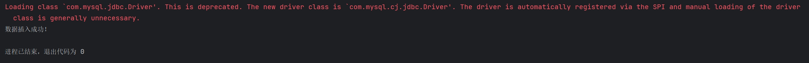
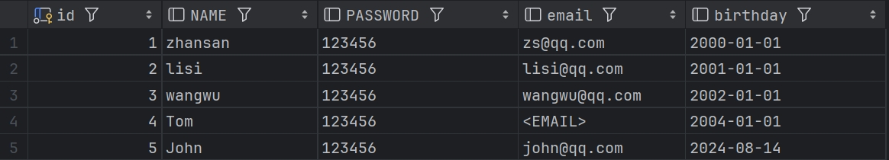

# 了解一下JDBC
JDBC（Java Database Connectivity）是Java语言中用来规范客户端程序如何访问数据库的应用程序接口，它定义了一系列的接口，为各种数据库的访问提供了统一的操作方式。

## 为什么我们会用到JDBC？
一般来说，数据库与应用程序无法直接链接，我们需要一个驱动，作为应用和数据库直接的桥梁，但是每个厂商之间的驱动是不相同的，MySQL有MySQL的驱动，Oracle有Oracle的驱动，我们不可能每使用一种数据库就去安装他的驱动，太过麻烦。

JDBC是让Java应用程序连接到不同的数据库管理系统(如MySQL、Oracle等)，执行SQL查询和更新，以及处理结果集。
驱动的安装就不需要我们亲自去做了，我们只需要掌握JDBC的语法，即可在Java中使用数据库了。


## 使用JDBC之前的工作
首先，在使用JDBC之前，我们需要先去下载jar包，我是去Maven仓库下载的
Maven仓库下载地址：https://mvnrepository.com/artifact/mysql/mysql-connector-java
下载后，我们需要导入驱动jar包
我们在项目内新建一个文件夹，用来存放jar包，后面需要添加的jar包也可以存放在内，把下载的jar包复制进文件内，打开IntelliJ IDEA

我们在项目内可以看到我们复制进来的jar包，但此时不算导入成功，我们需要右键，点击``Add as Library``，点击ok，可以展开的话就是导入成功了

## 第一个JDBC程序
### 查询数据库
JDBC有六个步骤，我们随后在Java程序里写编程的时候按照这六步来写即可
```
1、加载驱动
2、用户信息和url
3、创造链接
4、执行sql语句的对象
5、执行sql语句，并查看返回的结果
6、释放链接
```
我们先准备一份有内容的数据库
```
CREATE DATABASE jdbcStudy;

USE jdbcStudy;

CREATE TABLE `users`(
	id INT PRIMARY KEY,
	NAME VARCHAR(40),
	PASSWORD VARCHAR(40),
	email VARCHAR(60),
	birthday DATE
);

INSERT INTO `users`(id,NAME,PASSWORD,email,birthday)
VALUES(1,'zhansan','123456','zs@qq.com','2000-1-1'),
(2,'lisi','123456','lisi@qq.com','2001-1-1'),
(3,'wangwu','123456','wangwu@qq.com','2002-1-1')
```
然后，我们再打开IntelliJ IDEA，新建一个Java程序

代码如下
```
package JDBC;

import java.sql.*;

public class JDBCtest {
    public static void main(String[] args) throws ClassNotFoundException, SQLException {
        //JDBC

        //1、加载驱动
        Class.forName("com.mysql.jdbc.Driver"); //模板格式

        //2、用户信息和url
        String url = "jdbc:mysql://localhost:3306/jdbcstudy;
        String user = "root";
        String password = "123456";

        //3、创造链接
        Connection connection = DriverManager.getConnection(url, user, password);//这里返回的connection对象代表数据库

        //4、执行sql语句的对象
        Statement statement = connection.createStatement();

        //5、执行sql语句，并查看返回的结果
        String sql = "SELECT * FROM users";
        ResultSet resultSet = statement.executeQuery(sql);//返回的结果集
        while (resultSet.next()){
            System.out.print("id="+resultSet.getObject("id"));
            System.out.print(" name="+resultSet.getObject("NAME"));
            System.out.print(" password="+resultSet.getObject("PASSWORD"));
            System.out.print(" email="+resultSet.getObject("email"));
            System.out.println(" birth="+resultSet.getObject("birthday"));
        }
        
        //6、释放链接
        resultSet.close();
        statement.close();
        connection.close();
    }
}
```
运行结果如下，虽然有红色小字，但不影响程序的运行


### 修改信息|增加信息|删除信息
我们使用executeUpdate(String sql)来完成添加|删除信息
添加信息
```
Statement statement = connection.createStatement();
String sql = "insert into user(...)values(...)";
int num = statement.executeUpdate(sql);
if (num > 0){
    System.out.println("插入成功！");
}
```
删除信息
```
Statement statement = connection.createStatement();
String sql = "delete from user where ...";
int num = statement.executeUpdate(sql);
if (num > 0){
    System.out.println("删除成功！");
}
```
修改信息同上，只需要改变sql里面的语句即可

## 简化步骤
上面的方法看着很简便，但如果数据一多就特别麻烦，所以我们需要把方法提取出来
首先，我们构建一个文件``db.properties``用来保留登录信息，在文件中写入
```
driver=com.mysql.jdbc.Driver
url=jdbc:mysql://localhost:3306/jdbcstudy
username=root
password=123456
```
然后再构建一个java文件，用来存放方法
```
package JDBCtest2;

import java.io.IOException;
import java.io.InputStream;
import java.sql.*;
import java.util.Properties;

public class test2 {

    private static String driver = null;
    private static String url = null;
    private static String user = null;
    private static String password = null;
static {


    try {
        InputStream in = test2.class.getClassLoader().getResourceAsStream("db.properties");
        Properties properties = new Properties();
        properties.load(in);
        driver = properties.getProperty("driver");
        url = properties.getProperty("url");
        user = properties.getProperty("username");
        password = properties.getProperty("password");

        //1、驱动只需要加载一次
        Class.forName(driver);

    } catch (Exception e) {
        throw new RuntimeException(e);
    }
}
//获取链接
public static Connection getConnection() throws SQLException {
    return DriverManager.getConnection(url, user, password);
}
//释放资源
public static void release(Connection conn, Statement st, ResultSet rs) {
    if (rs!= null) {
        try {
            rs.close();
        } catch (SQLException e) {
            throw new RuntimeException(e);
        }
    }
    if (st!= null) {
        try {
            st.close();
        } catch (SQLException e) {
            throw new RuntimeException(e);
        }
    }
    if (conn != null) {
        try {
            conn.close();
        } catch (SQLException e) {
            throw new RuntimeException(e);
        }
    }

}

}
```
方法就提取出来了，我们实验一下

运行结果，成功插入



## PreparedStatement对象
PreparedStatement对象可以有效防止[SQL注入](https://baike.baidu.com/item/sql%E6%B3%A8%E5%85%A5/150289?fr=ge_ala "百度搜索")，并且运行时效率更高。
防止SQL注入的原理：把转递进来的参数当作字符，假设其中存在转义字符，会被直接转义，比如说``"``会被认为是引号，而不是其他。

代码如下
```
import java.sql.Connection;
import java.sql.PreparedStatement;
import java.sql.SQLException;
import java.util.Date;

public class insertTest {
    public static void main(String[] args) {
        Connection conn = null;
        PreparedStatement pst = null;

        try {
            conn = test2.getConnection();
            // 与之前的区别：
            // 使用？占位符来代替参数
            String sql = "insert into users(id, NAME, PASSWORD, email, birthday) values(?, ?, ?, ?, ?)";

            pst = conn.prepareStatement(sql);//预编译sql语句，但不执行

            //手动给参数赋值，
            // 第一个参数代表着第几个问号，第二个参数代表着参数值
            pst.setInt(1, 5);
            pst.setString(2, "John");
            pst.setString(3, "123456");
            pst.setString(4, "john@qq.com");
            // java.sql.Date是数据库的日期类型，需要用java.util.Date转换
            //         new Date().getTime()获取时间戳
            pst.setDate(5, new java.sql.Date(new Date().getTime()));

            int i = pst.executeUpdate();

            if (i > 0) {
                System.out.println("Insert success!");
            }

        } catch (SQLException e) {
            throw new RuntimeException(e);
        }
    }
}
```
成功插入

其余删改查和这个差不多，删和改只需要把sql语句和参数变一下，查就把sql语句和``executeUpdate``变成``executeQuery``即可


