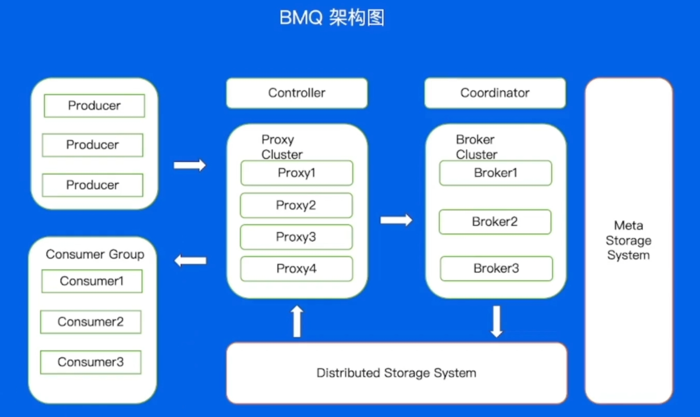

# 消息队列

（听不懂，不是人听的，内容的很奇怪，像初见，又像告别，又像是重逢，能看懂并且记下来都是神人了）

消息队列（MQ），指保存消息的一个容器，本质是个队列。要想称之为消息队列，这个队列要支持 **高吞吐**、**高并发** 并且 **高可用**。

## Kafka

### Kafka 的使用

1. 首先需要创建一个 Kafka 集群；
2. 在这个集群中创建一个 Topic，并且设置好分片数量；
3. 编写生产者逻辑，引入对应语言的 SDK，配置好集群和 Topic 等参数，初始化一个生产者，调用 Send 方法发送消息；
4. 编写消费者逻辑，引入对应语言的 SDK，配置好集群和 Topic 等参数，初始化一个消费者，调用 Poll 方法接收消息。

### Kafka的原理

- Topic : 逻辑队列，不同Topic 可以建立不同的 Topic
- Cluster : 物理集群，每个集群中可以建立多个不同的 Topic
- Producer : 生产者，负责将业务消息发送到Topic 中
- Consumer : 消费者，负责消费 Topic 中的消息
- ConsumerGroup : 消费者组，不同组Consumer 消费进度互不干涉

这其中还涉及到 Topic 内的 offset(相对位置)，Replica（副本），以及副本分布相关概念：

- Offset : 消息在 partition 内的相对位置信息，可以理解为唯一D，在 partition 内部严格递增
- Replica : 每个分片有多个 Replica，Leader Replica 将会从 ISR(In-Sync Replicas) 中选出，一般分为 Leader 和 Follower，Leader 是主片， Follwer 会异步去同步 Leader，以防 Leader 挂了可以立马补上

### Kafka 运行流程

（这里我也没看懂QAQ）

一条消息进入 kafka 处理的流程为： `Producer -> Broker -> Consumer`，在这三个部分可以分别采取一些方案帮助 Kafka 提高吞吐或者稳定性。

- Producer 端逻辑
	- 批量发送
		- 为了应对大消息量的场景，采取批量发送机制，通过一次性发送多个消息从而减少 I/O 次数，加强发送能力
	- 消息压缩
		- 在消息容量太大，带宽较小，导致发送速度慢的场景下，kafka 提供了消息压缩，通过对消息进行压缩处理减小消息的大小
- Broker 端逻辑
	- 写入
		- 在存储过程中，kafka 会通过副本生成日志，将日志写入磁盘，而这些日志显然是有时效的，因此根据存入的有效时间存入不同的日志段 LogSegment，此外根据磁盘的结构，采用顺序写的方式进行写入，可以提高写入效率
	- 读取
		- Consumer 通过发送 FetchRequest 请求消息数据，Broker 通过索引取出消息，按照时间窗口和信息大小发送给 Consumer
	- Broker 有两种文件索引方式
		- 偏移量索引：通过二分法寻找小于目标 offset 的最大文件
		- 时间戳索引：通过二分法找到小于目标时间戳最大的索引位置
	- 数据拷贝
		- kafka 拷贝数据的流程不经过用户态空间，而是在读取磁盘后直接将 Read Buffer 中的数据传输到 NIC Buffer，通过 NIC Buffer 直接交付给消费者进程
- Consumer 端逻辑
	- 分配的问题，也就是对于每一个 partition 来讲，该由哪一个 consumer 来消费
		- 手动分配（low level）：在启动的时候分配任务，哪个 Consumer 负责拉取哪几个 partition，但是万一其中一个 Consumer 宕机，就会导致无法拉取到完全的 partition
		- 自动分配（high level）：对于每一个消费者组，都会选择一个 Broker 作为一个协调者 Coordinator，这个协调者负责分配各个消费者获取 partition 的任务，这使得可以动态调整各个 Consumer 的任务

### Kafka缺点

- 运维成本高；
- 负载不均衡，解决方案复杂；
- 没有自己的缓存，需要依赖外部Cache;
- 若 Controller 和 Coordinator 与 Broker 在同一个进程中，大量 I/O 会导致性能下降。

## BMQ

BMQ （Bytedance Message Queue） 是字节跳动出品的消息队列产品，解决了 Kafka 在实际应用中的诸多问题。

### BMQ 架构模型

兼容 Kafka 协议，存算分离，云原生消息队列

- 新增 Proxy 层作为代理；
- Coordinator 和 Controller 可以独立部署；
- 底层新增 HDFS 用于存算分离。

Proxy 负责接收所有用户的请求，对于生产请求，Proxy 会将其转发给对应的 Broker；对于消费者相关的请求，例如 commit offset，join group 等，Proxy 会将其转发给对应的 Coordinator；对于读请求 Proxy 会直接处理，并将结果返回给客户端。

BMQ 的 Broker 与 Kafka 的 Broker 略有不同，它主要负责写入请求的处理，其余请求交给了 Proxy 和 Coordinator 处理。

Coordinator 与 Kafka 版本最大的差别在于我们将其从 Broker 中独立，作为单独的进程提供服务。这样的好处是读写流量与消费者协调的资源可以完全隔离，不会互相影响。另外 Coordinator 可以独立扩缩容，以应对不同集群的情况。

Controller 承担组件心跳管理、负载均衡、故障检测及控制命令接入的工作。因为 BMQ 将数据放在分布式存储系统上，因此无需管理数据副本，相较于 Kafka 省去了 ISR 相关的管理。Controller 可以更加专注地关注集群整体流量均衡及故障检测。

### BMQ的优点

  - **Kafka痛点**：传统Kafka采用分区（Partition）与Broker强绑定的架构，扩容需数据重平衡，导致运维复杂、资源浪费。
    
- **BMQ解决方案**：
    
    - **Proxy层解耦**：引入无状态Proxy节点处理客户端请求，与存储层分离，实现**动态扩缩容**无需数据迁移。
        
    - **分布式存储层**：数据持久化采用自研分布式存储系统（如HDFS或对象存储），支持**弹性扩展**，降低存储成本。
        
    - **自动负载均衡**：Topic分区动态调度至不同存储节点，规避Kafka的"热点分区"问题。

- **BMQ关键技术**：
    
    - **零拷贝优化**：绕过操作系统内核，直接操作存储设备（如SPDK），减少数据拷贝次数。
        
    - **异步流水线**：写路径采用异步化设计，合并小IO为顺序写入，提升吞吐量。
        
    - **分层存储**：热数据存内存/SSD，冷数据转至廉价HDD或对象存储，平衡成本与性能。

### BMQ的读写流程

- 创建Producer和Consumer：在使用BMQ之前，需要创建Producer和Consumer并连接到消息队列服务器。
    
- 创建队列：BMQ支持多个队列，可以为不同的消息类型创建不同的队列。
    
- 发送消息：生产者将消息发送到指定的队列中，消息会被存储到消息队列中，等待消费者来获取。
    
- 获取消息：消费者从队列中获取消息，并进行处理。
    
- 确认消息：消费者在处理完消息后，需要向BMQ服务器发送确认消息，告诉服务器已经消费完成。

## RocketMQ

（没看懂，但是好像很重要，留住，以后再学）

RocketMQ 以低延时出名，适合用在电商或者一些实时的业务上

官方文档：[rocketmq.apache.org/docs/](https://link.juejin.cn/?target=https%3A%2F%2Frocketmq.apache.org%2Fdocs%2F "https://rocketmq.apache.org/docs/")

### 基本概念

### 基本架构

