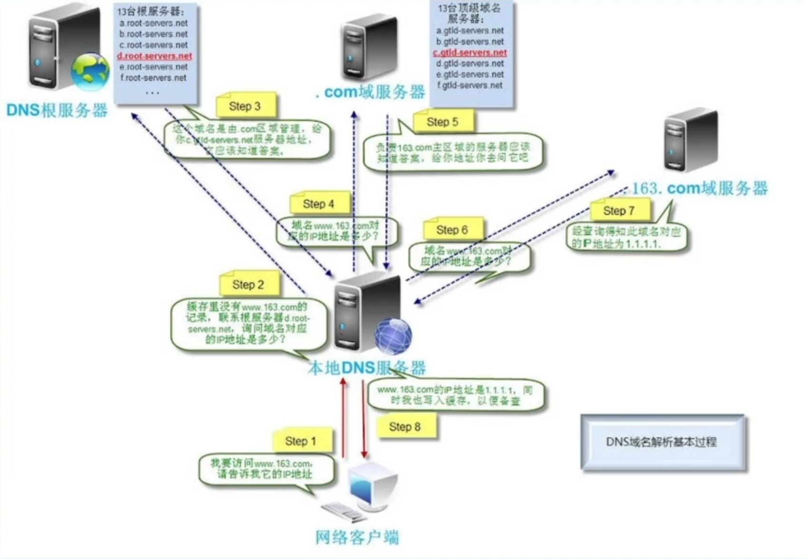
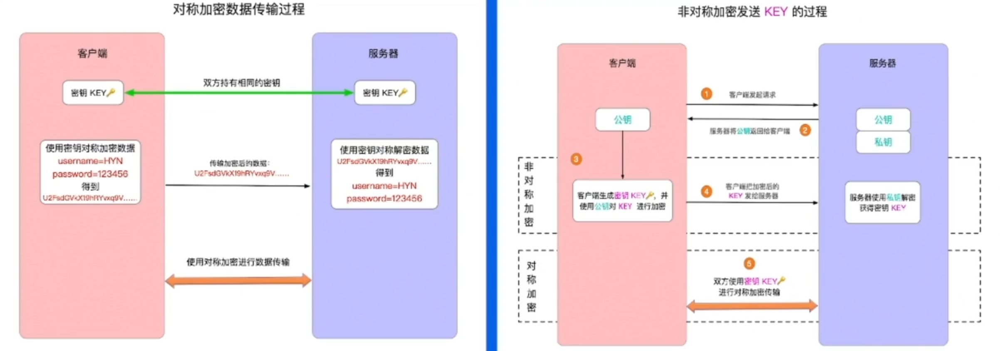

# 域名系统

使用域名系统来代替 hosts 文件

关于域名空间:
	- 域名空间被组织成树形结构
	- 域名空间通过划分zone的方式进行分层授权管理
	- 全球公共域名空间仅对应一棵树
	- 根域名服务器:查询起点
	- 域名组成格式:[a-zA-Z0-9-]，以点划分label

顶级域gTLD（general Top-level Domains）：gov政府.edu教育.com商业.mil军事.org非盈利组织

# DNS服务器

### DNS查询过程

比如这里的网络客户端想要访问163.com域名，首先会访问本地的DNS服务器，看看有没有163.com域名的解析记录，第一次访问都不会有解析记录的，如果没有解析记录会依次向根、顶级域进行解析以及保存在本地，以便于下次查询

### DNS记录类型

- A/AAAA:IP指向记录，用于指向IP，前为IPv4记录，后者为IPv6记录
- CNAME:别名记录，配置值为别名或主名，客户端根据别名继续解析以提取IP地址
- TXT:文本记录，购买证书时需要
- MX:邮件交换记录，用于指向邮件交换服务器
- NS:解析服务器记录，用于指定哪台服务器对于该域名解析
- SOA 记录:起始授权机构记录，每个zon要权威服务器的记录,有且仅有唯一的一条SOA记录，SOA是描述zone属性以及主

# 接入HTTPS协议

由于HTTP是明文传输，很容易被截取，因此有了HTTPS

### 对称加密和非对称加密

加密是在传输过程中为无规则乱码，即使被第三方获取，在没有密钥的情况下也无法进行解密数据，从而保证了数据的安全性
	- 对称加密由于双方密码一致，在发送时需要把密码发送给对方，这样在传输的过程中就有可能被截获
	- 非对称加密加密和解密使用两种不同的密钥，公钥和私钥，如果使用公钥加密就需要用私钥解密，反之一致

### 证书链

- Server 端发送是带签名的证书链
	
- Client 收到会仍然需要验证
	- 是否是可信机构颁布
	- 域名是否与实际访问一致
	- 检查数字签名是否一致
	- 检查证书的有效期
	- 检查证书的撤回状态

# 接入全站加速

源站容量问题：增加后机器扩容;静态内容，使用静态加速缓存
网络传输问题：动态加速DCDN
全站加速 = 静态加逗+动态加速

一般网址常见的问题有许多，例如：
- 源站容量低，可承载的并发请求数低，容易被打垮
- 丢包、劫持、mtu问题报文经过的网络设备越多，出问题的概率越大，自主选路网络链路长，时延高
- 卡顿响应慢
- 极大的流失了大部分的用户群体
- NPS 留存率数据不乐观。

### 静态加速

CDN（Content Delivery Network）内容分发网络，将网站内容发布到最接近用户的边缘节点，使网民可就近取得所需内容，有效解决互联网网络拥塞状况，提高网民访问的响应速度和成功率。静态CDN服务以图片、页面、js、css、大文件安装包等静态文件加速为主。主要原理是通过在现有的Internet中增加一层新的网络架构，将网站的内容发布到最接近用户的cache服务器内，通过DNS负载均衡的技术，判断用户来源就近访问cache服务器取得所需的内容，解决Internet网络拥塞状况，提高用户访问网站的响应速度，如同提供了多个分布在各地的加速器，以达到快速、可冗余的为多个网站加速的目的。

- 解决由于地域、带宽、运营商接入等问题带来的跨网访问问题
- 结合DNS调度系统，将用户的请求分配至最适合他的节点，提升用户的访问速度
- 中心节点收敛回源，降低回源且提升命中率，减轻源站压力
- 隐藏源站，提供大带宽接入，降低源站被攻击的风险
- 提供存储方案，解决业务线文件存放问题

# 四层负载均衡

基于IP+端口，利用某种算法将报文转发给某个后端服务器，实现负载均衡地落到后端服务器上。

三个主要功能:
1. 解耦 vip 和 rs
2. NAT
3. 防攻击:syn proxy

## 常见的算法

- RR轮询:Round Robin，将所有的请求平均分配给每个真实服务器RS
- 加权RR轮询:给每个后端服务器一个权值比例，将请求按照比例分配
- 最小连接:把新的连接请求分配到当前连接数最小的服务器
- 五元组hash:根据sip、sport、proto、dip、dport对静态分配的服务器做散列取模
	缺点:当后端某个服务器故障后，所有连接都重新计算，影响整个 hash 环
- 一致性hash:只影响故障服务器上的连接session，其余服务器上的连接不受影响

 