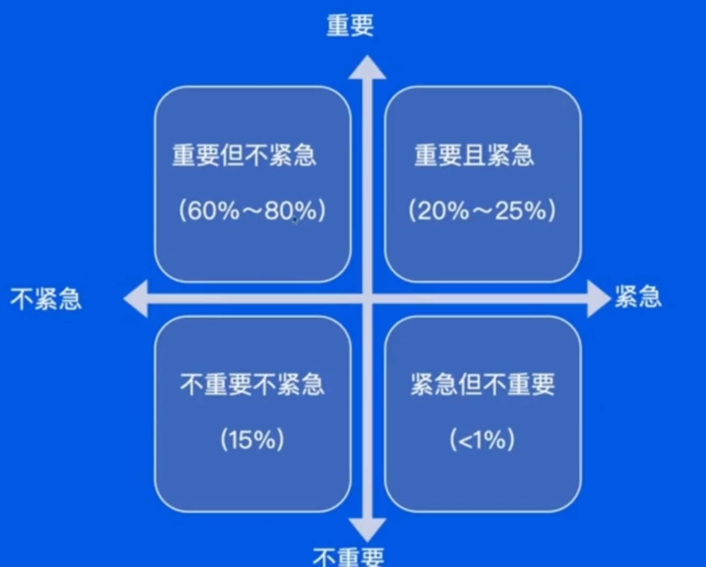

# 了解开发流程

复杂项目没有流程会有什么问题
- 需求阶段:每个人都有自己的想法，团队决策需要有一个过程
- 开发阶段:多人/多端协作开发，每个人有自己的安排，相互配合需要有一个流程
- 测试阶段:产物怎样交付，测试如何开展，BUG怎么修都需要流程
- 发布阶段:怎样确保发布过程平稳丝滑，版本和流量如何控制，需要有规范
- 运维阶段:线上问题如何应急响应，处理用户反馈和线上问题需要有流程

## 瀑布模型

需求、开发、测试、发布、运维，一个阶段完全好了，再到下一个

- 传统的线性开发模型，按顺序依次进行需求分析、系统设计、编码、测试和部署。
- 每个阶段的结果作为下一个阶段的输入。
- 瀑布模型的突出缺点是不适宜用户需求的变化
- 需求一旦确认，较难进行修改。
- 适用于需求较为稳定、项目较小的情况。

## 敏捷开发

更注重的是个体的互动、工作的软件、客户合作、响应变化

- 以小团队快速迭代
- 团队成员之间的合作更加紧密
- 以人为本，和用户沟通

更现代的流程模型

- 迭代、增量的开发方法，强调快速响应需求变化和持续交付价值。
- 开发过程中注重协作、沟通和自组织团队。
- 将开发任务分解为小块，每个迭代周期内交付可用的功能。
- 适用于需求不确定、变化频繁的项目。

## 字节团队的开发流程

# 开发流程详解

## 需求阶段

MVP (minimum viable product，最小化可行产品)思想

站在用户的角度思考
收集用户反馈，快速迭代

把重要和紧急的事情先做，重要放在前面，紧急放在重要后面。

## 开发阶段

### 云原生下的开发

**传统虚拟机**

- 在物理主机中虚拟出多个虚拟机，每个虚拟机拥有自己的操作系统
- 运维人员负责维护和交付虚拟机
- 每个虚拟机中都要安装相应的依赖环境

**容器化**

- 容器是在操作系统中虚拟出来的
- 通过cgroup，namespace和Union Mount等技术实现了容器之间的相互隔离，同时容器只有很低的开销
- 应用和其依赖作为一个整体，打包成镜像交付

**单体结构**

- 多个模块共同组成一个服务，服务体量较大
- 模块之间直接调用，不需要RPC通信
- 服务整体扩缩容量
- 多人开发一个代码仓库，需要充分集成测试

**微服务架构**

- 各个功能在不同的服务中
- 不同模块需要进行RPC通信
- 不同模块可以独立扩缩容
- 每个服务的代码仓库仅由少部分人维护

### 代码规范、自测和文档

**代码规范**
- 养成良好的注释习惯，超过三个月的代码，自己都会忘了当时在想什么
- 不要有魔法数字，魔法字符串
- 重复的逻辑抽象成公共的方法，不要copy代码
- 正确使用IDE的重构功能，防止修改错误

**自测**

- 单元测试
- 功能环境测试测试
- 数据构造

**文档**

- 大型改造需要有技术设计文档，方案评审
- 好的接口文档能更方便的和前端进行沟通

## 测试阶段

**功能环境**

- 需要一个能模拟线上的环境进行开发和测试
- 环境和环境之间能够隔离，不影响其他功能的开发和测试

**集成环境**

- 不同人开发的功能合并在一起测试，相互之间的影响可能产生缺陷
- 迭代发布的所有功能合并在一起测试，确保发布的所有功能之间的影响不产生缺陷

**回归环境**

- 确保新的功能不对老的功能产生影响
- 回归测试一般会借助自动化测试脚本

## 发布阶段

发布之前要查询检查一遍，观察每个服务的发布状态，及时处理异常

发布过程中监视和告警需要特别关注，如果有异常立刻判断是否由变更引起，如果是变引起或用户反馈，及时终止发布。

**发布负责人**

- 负责按照计划执行发布
- 需要通知各个相关人员发布进展
- 观察各个服务的发布状态，及时处理异常

**变更服务的相关 RD**

- 按照上线checklist检查服务的日志，监控，响应上线过程中的告警
- 对于自己负责的改动，在小流量或者是预览环境进行功能验证
- 执行发布计划中的其他操作(如线上配置，数据处理等)

**值班同学**

- 发布过程中的监控和告警需要特别关注，如果有异常需要立刻判断是否由变更引起
- 如果有变更引起的告警或者用户反馈，需要及时中止发布

### 简单发布

直接用新版本覆盖老版本

- 优点：简单、成本低

- 缺点：发布过程中服务会中断，出了问题会影响全部用户

适用：
- 测试环境部署
- 小公司或非核心业务

### 金丝雀发布

由于金丝雀对瓦斯非常铭感，因此以前开矿下矿洞，先放一只金丝雀进去探是否有毒气体，看到金丝雀能否活下来，金丝雀发布由此得名。先发一台服务看看是否有问题

- 优点：相对简单，能用少量用户验证新版本功能

- 缺点：发布过程中服务也会中断，发现不了随用户增大才会暴露的问题

适用：
- 测试环境部小公司或非核心业务

### 滚动发布（推荐）

每个实例都通过金丝雀的方式逐步放大流量，对用户影响小，体验平滑

- 优点：发布过程中用户不会中断，可以充分验证服务功能

- 缺点：流程复杂，对发布系统比较高的要求，发布速度慢，新老版本不兼容的情况不能用

适用：
- 发布系统能力较强，可以平滑切换流量
- 发布自动化程度高，可以自动滚动

### 蓝绿发布（推荐）

把服务分为蓝绿两组，先把蓝组流量摘除然后升级，只用绿组提供服务，之后切换全部流量，只用蓝组提供服务，然后升级绿组服务，最终全部升级

- 优点：发布速度快，流程相对简单

- 缺点：需要对一般机器承担所有流量的能力，出问题影响全部用户

适用：
- 服务器资源丰富
- 新老版本不能兼容的情况，需要一次性升级到新版

半夜流量一般比较低，适合做发布，所有这就是大部分后端开发都工作时间比较晚的原因

### 红黑发布

和蓝绿发布类似，但是发布时会动态扩容出一组新的服务，而不需要常备两组服务

- 优点：发布速度快流程相对简单

- 缺点：需要能扩容一倍对机器数量仍然有要求，出问题会影响全部用户

适用：
- 服务器资源丰富
- 新老版本不能兼容的情况，需要一次性升级到新版

## 运维阶段（了解就行）

公司在发展过程中，逐渐形成了十分复杂的超大规模微服务体系。为了实现对这些复杂微服务的监控，我们往往会在微服务中添加埋点采
集 Metrics、Logging、分布式 Trace 等多种数据。

# 优化流程

- 技术的发展会带来质量和效率的同时提高
- 将质量保障融入到流程，将流程自动化
- 从需求到上线全流程自动化，同时提高质量和效率

- DevOps：将开发和运维无缝集成的方法论，通过自动化和协作提高软件开发和运维效率和质量。
- 全流程自动化：通过自动化工具和流程实现代码构建、测试、部署和监控等环节的自动化。
- 目标是提高团队效率、减少手动操作和人为错误，实现快速交付和持续集成。

