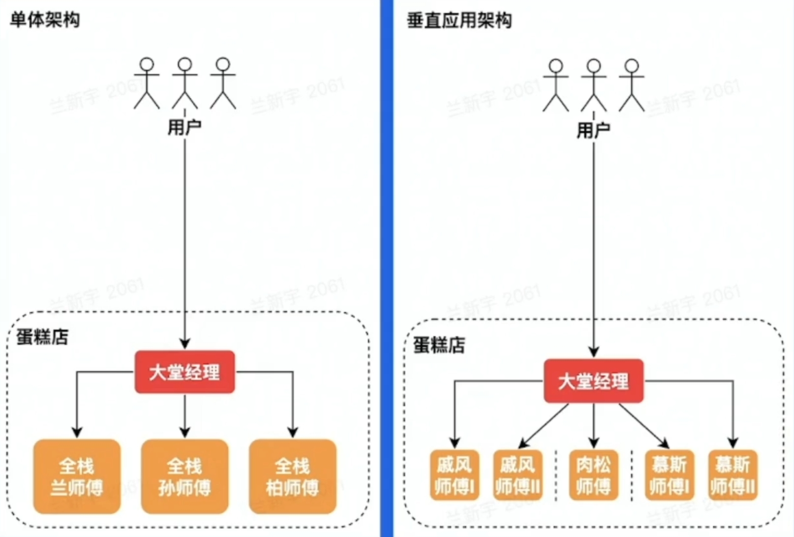
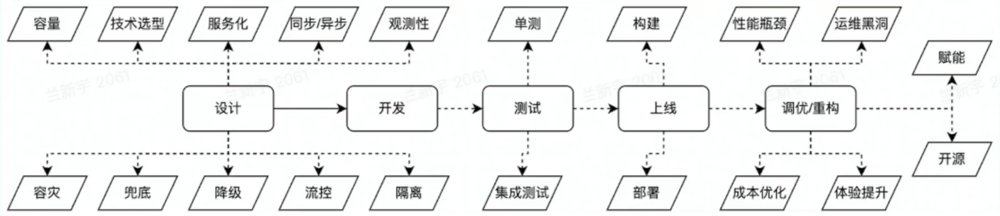

# 架构

架构，又称软件架构

- 是有关软件整体结构与组件的抽象描述
- 用于指导软件系统各个方面的设计

# 单机架构

软件系统需要具备对外提供服务，单机，就是把所有功能都实现在一个进程里，并部署在一台机器上

优点:
- 简单

问题
- - C10K问题（Concurrent 10,000 Connection）：服务器如何支持10K个并发连接，进行高性能网络编程。解决方式：采用IO复用模型epoll方法，在调用返回时，只给应用提供发生了状态变化的文件句柄，不需要轮询fd（文件描述符）
- 运维需要停服

## 单体、垂直应用|垂直切分

**单体架构**：分布式部署
**垂直应用架构**：按应用垂直切分的单体
优点：
- 水平扩容
- 运维不需要停服
问题：
- 职责太多，开发效率不高
- 爆炸半径大

## SOA、微服务|水平切分

S0A(Service-0riented Architecture)
1. 将应用的不同功能单元抽象为服务
2. 定义服务之间的通信标准

**微服务架构**： S0A 的去中心化演进方向

# 云计算

**云计算**：是指通过软件自动化管理，提供计算资源的服务网络，是现代互联网大规模熟悉分析和存储的基石。

基础：
- 虚拟化技术 
	- 整租 vs 合租（“整租”可以对应“独占虚拟机”，“合租”可以对应“共享虚拟机”）
- 编排方案 
	- 业主 vs 租赁平台（“业主”可以类比为“私有云或本地数据中心”，“租赁平台”可以类比为“公有云服务提供商”）

架构：
- laaS（Infrastructure as a Service）**（基础设施即服务）**
	- **定义**：基础设施即服务是一种云计算服务模型，它提供虚拟化的计算资源。用户可以通过Internet租用这些资源，如服务器、存储和网络硬件。
	- **控制程度**：IaaS提供了最高的控制程度，用户可以完全控制操作系统安装、应用程序部署和网络配置。
- PaaS（Platform as a Service）**（平台即服务）**
	- **定义**：平台即服务是一种云计算服务模型，它提供了一个平台，允许用户开发、运行和管理应用程序，而无需构建和维护底层硬件和软件基础设施。
	- **控制程度**：PaaS提供了一个中间层的控制，用户可以控制应用程序和某些应用程序托管功能，但对底层基础设施的控制有限。
- SaaS（Software as a Service）**（软件即服务）**
	- **定义**：软件即服务是一种云计算服务模型，它通过Internet提供应用程序，用户通常通过订阅模式访问这些应用程序。
	- **控制程度**：SaaS提供了最低的控制程度，用户只能使用应用程序的功能，而不能控制应用程序或其运行环境。
- FaaS（Function as a Service）**（方法即服务）**
	- **定义**：函数即服务，也称为无服务器计算，是一种云计算服务模型，它允许用户运行代码而无需管理底层的运行环境或基础设施。
	- **控制程度**：FaaS提供了一种事件驱动的计算模型，用户只需上传代码，服务提供商会处理其余的工作，包括自动扩展、负载均衡和状态管理。

# 云原生

云原生技术为组织(公司)在公有云、自由云、混合云等新型的动态环境中，构建和运行可弹性拓展的应用提供了可能。

## 弹性计算资源类型 

- **服务资源调度**
	- **微服务**：微服务架构将复杂的应用程序拆分为一组小型、独立的服务，每个服务专注于完成一个特定的业务功能。它们通常具有快速开发、部署和扩展的能力
	- **大服务**：大服务通常指那些功能复杂、使用量高且对性能要求较高的服务。它们可能需要长期运行并处理大量数据。
- **计算资源调度**
	- **在线**
		- - **特点**：在线计算通常需要实时或近实时响应用户请求，对性能和延迟要求较高。
		- **应用场景**：例如，电商网站的热销榜单展示。这类应用需要快速响应用户的查询请求，实时更新数据，并根据流量动态调整资源。
	- **离线**
		- **特点**：离线计算通常用于处理非实时的数据分析或批处理任务，对延迟要求不高，但对数据处理的完整性和准确性要求较高。
		- **应用场景**：例如，热销榜单的更新。这类任务可以在后台运行，定期处理大量数据，生成分析结果，然后更新到在线系统中。
- **消息队列**
	- **在线消息队列**：
	    - **特点**：在线消息队列主要用于实时或近实时的消息传递，能够实现系统的解耦和削峰填谷。
	    - **应用场景**：
	        - **削峰**：在高并发场景下，消息队列可以缓冲用户请求，避免系统过载。
	        - **解耦**：将不同的系统或服务通过消息队列连接，降低系统间的耦合度，提高系统的可扩展性和可靠性。
	- **离线消息队列**：
		    - **特点**：离线消息队列主要用于处理非实时的数据处理任务，通常用于大数据分析、日志处理等场景。
		    - **应用场景**：例如，收集用户行为日志并进行离线分析，生成用户画像或推荐系统数据。这类任务可以在后台运行，不依赖实时响应。

## DevOps

Dev0ps 是云原生时代软件交付的利器贯穿整个软件开发周期，是一种将软件开发（Development）和 IT 运维（Operations）相结合的文化、理念和实践方法。它旨在打破开发和运维之间的传统壁垒，通过自动化、协作和沟通，实现软件的快速交付和高质量。DevOps 强调团队赋能、跨团队沟通和协作，以及技术自动化。

结合自动化流程，提高软件开发、交付效率

软件大概的生命周期如下：

# 离在线资源并池

- **核心收益**：

	- **降低物理资源成本**：通过资源复用，减少闲置资源，提高整体资源利用率。
	    
	- **提供更多的弹性资源，增加收入**：在离线业务的低峰期释放资源给在线业务使用，反之亦然，从而实现资源的灵活调配。

- **在线业务的特点**：

	- **IO密集型为主**：在线业务通常对延迟敏感，需要快速响应用户请求。
	    
	- **潮汐性、实时性**：在线业务通常呈现明显的潮汐效应，例如白天流量高，夜间流量低。
    

- **离线业务的特点**：

	- **计算密集型占多数**：离线业务通常需要大量的计算资源，例如数据分析、模型训练等。
	    
	- **非实时性**：离线业务对实时性要求较低，可以在资源允许的情况下排队执行。

