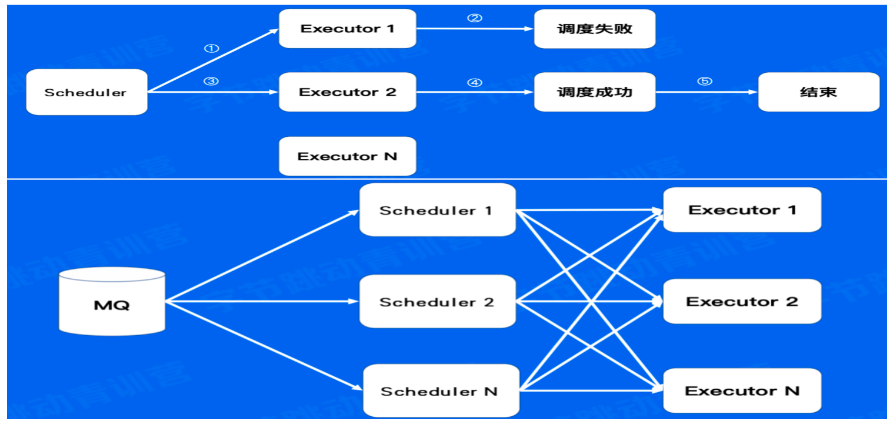
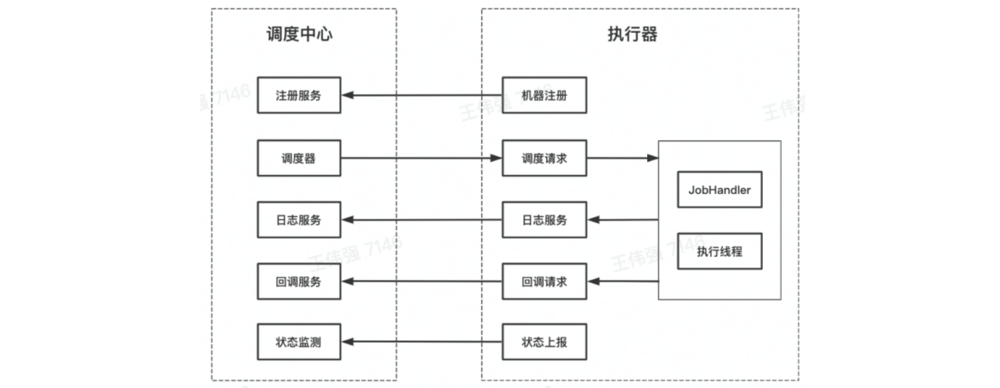

# 基本的定时任务

- `Windows`运行批处理文件
	
- `Windows`任务计划程序（右键`我的电脑`）
	
- `Linux`命令—`CronJob`
	
- 应用程序编码层—单机定时任务（`Timer—Java`、`Ticker—Go`、`ScheduledExecutorService`—线程池技术）
	
- 任务调度—`Quartz`（单任务极致控制、没有负载均衡机制）
	
- 分布式定时任务（平台化管理、分布式部署、支持海量数据）

# 分布式定时任务

- 定时任务是指系统为了自动完成特定任务，**实时、延时、周期性**完成任务调度的过程。
	
- 分布式定时任务是把分散的、可靠性差的定时任务纳入统一的平台，并实现集群管理调度和分布式部署的一种定时任务的管理方式。

按触发时机分类:
- 定时任务：特定时间触发，比如今天15:06执行
- 延时任务：延时触发，比如10s后执行
- 周期任务：固定周期时间，或固定频率周期调度触发，比如每天12点或者每隔5s执行

### 特点

- 自动化：全自动完成定时任务的认度和执行
- 平台化：基于平台化的思维管控系列的分布式定时任务
- 分布式：在分布式系统环境下运行任务调度，突破单机定时任务的性能瓶颈
- 伸缩性：采用集群方式部署，可随时按需扩缩容
- 高可用：单点故障不影响最终任结果，可以做到故障转移

### 执行方式

- 单机任务：随机触发一台机器执行任务，适用于计算量小、并发度低的任务
	
- 广播任务：广播到所有机器上执行同一个任务，比如所有机器一起清理日志
	
- Map任务：一个任务可以分出多个子任务，每个子任务负责一部分的计算。适用于计算量单机无法满足要求的任务
	
- MapReduce任务：在Map任务的基础上，还可以对所有子任务的结果做汇总计算，适用于计算量大，并且需要对子任务结果做汇总的任务

### 业内定时任务框架

### 比较

分布式定时任务VS单机定时任务
	
- 关系:
	- 都可以实现自动化的定时、延时、周期任务调度
- 差异:
	- 分布式定时任务可支撑更大的业务体量
	- 分布式定时任务的性能、伸缩性、稳定性更高

分布式定时任务VS大数据处理引擎
	
- 关系:
	- 都可以对海量数据做处理
	- 性能、伸缩性、稳定性都很高
- 差异:
	- 定时并不是大数据处理引擎要解决的核心问题
	- 大数据处理引擎往往致力于将源数据处理成结果数据，分布式定时任务除了能做这个之外，还可以调用HTTP和RPC服务

# 核心架构

分布式定时任务核心要解决**触发、调度、执行**三个关键问题

- 触发器：Trigger，解析任务，生成触发事件
	- 这个定时任务在什么时间点被准时准点的触发
	
- 调度器：Scheduler，分配任务，管理任务生命周期
	- 这个任务触发了怎么去协调机器来进行任务的调度
	
- 执行器：Executor，获取执行任务单元，执行任务逻辑
	- 单台机器怎么去把分配的任务执行好，遇到故障的回复等等

除此之外，还需要提供一个控制台(Admin)，:提供任务管理和干预的功能。

## 控制台

- 任务:Job，任务元数据
	- 任务元数据(Job)是用户对任务属性定义（who），包括任务类型调度时机（when）、执行行为（what）、执行方式（how）等
	
- 任务实例:Joblnstance,任务运行的实例
	- 任务实例(Joblnstance)是一个确定的 Job 的一次运行实例（Job_id、触发时间、状态&结果、过程消息）
	
- 任务结果:JobResult，任务实例运行的结果
- 任务历史:JobHistory，用户可以修改任务信息，任务实例对应的任务元数据可以不同，因而使用任务历史存储

## 触发器

**核心职责**
- 给定一系列任务，解析它们的触发规则，在规定的时间点触发任务的调度

**设计约束**
- 需支持大量任务
- 需支持秒级的调度
- 周期任务需要多次执行
-  需保证秒级扫描的高性能，并避免资源浪费

### 方案

时间轮 ( Quartz 所用方案)时间轮是一种高效利用线程资源进行批量化调度的一种调度模型。时间轮是一个存储环形队列，底层采用数组实现，数组中的每个元素可以存放一个定时任务列表。

不同业务之间，任务的调度相互影响怎么办？负责扫描和触发的机器挂了怎么办？

- 存储上：不同国别、业务做资源隔离
- 运行上：不同国别、业务分开执行
- 部署时：采用多机房集群化部署，避免单点故障，通过数据库锁或分布式锁保证任务只被触发一次

## 调度器

### 资源来源

- 业务系统提供资源（阿里、美团、字节）
    
    - 优点：任务执行逻辑与业务系统共用一份资源，利用率高
    - 缺点：更容易发生定时任务脚本影响在线业务的事故；不能由定时任务平台控制扩缩容
	
- 定时任务平台提供机器资源（字节）
    
    - 优点：任务执行逻辑与业务系统提供的在线服务隔离，避免相互影响，可以优化扩缩容
    - 缺点：消耗更多机器资源；需要额外为定时任务平台申请接口调用权限，而不能直接继承业务系统的权限

### 节点选择

- **随机节点执行**：选择集群中一个可用的执行节点执行调度任务。适用场景：定时对账，
- **广播执行**：在集群中所有的执行节点分发调度任务并执行。适用场景：批量运维。
- **分片执行**：按照用户自定义分片逻辑进行拆分，分发到集群中不同节点并行执行，提升资源利用效率。适用场景：海量日志统计。

**任务分片**：

### 高级特性

- **任务编排**：使用有向无环图 DAG(Directed Acyclic Graph)进行可视化任务编排
	- N个执行器Executor，M个业务数据区段，最好M>=N，且M是N的整数倍
	
- **故障转移**：分片任务基于一致性Hash策略分发任务，当某个执行器异常时，调度器会将任务分发到其他执行器。
	- 分片任务基于一致性hash策略分发任务，当某Executor异常时，调度器会将任务分发到其他Executor
	
- **高可用**：调度器可以集群部署，做到完全无状态，靠消息队列的重试机制保障任务一定会被调度。

上半图为故障转移的分发任务，下半图为高可用的消息队列重试机制

## 执行器

基于注册中心，可以做到执行器的弹性扩缩容

  