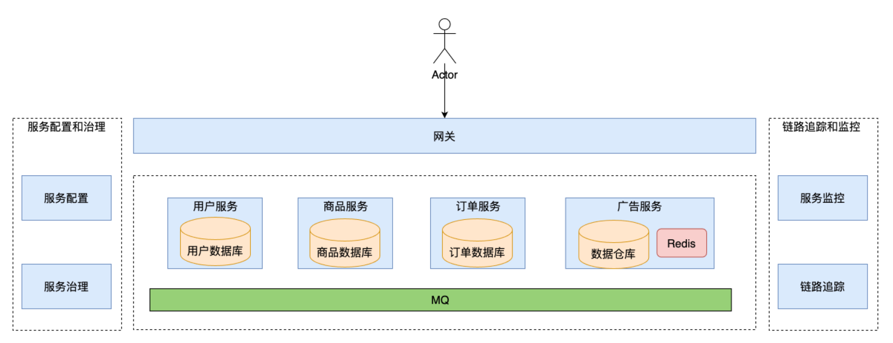
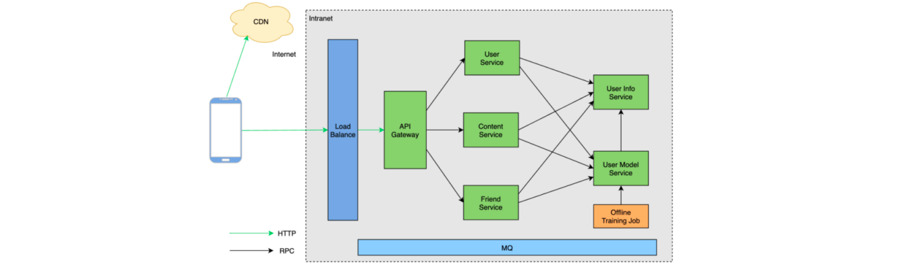
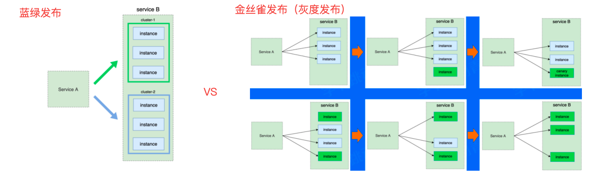
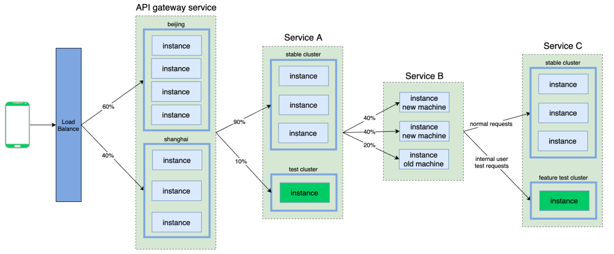
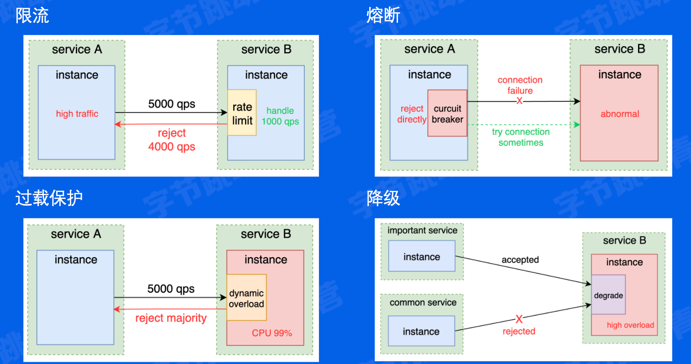

# 了解微服务架构

- 优势：
    
    1. 开发效率高、2. 业务独立设计、3. 自下而上、4. 故障隔离
- 劣势：
    
    1. 治理、运维难度高、2. 观测挑战、3. 安全性、4. 分布式系统的问题

## 核心要素

- 服务治理
	
	1. 服务注册、2. 服务发现、3. 负载均衡、4. 扩缩容、5. 流量治理、6. 稳定性治理

- 可观测性
	
	1. 日志采集、2. 日志分析、3. 监控打点、4. 监控大盘、5. 异常报警、6. 链路追踪

- 安全
	
	1. 身份验证、2. 认证授权、3. 访问令牌、4. 审计、5. 传输加密、5. 黑产攻击

# 微服务架构原理及特征

## 基本概念

- **服务**(service)
	
	- 一组具有**相同逻辑**的**运行实体**。

- **实例**(instance)
	
	- 一个服务中，每个运行实体即为一个实例。

- 实例与进程的关系
	
	- 实例与进程之间没有必然对应关系，可以一个实例可以对应一个或多个进程(反之不常见)

- 集群(cluster)
	
	- 通常指服务内部的逻辑划分，包含多个实例。

- 常见的实例承载形式
	
	- 进程、VM、k8s pod

- 有状态/无状态服务
	
	- 服务的实例是否存储了可持久化的数据(例如磁盘文件)。

### 服务间通信

对于单体服务，不同模块通信只是简单的函数调用。
对于微服务，服务间通信意味着网络传输。

### 服务注册及发现

在代码层面，我们如何去调用一个服务的地址？

答：加一层，新增一个统一的服务注册中心，用于存储服务名到服务实例的映射，类似于 DNS，但DNS问题也很多，例如：本地 DNS 存在缓存，导致延时负载均衡问题，不支持服务实例的探活检查域名无法配置端口等等

下图为服务实例上线与下线过程，讲师在讲这里时非常清晰很生动

### 流量特征

- 统一网关入口
- 内网通信多数采用RPC
- 网状调用链路

# 核心服务治理功能

## 服务发布

服务发布(deployment)，即指让一个服务升级运行新的代码的过程

常见的服务发布难点：
	
	1. 服务不可用、2. 服务抖动、3. 服务回滚 

讲解中讲了两种方法，都是之前有了解过的：
- 蓝绿发布：简单、但需要两倍资源（可以根据流量的错峰特性使用蓝绿发布）
- 金丝雀发布：过度平滑，但是在部署时进度在1%～99%时都有可能出现问题，需要回滚版本，这种维护能力需要平台级的设施提供支持。

## 流量治理

在微服务架构下，我们可以基于地区、集群、实例、请求等维度，对端到端流量的路由进行精确控制。

## 负载均衡

负载均衡((Load Balance)负责分配请求在每个下游实例上的分布。

常见的LB策略：
- 1. 绝对公平、2. 随机、3. 一次性哈希

## 稳定性治理

线上服务总是会出问题的，这与程序的正确性无关。

常见的问题：
- 1. 网络攻击、2. 流量突增、3. 机房断电、4. 光纤被挖、5. 机械故障、6. 网络故障、 7. 机房空调故障

微服务架构中典型的稳定性治理功能：
- 1. 限流、2. 熔断、3. 过载保护、4. 降级

# 重试

本地函数调用可能出现的问题：
- 1. 参数非法、2. OOM (Out Of Memory)、3. NPE (Null Pointer Exception)、4. 边界 case
- 5. 系统崩溃、6. 死循环、7. 程序异常退出

远程函数调用可能出现的问题：
- 1. 网络抖动、2. 下游负载高导致超时、3. 下游机器宕机、4. 本地机器负载高，调度超时、5. 下游熔断、限流

**本地函数重试基本上是没有意义的**，而远程函数重试则有意义，因为其发生请求错误的原因可能不是下游程序编写出错

## 重试的意义

- 降低错误率：单次错误概率为0.01，连续错误两次概率为0.0001
- 降低长尾延迟：对于偶尔耗时较长的请求，重试请求有机会提前返回
- 规避暂时性错误：网络抖动
- 避开下游故障实例：一个服务可能会有少量故障实例（如机器故障），重试可以将请求打到其他机器

## 重试的难点

- 幂等性
	
	- 幂等性是指多次执行同一操作，结果与执行一次相同，确保了即使请求被多次发送，也不会引发重复操作或数据不一致的问题

- 超时设置
	
	- 超时设置是重试机制中的关键环节，合理的超时时间可以避免系统资源被无效占用，同时也能减少重试风暴的风险

- 重试风暴
	- 重试风暴是指由于重试策略配置不当，导致系统在短时间内收到大量重试请求，从而引发系统过载甚至崩溃的现象

## 重试策略

- 限制重试比例
	
	- 设定一个重试比例阈值（例如1%），重试此处占所有请求比例不超过该阈值。

- 防止链路重试
	
	- 链路层面的防重试风暴的核心是限制每层都发生重试，理想情况下只有最下一层发生重试，可以返回特殊的 status 表明“请求失败，但别重试”

- 对冲请求（Hedged requests）
	
	- 对于可能超时(或延时高)的请求，重新向另一个下游实例发送一个相同的请求，并等待先到达的响应,

## 重试效果验证

讲解中有举例，字节跳动工作组有做过对应的实验并产出结论

