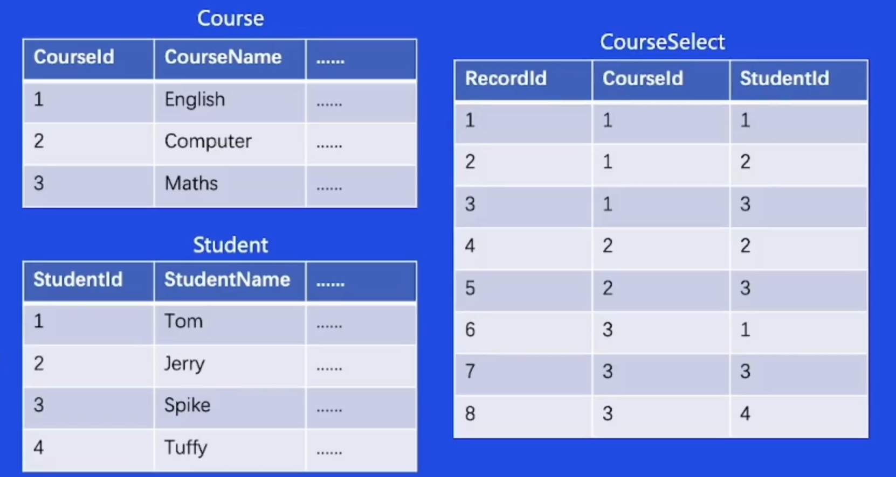
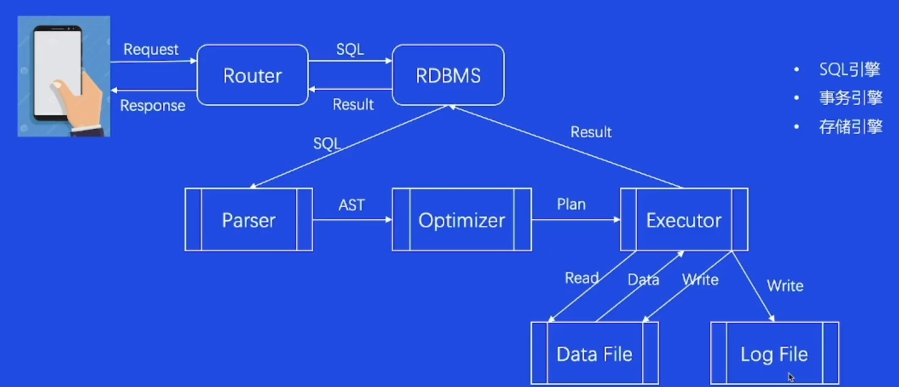

# ACID

**ACID**：
- 原子性( tomicity):事务是一个不可再分割的工作单元,事务中的操作要么都发生，要么都不发生。
- 一致性( onsistency):数据库事务不能破坏关系数据的完整性以及业务逻辑上的一致性，每个操作都必须是合法的。
- 隔离性( solation):多个事务并发访问时,事务之间是隔离的,一个事务不应该影响其它事务运行效果，类似于串行操作。
- 持久性(Curability):在事务完成以后，该事务所对数据库所作的更改便持久的保存在数据库之中，并不会被回滚。

# 模型

1960s，传统的文件系统已经不能满足人们的需要，数据库管理系统(DBMS)应运而生DBMS:按照某种数据模型来组织、存储和管理数据的仓库。所以通常按照数据模型的特点将传统数据库系统分成网状数据库、层次数据库和关系数据库三类。

## 网状模型

把每个数据作为一个节点，构成一个网状的结构，每个父节点可以有多个子节点，一个子节点也可以有多个父节点，多对多

## 层次模型

层次模型是一个树形模型，层次模型和网状模型特别相像，最大的不同是每个父节点可以有多个子节点，但每个子节点只能有一个父节点，一对多

## 关系模型

把所有的关系都存放在一个或多个二维表里，就是我们现在所使用的数据库模型

## 优势与劣势

| 模型类型 | 优势                                                       | 劣势                                                         |
| ---- | -------------------------------------------------------- | ---------------------------------------------------------- |
| 网状模型 | - 能直接描述现实世界 - 存取效率较高                                  | - 结构复杂 - 用户不易使用 - 访问程序设计复杂                           |
| 层次模型 | - 结构简单 - 查询效率高 - 可以提供较好的完整性支持                      | - 无法表示M:N的关系 - 插入、删除限制多 - 遍历子节点必须经过父节点 - 访问程序设计复杂 |
| 关系模型 | - 实体及实体间的联系都通过二维表结构表示 - 可以方便的表示M:N关系 - 数据访问路径对用户透明 | - 关联查询效率不够高 - 关系必须规范化                                   |
# SQL

- 语法风格接近自然语言;
- 高度非过程化;
- 面向集合的操作方式;
- 语言简洁，易学易用。

一条SQL语句的执行：

- Parser：语法解析器
- AST：语法树
- Optimizer：优化器
- Plan：生成一个树状结构PlanTree
- Executor：执行器
==其中Parsser、Optimizer、Executor都是SQL引擎，DataFile、LogFile都是存储引擎，事物引擎没有显示的表现在图上==

## Parser

解析器(Parser)一般分为词法分析(Lexical analysis)、语法分析(Syntax analysis)、语义分析(Semantic analyzer)等步骤。

## Optimizer

作用是在多种可能中选取最优的那种

### 基于规则的优化（**RBO**  Rule  Base Optimizer）

- 条件优化
	- a > b & a > 5  -->  a > 5 & b > 5
	- a > 5 & a < b & b = 1 -->  false

- 表连接优化
	- 总是小表先进行连接

- Scan优化
	- 唯一索引
	- 普通索引
	- 全表扫描

### 基于代价的优化（**CBO**  Cost Base Optimizer）

一个查询有多种执行方案，CBO会选择其中代价最低的方案去真正的执行

例如：时间，IO，CPU，NET，内存

## 存储引擎

### InnoDB

- 支持行锁，采用MVCC来支持高并发，有可能死锁
- 支持事务
- 支持外键
- 支持崩溃后的安全恢复
- 不支持全文索引

### B+Tree

页面内页目录中使用二分法快速定位到对应的槽，然后再遍历该槽对应分组中的记录即可快速找到指定的记录。
从根到叶，中间节点存储

## 事物日志

- **Atomicity & Undo log**
	 - Undo Log是**逻辑日志**，记录的是数据的增量变化。利用Undo Log可以进行事务回滚，从而保证事务的原子性。同时也实现了多版本并发控制(MVCC)解决读写冲突和一致性读的问题

- **Isolation & MVCC**
	- MVCC的意义:
		- 读写互不阻塞;
		- 降低死锁概率;
		- 实现一致性读。

- **Durability & Redo Log**
	- redo log是**物理日志**，记录的是页面的变化，它的作用是保证事务持久化。如果数据写入磁盘前发生故障，重启MySQL后会根据redo loq重做。

# 大流量

以下为缩写，有需要对照去查资料

## Sharding

问题背景
- 单节点写容易成为瓶颈单机数据容量上限

解决方案
- 业务数据进行水平拆分代理层进行分片路由

实施效果
- 数据库写入性能线性扩展数据库容量线性扩展

## 扩容

问题背景
- 活动流量上涨集群性能不满足要求

解决方案
- 扩容DB物理节点数量利用影子表进行压测

实施效果
- 数据库集群提供更高的吞吐保证集群可以承担预期流量

## 代理连接池

问题背景
- 突增流量导致大量建联大量建联导致负载变大，延时上升

解决方案
- 业务侧预热连接池
- 代理侧预热连接池
- 代理侧支持连接队列

实施效果
- 避免 DB 被突增流量打死避免代理和 DB 被大量建联打死