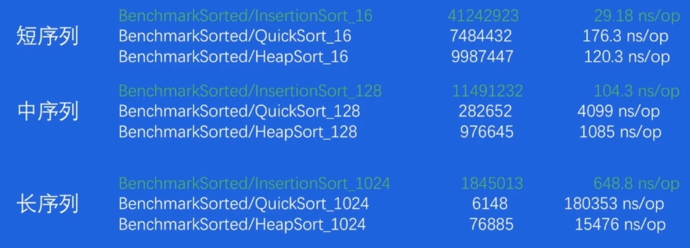

# 排序

## Insertion Sort 插入排序

将元素不断插入已经排序好的 array 中
- 起始只有一个元素5，其本身是一个有序序列
- 后续元素插入有序序列中，即不断交换，直到找到第一个比其小的元素

| Best | Avg    | Worst  |
| ---- | ------ | ------ |
| O(n) | O(n^2) | O(n^2) |

缺点
- 平均和最坏情况的时间复杂度高达 O(n^2)

优点
- 最好情况时间复杂度为O(n)

总结：插入排序平均和最坏情况时间复杂度都是 O(n^2)

## Quick Sort 快速排序

分治思想，不断分割序列直到序列整体有序
- 选定一个 pivot (轴点)
- 使用 pivot 分割序列，分成元素比 pivot 大 和元素比 pivot 小两个序列

| Best        | Avg         | Worst  |
| ----------- | ----------- | ------ |
| O(n * logn) | O(n * logn) | O(n^2) |

缺点
- 平均和最坏情况的时间复杂度高达 O(n * logn)

优点
- 最好情况时间复杂度为O(n^2)

总结：快速排序整体性能处于中间层次

## Heap Sort 堆排序

大顶堆和小顶堆
- 小顶堆是根节点比子节点小
- 大顶堆是根节点比子节点大

| Best        | Avg         | Worst       |
| ----------- | ----------- | ----------- |
| O(n * logn) | O(n * logn) | O(n * logn) |
总结：众生平等堆排序性能稳定

## 实际场景 benchmark

根据序列元素排列情况划分
- 完全随机的情况(random)
- 有序/逆序的情况 (sorted/reverse)
- 元素重复度较高的情况(mod8)
在此基础上，还需要根据序列长度的划分(16/128/1024)

### random

- 插入排序在短序列中速度最快
- 快速排序在其他情况中速度最快
- 堆排序速度于最快算法差距不大

### sorted

- 插入排序在序列已经有序的情况下最快

总结：
- 所有短序列和元素有序情况下，插入排序性能最好
- 在大部分的情况下，快速排序有较好的综合性能
- 几乎在任何情况下，堆排序的表现都比较稳定

# pdqsort (pattern-defeating-quicksort)

是一种不稳定的混合排序算法，它的不同版本被应用在 C++ BOOST、Rust 以及 Go 1.19 中。它对常见的序列类型做了特殊的优化，使得在不同条件下都拥有不错的性能

结合三种排序方法的优点
- 对于短序列(小于一定长度)，我们使用插入排序
- 其他情况，使用快速排序来保认整体性能
- 当快速排序表现不佳时，使用堆排序来保证最坏情况下时间复杂度仍然为 O(n*logn)

当最终 pivot 的位置离序列两端很接近时(距离小于 length/8)判定其表现不佳，当这种情况的次数达到 limit(即 bits.Len(length)时，切换到堆排序

### pivot的选择

- 使用第一个元素作为pivot（最简单的方案）
实现简单，但是往往效果不好，如果在sorted情况下性能会很差
- 遍历数组，寻找真正的中位数
遍历比对代价很高，性能不好

优化-Pivot 的选择
- 短序列(<=8)，选择固定元素
- 中序列(<=50)，采样三个元素，median of three
- 长序列(>50)，:采样九个元素，median of medians

同时Pivot 的采样方式使得我们有探知序列当前状态的能力
- 如果采样的元素都是逆序排序，那我们可能推出序列已经逆序，我们只需要翻转整个序列
- 如果采样的元素都是顺序排序，那我们可能推出序列已经顺序，在前面我们已经探究出插入排序对有序序列效率更高，在这里就使用插入排序

注：**插入排序实际使用 partiallnsertionSort，即有限制次数的插入排序**，因为插入排序在一般序列性能表现是比较差的，我们只是认为可能有顺序的可能，不是真正的有序，用partiallnsertionSort可以限制插入的次数

如果两次 partition 生成的 pivot 相同，即 partition 进行了无效分割,此时认为 pivot 的值为重复元素

优化-重复元素较多的情况(partitonEqual)
当检测到此时的 pivot 和上次相同时(发生在 leftSubArray)，使用partitionEqual 将重复元素排列在一起，减少重复元素对于 pivot 选择的干扰

| Best | Avg         | Worst       |
| ---- | ----------- | ----------- |
| O(n) | O(n * logn) | O(n * logn) |

