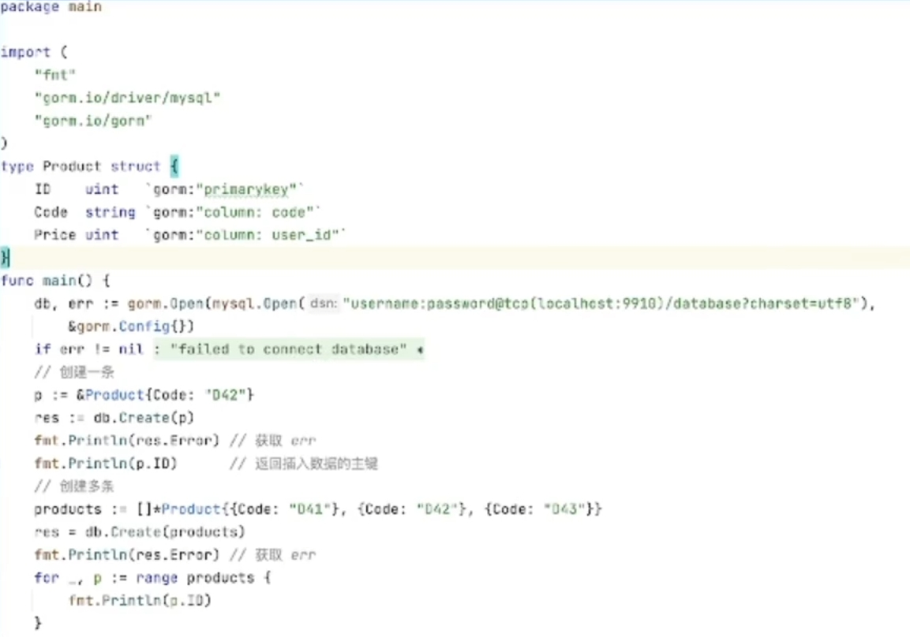
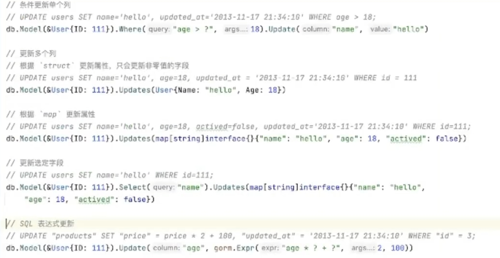
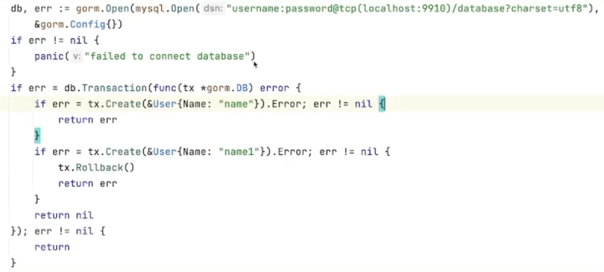

## Gorm 的基本使用

/p1.png)

相关文档 https://gorm.io/zh_CN/docs/index.html

gorm目前支持 MySQL、SQLServer、PostgreSQL、SQLite

以 MySQL 为例：
```go
import (
  "gorm.io/driver/mysql"
  "gorm.io/gorm"
)

func main() {
  // 参考 https://github.com/go-sql-driver/mysql#dsn-data-source-name 获取详情
  dsn := "user:pass@tcp(127.0.0.1:3306)/dbname?charset=utf8mb4&parseTime=True&loc=Local"
  db, err := gorm.Open(mysql.Open(dsn), &gorm.Config{})
}
```

或者可以更详细的配置：
```go
db, err := gorm.Open(mysql.New(mysql.Config{
  DSN: "gorm:gorm@tcp(127.0.0.1:3306)/gorm?charset=utf8&parseTime=True&loc=Local", // DSN data source name
  DefaultStringSize: 256, // string 类型字段的默认长度
  DisableDatetimePrecision: true, // 禁用 datetime 精度，MySQL 5.6 之前的数据库不支持
  DontSupportRenameIndex: true, // 重命名索引时采用删除并新建的方式，MySQL 5.7 之前的数据库和 MariaDB 不支持重命名索引
  DontSupportRenameColumn: true, // 用 `change` 重命名列，MySQL 8 之前的数据库和 MariaDB 不支持重命名列
  SkipInitializeWithVersion: false, // 根据当前 MySQL 版本自动配置
}), &gorm.Config{})
```

### 创建数据



我们可以使用 `clause.OnConflict` 处理数据冲突
`DoNothing: true` 意思是遇到数据冲突不做任何改变 
```go
p:=&Product{Code:"D42"，ID:1}
db.Clauses(clause.OnConflict{DoNothing: true}).Create(&p)
```

可以使用 `default` 标签为字段定义默认值
```go
type User struct {
	ID      int64
	Name    string `gorm:"default:galeone"`
	Age     int64  `gorm:"default:18"`
}
```

### 查询数据


需要注意的点：

- 使用 First 时，需要注意查询不到数据会返回 ErrRecordNotFound
	
- 使用 Find 查询多条数据，查询不到数据不会返回错误
	
- 当使用结构作为条件查询时，GORM 只会查询非零值字段。这意味着如果您的字段值为 0、"、false 或其他 零值，该字段不会被用于构建查询条件，使用Map 来构建查询条件。

### 更新数据



使用 Struct 更新时，只会更新非零值，如果需要更新零值可以使用 Map 更新或使用Select 选择字段。


### 删除数据

#### 物理删除


#### 软删除

GORM 提供了 gorm.DeletedAt 用于帮助用户实现软删

拥有软删除能力的 Model 调用 Delete 时，记录不会被从数据库中真正删除。但 GORM 会将 DeletedAt 置为当前时间并且你不能再通过正常的查询方法找到该记录。

使用 Unscoped 可以查询到被软删的数据


### 事物

Gorm 提供了 Begin、Commit、Rollback 方法用于使用事务

/p6.png)

- 特别注意的点，db.Begin() 后会生成一个变量，我们后续的操作都是通过后面的变量


Gorm 提供了 Tansaction 方法用于自动提交事务，避免用户漏写 Commit、Rollbcak




