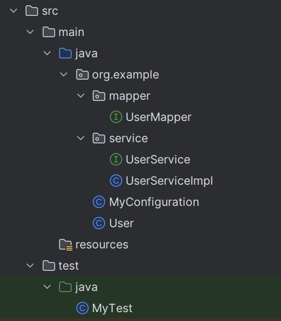

## 所需基本依赖

```xml
<dependencies>
        <!-- https://mvnrepository.com/artifact/org.springframework/spring-webmvc -->
        <dependency>
            <groupId>org.springframework</groupId>
            <artifactId>spring-webmvc</artifactId>
            <version>6.1.12</version>
        </dependency>

        <dependency>
            <groupId>junit</groupId>
            <artifactId>junit</artifactId>
            <version>4.12</version>
        </dependency>

        <dependency>
            <groupId>org.springframework</groupId>
            <artifactId>spring-core</artifactId>
            <version>6.1.12</version>
        </dependency>
    </dependencies>
```
# 配置文件注册bean

## 配置文件基础模板
```xml
<?xml version="1.0" encoding="UTF-8"?>  
<beans xmlns="http://www.springframework.org/schema/beans"  
       xmlns:xsi="http://www.w3.org/2001/XMLSchema-instance"  
       xmlns:context="http://www.springframework.org/schema/context"  
       xmlns:aop="http://www.springframework.org/schema/aop"  
       xsi:schemaLocation="http://www.springframework.org/schema/beans  
       https://www.springframework.org/schema/beans/spring-beans.xsd       http://www.springframework.org/schema/context       https://www.springframework.org/schema/context/spring-context.xsd       http://www.springframework.org/schema/aop       https://www.springframework.org/schema/aop/spring-aop.xsd">

</beans>
```

- 使用配置文件注册一个bean最简单的方式，参数为 null
```xml
<bean id="hello" class="org.example.pojo.HelloWorld"/>  
```

- 如果 bean 需要传入参数，并且希望是通过有参构造来创建
```xml
<bean id="hello" class="org.example.pojo.HelloWorld">  
    <constructor-arg name="message" value="Hello World!"/>
</bean>
```

- 如果bean需要传入参数，并且希望是通过无参构造来创建
- property 里的参数同上
```xml
<bean id="hello" class="org.example.pojo.HelloWorld">  
    <property name="message" value="Hello World!"/>
</bean>
```

## 关于配置文件注册bean
- 赋值的原理是通过类中的set注入
- id 相当于一个变量名，class 是类文件路径来源，还可以加个 name 作为 别名，注意 ==id 开头小写==
- 有参构造和无参构造中的 name 是参数名， value 是默认传入的值
- ==constructor-arg通过有参构造创建，创建对象的同时赋值==  
- ==property通过无参构造创建，创建对象后，再通过set方法赋值==

## 导入其他配置文件里的内容
```xml
<import resource="其他Spring配置文件.xml"/>
```
导入的配置文件和本身共有注册 bean，优先用自己的
## 赋值方法

### 1、下标赋值
```xml
<bean id="hello" class="org.example.pojo.HelloWorld">  
    <constructor-arg index="0" value="Hello World!"/>
</bean>
```

### 2、通过类型赋值
```xml
<bean id="hello" class="org.example.pojo.HelloWorld">  
    <constructor-arg type="java.lang.String" value="Hello World!"/></bean>
```
缺陷：
### 3、通过参数名赋值
```xml
<bean id="hello" class="org.example.pojo.HelloWorld">  
    <constructor-arg name="message" value="Hello World!"/>
</bean>
```

## 获取bean
```java
ApplicationContext context = new ClassPathXmlApplicationContext("Spring配置文件.xml");
类 变量名 = context.getBean("beanID", 类.class);
```

# Autowired

自动装填
@Autowired 先判断byType，再判断byName
```java
public class People {  
    // 等价于@Nullable，对象可以为null  
    @Autowired(required = false)  
    private Cat cat;  
    @Autowired  
    // @Autowired 先判断byType，再判断byName  
    @Qualifier(value = "dog")  
    // 如果自动装配的环境比较复杂，无法通过一个@Autowired完成时，就要使用@Qualifer(value = "***")指定bean名  
    private Dog dog;  
    private String name;  
}
```

## 按照原本的配置方式

```xml
<bean id="people" class="org.example.pojo.People">
        <property name="cat" ref="cat"/>
        <property name="dog" ref="dog"/>
        <property name="name" value="呵帅"/>
    </bean>
```

## 使用Autowired自动装配

### 开启注解的支持
```xml
<context:annotation-config/>
```

### 注册bean
```xml
<bean id="people" class="org.example.pojo.People" autowire="byName">  
    <property name="name" value="呵帅"/>  
</bean>
```

我们使用完Autowired自动装配后，就可以不在配置文件里面配置参数对象
但是有几点需要注意：
- byName:按照属性名自动装配，和对象中set注入方法中的属性名一致  
- byType:按照属性类型自动装配，和对象中的set方法里的属性类型一致
- 使用byType必须保证类型全局唯一，否则会报错  
- 使用byName必须保证属性名全局唯一，否则会报错

### 修改自动装配方式
```xml
<bean id="people" class="org.example.pojo.People" autowire="byName">  
    <property name="name" value="呵帅"/>  
</bean>
```
把 autowire 里面的参数修改成 byName 或者 byType 即可，默认为 byType

# 依赖注入DI（Dependecy Injection）

- **依赖注入是从应用程序的角度在描述，应用程序依赖容器创建并注入它所需要的外部资源**

## 注入方式

- **第一种，普通值注入，value
```xml
<property name="name" value="John"/>
```

- **第二种，引用注入，ref
```xml
<property name="address" ref="address"/>
```

- **第三种，数组注入，array
```xml
<property name="friends" >
     <array>
        <value>Jane</value>
        <value>Tom</value>
        <value>Mary</value>
    </array>
</property>
```

- **第四种，键值对，map
```xml
<property name="cards">
    <map>
        <entry key="身份证" value="123456789012345678"/>
    <entry key="银行卡" value="987654321098765432"/>
	    <entry key="信用卡" value="54444"/>
	</map>
</property>
```

- **第五种，list注入，list

```xml
<property name="courses">
            <list>
                <value>Java</value>
                <value>Python</value>
                <value>C++</value>
            </list>
        </property>
```

- **第六种，set注入，set

```xml
<property name="interests">
            <set>
                <value>篮球</value>
                <value>足球</value>
                <value>乒乓球</value>
            </set>
        </property>
```

## 命名空间

### P 命名空间

- **spring中的p命名空间就是为了更加方便的使用set方法注入属性内容，可以直接注入属性值，property
- 首先我们需要引入对应这个p命名空间的xml约束
```xml
xmlns:p="http://www.springframework.org/schema/p"
```

举个例子
```java
public class User {
    private String name;
    private int age;
    
    public String getName() {
        return name;
    }

    public void setName(String name) {
        this.name = name;
    }

    public int getAge() {
        return age;
    }

    public void setAge(int age) {
        this.age = age;
    }
}
```

按照我们原来的写法应该是这么写

```xml
<bean id="User" class="org.example.pojo.User">
	<property name="age" value="18"/>
	<property name="name" value="呵帅">
</bean>
```

改用P命名空间后是这样

```xml
<bean id="user" class="org.example.pojo.User" p:name="呵帅" p:age="18" scope="singleton"/>
```
- 设置代理模式：scope，默认scope是singleton单例模式
- 单例模式只允许创建一个实例，后续通过id获取的都是同一个实例
- 原型模式prototype，允许创建多个实例，每次获取都是新的实例

### C 命名空间

- **spring中的c命名空间就是为了更加方便的使用有参构造方法注入，通过构造器注入，constructor-arg
- c命名空间注入，通过构造器注入，constructor-arg
- 首先我们需要引入对应这个p命名空间的xml约束
```xml
xmlns:c="http://www.springframework.org/schema/c"
```

- **通过使用名称的方式
```xml
<bean id="user2" class="org.example.pojo.User" c:name="呵帅2" c:age="18" scope="prototype"/>
```

- **通过使用索引的方式
```xml
<bean id="user2" class="org.example.pojo.User" c:_0="呵帅2" c:_1="18" scope="prototype"/>
```

# mybatis


- DataSource：使用Spring的数据源代替mybatis的配置 c3p0 dbcp druid这是使用Spring提供的JDBC：org.springframework.jdbc.datasourceDataSource
- 使用Spring的数据源代替mybatis的配置 c3p0 dbcp druid这是使用Spring提供的JDBC：org.springframework.jdbc.datasource

## 添加maven

```xml
<dependencies>
        <dependency>
            <groupId>junit</groupId>
            <artifactId>junit</artifactId>
            <version>4.13.1</version>
        </dependency>

        <dependency>
            <groupId>mysql</groupId>
            <artifactId>mysql-connector-java</artifactId>
            <version>8.0.27</version>
        </dependency>

        <dependency>
            <groupId>org.mybatis</groupId>
            <artifactId>mybatis</artifactId>
            <version>3.5.7</version>
        </dependency>

        <dependency>
            <groupId>org.springframework</groupId>
            <artifactId>spring-webmvc</artifactId>
            <version>5.1.13.RELEASE</version>
        </dependency>

        <!--Spring操作数据库还需要一个spring-jdbc的依赖-->
        <dependency>
            <groupId>org.springframework</groupId>
            <artifactId>spring-jdbc</artifactId>
            <version>5.1.13.RELEASE</version>
        </dependency>

        <dependency>
            <groupId>org.aspectj</groupId>
            <artifactId>aspectjweaver</artifactId>
            <version>1.9.4</version>
        </dependency>

        <!-- https://mvnrepository.com/artifact/org.mybatis/mybatis-spring -->
        <dependency>
            <groupId>org.mybatis</groupId>
            <artifactId>mybatis-spring</artifactId>
            <version>3.0.4</version>
        </dependency>

        <dependency>
            <groupId>org.projectlombok</groupId>
            <artifactId>lombok</artifactId>
            <version>1.18.36</version>
        </dependency>

    </dependencies>
```

## 配置文件mybatis

需要使用的文件

```xml
<?xml version="1.0" encoding="UTF-8"?>  
<beans xmlns="http://www.springframework.org/schema/beans"  
       xmlns:xsi="http://www.w3.org/2001/XMLSchema-instance"  
       xmlns:aop="http://www.springframework.org/schema/aop"  
       xsi:schemaLocation="http://www.springframework.org/schema/beans  
       http://www.springframework.org/schema/beans/spring-beans.xsd        http://www.springframework.org/schema/aop        http://www.springframework.org/schema/aop/spring-aop.xsd">  
  
    <!--DataSource：使用Spring的数据源代替mybatis的配置 c3p0 dbcp druid    这是使用Spring提供的JDBC：org.springframework.jdbc.datasource  
    -->    <bean id="dataSource" class="org.springframework.jdbc.datasource.DriverManagerDataSource">  
        <property name="driverClassName" value="com.mysql.cj.jdbc.Driver"/>  
        <property name="url" value="jdbc:mysql://localhost:3306/mybatis_lean"/>  
        <property name="username" value="root"/>  
        <property name="password" value="Abc123"/>  
    </bean>  
    <!--sqlSessionFactory-->  
    <bean id="sqlSessionFactory" class="org.mybatis.spring.SqlSessionFactoryBean">  
        <property name="dataSource" ref="dataSource"/>  
        <!--绑定mybatis配置文件-->  
        <property name="configLocation" value="classpath:mybatis-config.xml"/>  
        <property name="mapperLocations" value="classpath:org/example/mapper/*.xml"/>  
    </bean>  
    <!--SqlSessionTemplate：就是我们之前使用的sqlSession   Template：模板-->  
    <bean id="sqlSession" class="org.mybatis.spring.SqlSessionTemplate">  
        <!--只能使用构造器注入，这是因为没有set方法-->  
        <constructor-arg index="0" ref="sqlSessionFactory"/>  
    </bean>  
</beans>
```

resource/applicationContext.xml
```xml
<?xml version="1.0" encoding="UTF-8"?>  
<beans xmlns="http://www.springframework.org/schema/beans"  
       xmlns:xsi="http://www.w3.org/2001/XMLSchema-instance"  
       xmlns:aop="http://www.springframework.org/schema/aop"  
       xsi:schemaLocation="http://www.springframework.org/schema/beans  
       http://www.springframework.org/schema/beans/spring-beans.xsd        http://www.springframework.org/schema/aop        http://www.springframework.org/schema/aop/spring-aop.xsd">  
  
    <import resource="spring-dao.xml"/>  
  
    <bean id="userMapper" class="org.example.mapper.UserMapperImpl">  
        <property name="sqlSession" ref="sqlSession"/>  
    </bean>  
    <bean id="userMapper2" class="org.example.mapper.UserMapperImpl2">  
        <property name="sqlSessionFactory" ref="sqlSessionFactory"/>  
    </bean></beans>
```

org/example/mapper/UserMapper.xml
```xml
<?xml version="1.0" encoding="UTF-8" ?>  
<!DOCTYPE mapper  
        PUBLIC "-//mybatis.org//DTD Config 3.0//EN"  
        "http://mybatis.org/dtd/mybatis-3-mapper.dtd">  
<mapper namespace="org.example.mapper.UserMapper">  
  
    <select id="selectUser" resultType="user">  
        SELECT * FROM mybatis_lean.user;  
    </select>  
  
    <insert id="addUser" parameterType="user">  
        insert into mybatis_lean.user (id, name, pwd) values (#{id}, #{name}, #{pwd});  
    </insert>  
    <delete id="deleteUser" parameterType="int">  
        delete from mybatis_lean.user where id = #{id};  
    </delete>  
  
</mapper>
```

## 注解开发mybatis

需要使用的文件



可以清晰的看出，少了很多不必要的文件

用类 MyConfiguration.class 文件代替配置文件 
```java
package org.example;  
  
import org.apache.ibatis.datasource.pooled.PooledDataSource;  
import org.mybatis.spring.SqlSessionFactoryBean;  
import org.mybatis.spring.annotation.MapperScan;  
import org.springframework.context.annotation.Bean;  
import org.springframework.context.annotation.ComponentScan;  
import org.springframework.context.annotation.Configuration;  
  
import javax.sql.DataSource;  
  
@Configuration  
@ComponentScan("org.example.service")  
@MapperScan("org.example.mapper")  
public class MyConfiguration {  
  
    @Bean  
    public DataSource dataSource() {  
        return new PooledDataSource("com.mysql.cj.jdbc.Driver", "jdbc:mysql://localhost:3306/mybatis_lean", "root", "Abc123");  
  
    }  
  
    @Bean  
    public SqlSessionFactoryBean sqlSessionFactoryBean() {  
        SqlSessionFactoryBean bean = new SqlSessionFactoryBean();  
        bean.setDataSource(dataSource());  
        return bean;  
    }  
  
}
```

mapper 层接口
```java
package org.example.mapper;  
  
import org.apache.ibatis.annotations.Delete;  
import org.apache.ibatis.annotations.Insert;  
import org.apache.ibatis.annotations.Select;  
import org.example.User;  
  
import java.util.List;  
  
public interface UserMapper {  
    @Select("select * from user")  
    public List<User> selectUser();  
    @Insert("insert into user(id, name, pwd) VALUES(#{id}, #{name}, #{pwd})")  
    public int addUser(User user);  
    @Delete("delete from user where id=#{id}")  
    public int deleteUser(int id);  
}
```

service 层接口
```java
package org.example.service;  
  
import org.example.User;  
  
import java.util.List;  
  
public interface UserService {  
    public List<User> selectUser();  
    public int addUser(User user);  
    public int deleteUser(int id);  
}
```

service 层实现类
```java
package org.example.service;  
  
import org.example.User;  
import org.example.mapper.UserMapper;  
import org.springframework.beans.factory.annotation.Autowired;  
import org.springframework.stereotype.Service;  
  
import java.util.List;  
  
@Service  
public class UserServiceImpl implements UserService{  
  
    @Autowired  
    UserMapper mapper;  
  
    @Override  
    public List<User> selectUser() {  
        return mapper.selectUser();  
    }  
  
    @Override  
    public int addUser(User user) {  
        return mapper.addUser(user);  
    }  
  
    @Override  
    public int deleteUser(int id) {  
        return mapper.deleteUser(id);  
    }  
}
```

# AOP

简单来说就是就是在运行期间加些事件进去

## 方式一：使用原生的Spring API接口

- **配置aop：需要导入aop的命名空间

```xml
<aop:config>  
    <!--配置切入点  expression：表达式，execution(要执行的位置 修饰词 返回值，列名 方法名 参数)-->  
    <aop:pointcut id="pointcut" expression="execution(* org.example.service..userServiceImpl.*(..))"/>  
  
    <!--执行环绕增强-->  
    <!--相当于将log这个类切入到pointcut上-->  
    <aop:advisor advice-ref="log" pointcut-ref="pointcut"/>  
    <aop:advisor advice-ref="afterLog" pointcut-ref="pointcut"/>  
</aop:config>
```

实现 AfterReturningAdvice
- 在方法执行后运行
```java
package org.example.Log;  
  
import org.springframework.aop.AfterReturningAdvice;  
  
import java.lang.reflect.Method;  
  
public class AfterLog implements AfterReturningAdvice {  
    @Override  
    public void afterReturning(Object returnValue, Method method, Object[] args, Object target) throws Throwable {  
        System.out.println("执行力" + method.getName() + "方法后，返回值为：" + returnValue);  
    }  
}
```

实现 MethodBeforeAdvice
- 在方法执行前运行
```java
package org.example.Log;  
  
import org.springframework.aop.MethodBeforeAdvice;  
  
import java.lang.reflect.Method;  
  
public class log implements MethodBeforeAdvice {  
    @Override  
    // method：要执行的目标对象的方法  
    // args：目标对象方法的参数  
    // target：目标对象  
    public void before(Method method, Object[] args, Object target) throws Throwable {  
        System.out.println(target.getClass().getName() + "的" + method.getName() + "被执行了");  
  
    }  
}
```

## 方式二：自定义类

```xml
<bean id="diy" class="org.example.diy.DiyPointCut"/>
<aop:config>  
    <!--自定义切面，ref 要引用的类-->  
    <aop:aspect ref="diy">  
        <!--切入点-->  
        <aop:pointcut id="pointcut" expression="execution(* org.example.service.userServiceImpl.*(..))"/>  
        <!--通知-->  
        <aop:before method="before" pointcut-ref="pointcut"/>  
        <aop:after method="after" pointcut-ref="pointcut"/>  
  
    </aop:aspect>  
</aop:config>
```

自定义的类
```java
package org.example.diy;  
  
public class DiyPointCut {  
  
    public void before() {  
        System.out.println("==========方法执行前===========");  
    }  
  
    public void after() {  
        System.out.println("==========方法执行后===========");  
  
    }  
}
```

## 方式三：使用注解开发

- 开启注解支持  JDK（默认 expose-proxy="false"）  cglib（expose-proxy="true"）

```xml
<aop:aspectj-autoproxy expose-proxy="false"/>
```

```java
package org.example.diy;  
  
import org.aspectj.lang.ProceedingJoinPoint;  
import org.aspectj.lang.annotation.After;  
import org.aspectj.lang.annotation.Around;  
import org.aspectj.lang.annotation.Aspect;  
import org.aspectj.lang.annotation.Before;  
  
//使用注解方式实现AOP  
  
@Aspect // 标注这个类是一个切面  
public class AnnotationPointCut {  
    @Before("execution(* org.example.service.userServiceImpl.*(..))")  
    public void before() {  
        System.out.println("====方法执行前====");  
    }  
  
    @After("execution(* org.example.service.userServiceImpl.*(..))")  
    public void after() {  
        System.out.println("====方法执行后====");  
    }  
  
    @Around("execution(* org.example.service.userServiceImpl.*(..))")  
    public void around(ProceedingJoinPoint pj) throws Throwable {  
        System.out.println("方法执行前");  
  
        // 执行方法  
        pj.proceed();  
  
        System.out.println("方法执行后");  
    }  
}
```

## 调用运行
```java
import org.example.service.userService;  
import org.example.service.userServiceImpl;  
import org.springframework.context.ApplicationContext;  
import org.springframework.context.support.ClassPathXmlApplicationContext;  
  
public class MyTest {  
    public static void main(String[] args) {  
        ApplicationContext context = new ClassPathXmlApplicationContext("applicationContext.xml");  
        //动态代理代理的是接口  
        userService userService = context.getBean("userService", userService.class);  
  
        userService.add();  
        userService.select();  
    }  
}
```