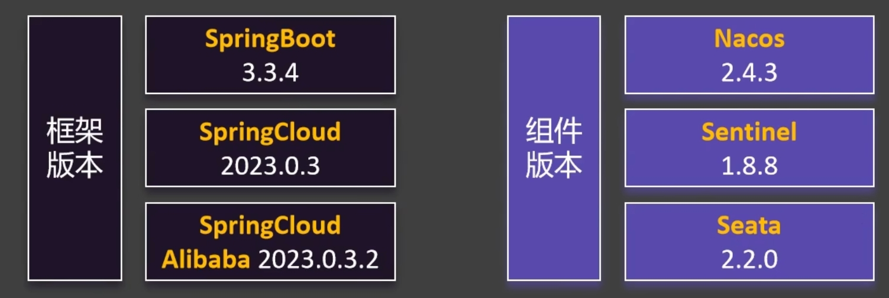
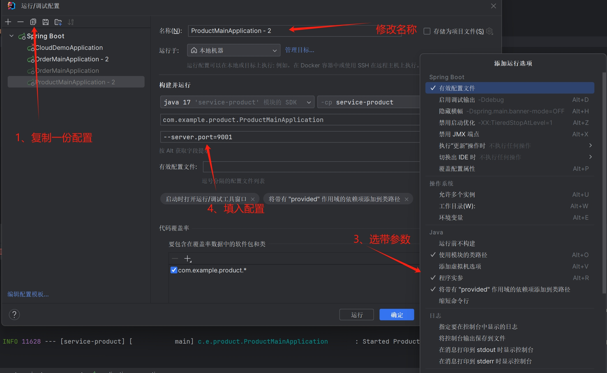
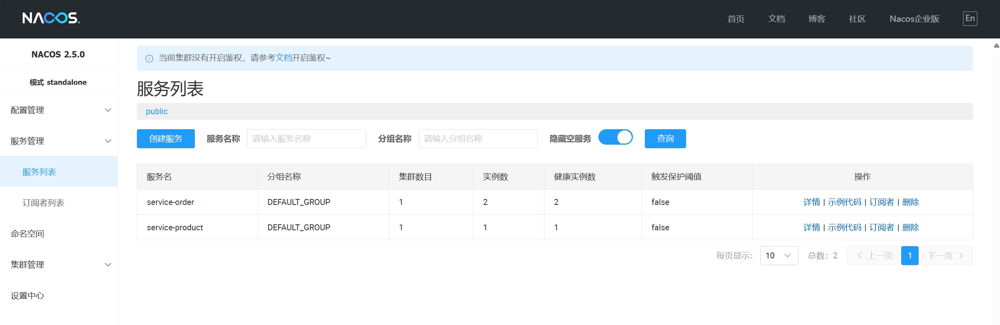
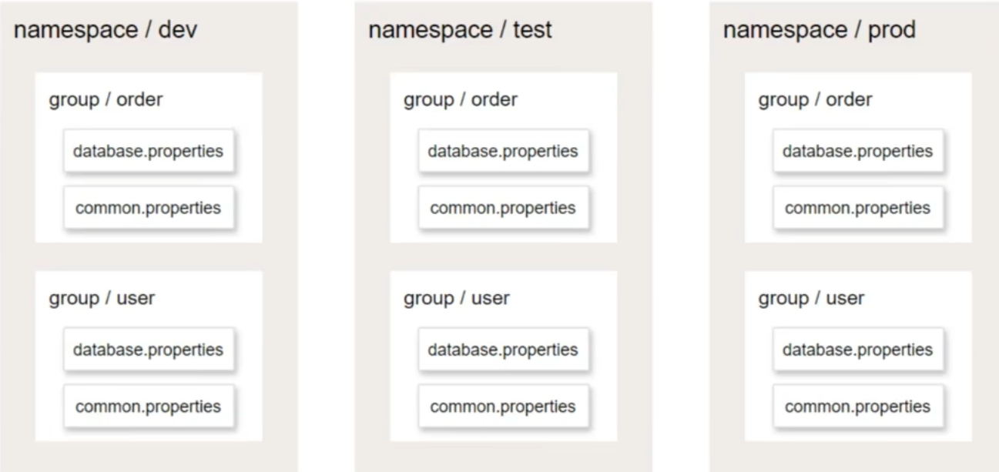
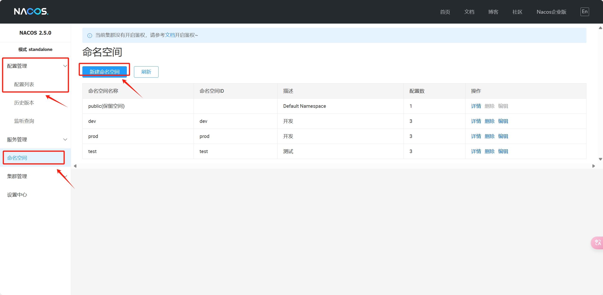
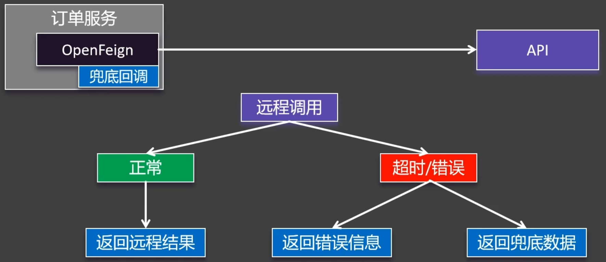
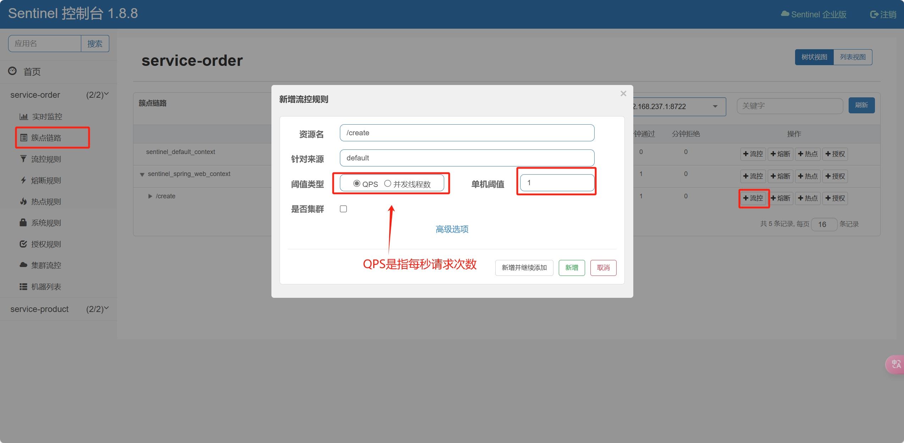

版本选择


# Nacos

下载：[Nacos Server 下载 | Nacos 官网](https://nacos.io/download/nacos-server/?spm=5238cd80.47ee59c.0.0.189fcd36L0LAVJ)

下载解压后在bin文件，打开cmd，输入 `startup.cmd -m standalone`

## 服务注册


导入web依赖
```xml
<dependency>  
    <groupId>org.springframework.boot</groupId>  
    <artifactId>spring-boot-starter-web</artifactId>  
</dependency>
```

引入服务依赖发现
```java
@SpringBootApplication
public class OrderMainApplication {
    public static void main(String[] args) {
        SpringApplication.run(OrderMainApplication.class, args);
    }
}
```

修改配置文件
```properties
spring.application.name=service-order

server.port=8000

spring.cloud.nacos.server-addr=127.0.0.1:8848
```

启动程序后即可在服务列表中查看


启动不同端口来模拟集群，这个复制找半天



## 服务发现

首先，在主配置类 `MainApplication` 加上注解 `@EnableDiscoveryClient` 开启服务发现功能

然后在需要使用服务发现的地方调用已经装配好的 `DiscoveryClient`
```java
@Autowired
    DiscoveryClient discoveryClient;
    @Test
    public void TestDiscoveryClient() {
        for (String service : discoveryClient.getServices()) {
            System.out.println("service = " + service);
            for (ServiceInstance instance : discoveryClient.getInstances(service)){
                System.out.println("ip: " + instance.getHost() + ", port: " + instance.getPort());
            }
        }
    }
```

或者使用 `NacosServiceDiscovery`，区别在于 `NacosServiceDiscovery` 只能用在 Nacos 的服务发现，`DiscoveryClient` 能用在其他地方
```java
@Autowired
    NacosServiceDiscovery nacosServiceDiscovery;

    @Test
    public void TestNacosServiceDiscovery() throws NacosException {
        for (String service : nacosServiceDiscovery.getServices()) {
            System.out.println("service = " + service);
            for (ServiceInstance instance : nacosServiceDiscovery.getInstances(service)) {
                System.out.println("ip: " + instance.getHost() + ", port: " + instance.getPort());
            }
        }
    }
```

## 远程调用的基本实现

最外层依赖
```xml
<?xml version="1.0" encoding="UTF-8"?>
<project xmlns="http://maven.apache.org/POM/4.0.0" xmlns:xsi="http://www.w3.org/2001/XMLSchema-instance"
         xsi:schemaLocation="http://maven.apache.org/POM/4.0.0 https://maven.apache.org/xsd/maven-4.0.0.xsd">
    <modelVersion>4.0.0</modelVersion>
    <parent>
        <groupId>org.springframework.boot</groupId>
        <artifactId>spring-boot-starter-parent</artifactId>
        <version>3.3.4</version>
        <relativePath/> <!-- lookup parent from repository -->
    </parent>
    <packaging>pom</packaging>
    <modules>
        <module>services</module>
        <module>model</module>
    </modules>
    <groupId>com.example</groupId>
    <artifactId>cloud-demo</artifactId>
    <version>0.0.1-SNAPSHOT</version>
    <name>cloud-demo</name>
    <description>cloud-demo</description>
    <properties>
        <maven.compiler.source>17</maven.compiler.source>
        <maven.compiler.target>17</maven.compiler.target>
        <project.build.sourceEncoding>UTF-8</project.build.sourceEncoding>
        <spring-cloud.version>2023.0.3</spring-cloud.version>
        <spring-cloud-alibaba.version>2023.0.3.2</spring-cloud-alibaba.version>
    </properties>

    <dependencyManagement>
        <dependencies>
            <dependency>
                <groupId>org.springframework.cloud</groupId>
                <artifactId>spring-cloud-dependencies</artifactId>
                <version>${spring-cloud.version}</version>
                <type>pom</type>
                <scope>import</scope>
            </dependency>
            <dependency>
                <groupId>com.alibaba.cloud</groupId>
                <artifactId>spring-cloud-alibaba-dependencies</artifactId>
                <version>${spring-cloud-alibaba.version}</version>
                <type>pom</type>
                <scope>import</scope>
            </dependency>
        </dependencies>
    </dependencyManagement>


    <build>
        <plugins>
            <plugin>
                <groupId>org.springframework.boot</groupId>
                <artifactId>spring-boot-maven-plugin</artifactId>
            </plugin>
        </plugins>
    </build>

</project>
```

### 第二层详细功能实现

#### order

依赖
```xml
<?xml version="1.0" encoding="UTF-8"?>
<project xmlns="http://maven.apache.org/POM/4.0.0"
         xmlns:xsi="http://www.w3.org/2001/XMLSchema-instance"
         xsi:schemaLocation="http://maven.apache.org/POM/4.0.0 http://maven.apache.org/xsd/maven-4.0.0.xsd">
    <modelVersion>4.0.0</modelVersion>
    <parent>
        <groupId>org.example</groupId>
        <artifactId>services</artifactId>
        <version>0.0.1-SNAPSHOT</version>
    </parent>

    <artifactId>service-order</artifactId>

    <properties>
        <maven.compiler.source>21</maven.compiler.source>
        <maven.compiler.target>21</maven.compiler.target>
        <project.build.sourceEncoding>UTF-8</project.build.sourceEncoding>
    </properties>

    <dependencies>
        <dependency>
            <groupId>org.springframework.boot</groupId>
            <artifactId>spring-boot-starter-web</artifactId>
        </dependency>

        <dependency>
            <groupId>org.springframework.boot</groupId>
            <artifactId>spring-boot-starter-test</artifactId>
            <scope>test</scope>
        </dependency>
    </dependencies>

</project>
```

OrderMainApplication
```java
package com.example.order;

@EnableDiscoveryClient
@SpringBootApplication
public class OrderMainApplication {
    public static void main(String[] args) {
        SpringApplication.run(OrderMainApplication.class, args);
    }
}
```

config
```java
package com.example.order.config;

@Configuration
public class OrderConfig {
    @Bean
    public RestTemplate restTemplate() {
        return new RestTemplate();
    }
}

```

controller
```java
package com.example.order.Controller;

@RestController
public class orderController {
    @Autowired
    OrderServiceImpl orderService;
    @GetMapping("/create")
    public Order getOrder(@RequestParam("userId") long userId,
                          @RequestParam("productId") long productId) {
        Order order = orderService.createOrder(productId, userId);
        return order;
    }
}
```

ServiceImpl
```java
package com.example.order.Service.Impl;

@Slf4j
@Service
public class OrderServiceImpl implements OrderService {
    @Autowired
    DiscoveryClient discoveryClient;
    @Autowired
    RestTemplate restTemplate;
    @Override
    public Order createOrder(long productId, long userId) {
        Product product = getProductFromRemote(productId);
        Order order = new Order();
        order.setId(1L);
        // TODO 总金额暂设为0
        order.setTotalAmount(product.getPrice().multiply(new BigDecimal(product.getNum())));
        order.setUserId(userId);
        order.setNickname("hs");
        order.setAddress("byxy");
        // TODO 远程查询商品列表
        order.setProductList(Arrays.asList(product));
        return order;
    }

    private Product getProductFromRemote(Long productId){
        // 获取商品所在机器的服务实例
        List<ServiceInstance> instances = discoveryClient.getInstances("service-product");
        ServiceInstance serviceInstance = instances.get(0);
        //远程URL地址 ： http://localhost:9001/product/4
        String url = "http://" + serviceInstance.getHost() + ":" + serviceInstance.getPort() + "/product/" + productId;

        log.info("远程请求:{}", url);
        // 远程发送请求
        Product forObject = restTemplate.getForObject(url, Product.class);
        return forObject;
    }
}
```

#### product

依赖
```xml
<?xml version="1.0" encoding="UTF-8"?>
<project xmlns="http://maven.apache.org/POM/4.0.0"
         xmlns:xsi="http://www.w3.org/2001/XMLSchema-instance"
         xsi:schemaLocation="http://maven.apache.org/POM/4.0.0 http://maven.apache.org/xsd/maven-4.0.0.xsd">
    <modelVersion>4.0.0</modelVersion>
    <parent>
        <groupId>org.example</groupId>
        <artifactId>services</artifactId>
        <version>0.0.1-SNAPSHOT</version>
    </parent>

    <artifactId>service-product</artifactId>

    <properties>
        <maven.compiler.source>21</maven.compiler.source>
        <maven.compiler.target>21</maven.compiler.target>
        <project.build.sourceEncoding>UTF-8</project.build.sourceEncoding>
    </properties>

    <dependencies>
        <dependency>
            <groupId>org.springframework.boot</groupId>
            <artifactId>spring-boot-starter-web</artifactId>
        </dependency>
    </dependencies>

</project>
```

ProductMainApplication
```java
package com.example.product;

@SpringBootApplication
public class ProductMainApplication {
    public static void main(String[] args) {
        SpringApplication.run(ProductMainApplication.class, args);
    }
}
```

config
```java
package com.example.product.config;

@Configuration
public class ProductServiceConfig {
    @Bean
    public RestTemplate restTemplate() {
        return new RestTemplate();
    }
}
```

controller
```java
package com.example.product.controller;

@RestController
public class ProductController {
    @Autowired
    ProductServiceImpl productService;
    @GetMapping("/product/{id}")
    public Product getProduct(@PathVariable("id") Long id) {
        Product product = productService.getProductById(id);
        return product;
    }
}
```

ServiceImpl
```java
package com.example.product.service.Impl;

@Service
public class ProductServiceImpl implements ProductService {
    @Override
    public Product getProductById(Long id) {
        Product product = new Product();
        product.setId(id);
        product.setPrice(new BigDecimal("99"));
        product.setProductName("苹果 - " + id);
        product.setNum(2);
        return product;
    }
}
```

### model

主要是装 order 和 product 的 实体entity
```java
package com.example.order.Bean;

import com.example.product.Bean.Product;

@Data
public class Order {
    private long id;
    private BigDecimal totalAmount;
    private Long userId;
    private String nickname;
    private String address;
    private List<Product> productList;
}
```

```java
package com.example.product.Bean;

@Data
public class Product {
    private Long id;
    private BigDecimal price;
    private String productName;
    private int num;
}
```

装好后在 order 和 product 两个项目中导入这个model的依赖
```java
<dependency>  
    <groupId>org.example</groupId>  
    <artifactId>model</artifactId>  
    <version>0.0.1-SNAPSHOT</version>  
</dependency>
```

## 负载均衡

### 方式一

所需依赖
```xml
<dependency>  
    <groupId>org.springframework.cloud</groupId>  
    <artifactId>spring-cloud-starter-loadbalancer</artifactId>  
</dependency>
```

```java
@Autowired
    LoadBalancerClient loadBalancerClient;

    @Test
    void test() {
        // 可以选择单个服务实例
        ServiceInstance choose = loadBalancerClient.choose("service-product");
        System.out.println(choose.getHost() + ":" + choose.getPort());
        choose = loadBalancerClient.choose("service-product");
        System.out.println(choose.getHost() + ":" + choose.getPort());
        choose = loadBalancerClient.choose("service-product");
        System.out.println(choose.getHost() + ":" + choose.getPort());
    }
```

通过测试可得知，并不是通过平均抽取来实现负载均衡，而是通过依次调用

修改前面代码，添加一个负载均衡来发送请求
```java
private Product getProductFromRemoteWithLoadBalancer(Long productId){
        // 获取商品所在机器的服务实例
        ServiceInstance choose = loadBalancerClient.choose("service-product");
        //远程URL地址 ： http://localhost:9001/product/4
        String url = "http://" + choose.getHost() + ":" + choose.getPort() + "/product/" + productId;

        log.info("远程请求:{}", url);
        // 远程发送请求
        return restTemplate.getForObject(url, Product.class);
    }
```

### 方式二

我们可以直接通过添加注解的形式来实现负载均衡
```java
package com.example.order.config;

import org.springframework.cloud.client.loadbalancer.LoadBalanced;
import org.springframework.context.annotation.Bean;
import org.springframework.context.annotation.Configuration;
import org.springframework.web.client.RestTemplate;

@Configuration
public class OrderConfig {

    @LoadBalanced //注解式负载均衡
    @Bean
    public RestTemplate restTemplate() {
        return new RestTemplate();
    }
}
```

编写函数
```java
private Product getProductFromRemoteWithLoadBalancerAnnotation(Long productId){

        String url = "http://service-product/product/" + productId;

        log.info("远程请求:{}", url);
        // 远程发送请求 service-product会被动态替换
        return restTemplate.getForObject(url, Product.class);
    }
```


## 配置中心

导入依赖
```xml
<dependency>  
    <groupId>com.alibaba.cloud</groupId>  
    <artifactId>spring-cloud-starter-alibaba-nacos-config</artifactId>  
</dependency>
```

### 基本用法

首先创建一个配置


然后在需要引入配置的项目中的配置文件中加入
`spring.config.import=nacos:service-order.properties`

ok，完成配置，然后再试试能不能调用到配置
```java
@RestController  
@RefreshScope // 激活配置属性的自动刷新  
public class orderController {  
  
    ......
  
    @Value("${order.timeout}")  
    String orderTimeout;  
    @Value("${order.auto-confirm}")  
    String orderAutoConfirm;  
  
    @GetMapping("/config")  
    public String config() {  
        return "order.timeout=" + orderTimeout + "\n" + "order.auto-confirm=" + orderAutoConfirm;  
    }  
	......
}
```

- @RefreshScope的作用是在我们修改配置中心的时候可以不重启项目，激活配置属性的自动刷新功能

但是这样会有一个问题，就是如果导入了依赖，但不配置，启动时会报错，因此我们在不需要配置的项目中的配置文件加入禁用导入检查
```xml
spring.cloud.nacos.config.import-check.enabled=false
```

<font color=red>注：如果配置中心与项目中有相同的配置项，以配置中心为主</font>

### 动态刷新

- 方式一
	
	和上面一样@Value(“${xx}”)获取配置+@Refreshscope 实现自动刷新

- 方式二

把配置的属性抽取出来
```java
@Component  
@ConfigurationProperties(prefix = "order") //配置批量绑定，在nacos下可以无需（接上）@RefreshScope就能实现自动刷新  
@Data  
public class OrderProperties {  
  
    String timeout;  
  
    String autoConfirm;  
}
```

- ConfigurationProperties 是批量绑定，如上为例，是前缀以 `order.` 开头的配置项，下面的属性名与点后一样对应，配置上的短横线 `-` 换成驼峰
- 记得绑定成容器 @Component

回到调用的地方，@RefreshScope 可以不要了
```java
@RestController
public class orderController {

    ...

    @Autowired
    OrderProperties orderProperties;

    @GetMapping("/config")
    public String config() {
        return "order.timeout=" + orderProperties.getTimeout() + "\n" + "order.auto-confirm=" + orderProperties.getAutoConfirm();
    }
}
```

### 监听配置变化

```java
@EnableDiscoveryClient  
@SpringBootApplication  
public class OrderMainApplication {  
    public static void main(String[] args) {  
        SpringApplication.run(OrderMainApplication.class, args);  
    }  
  
    @Bean  
    ApplicationRunner applicationRunner(NacosConfigManager nacosConfigManager) {  
        return args -> {  
            ConfigService configService = nacosConfigManager.getConfigService(); // 拿到配置服务  
            // 在服务里添加一个监听器，参数分别是dataId，就是想监控的配置文件Id，第二个是项目组，第三个是传一个监听器
            configService.addListener(  
                    "service-order.properties",  
                    "DEFAULT_GROUP",  
                    new Listener() {  
                        @Override  
                        public Executor getExecutor() {  
	                        // new 一个线程池
                            return Executors.newFixedThreadPool(4);  
                        }  
  
                        @Override  
                        public void receiveConfigInfo(String configInfo) {  
                            System.out.println("变化的配置信息: " + configInfo);  
                            System.out.println("发送到....");  
                        }  
                    });  
        };  
    }  
}
```

- ApplicationRunner 是 springboot 里的一次性任务，项目一启动就会执行
- NacosConfigManager 可以监听配置的变化


### 数据隔离

一般 Nacos 的组织是有多套 命名空间Namespace， Namespace 下有多个 分组Group、Group 下又有多个 数据集Data-id，每个环境下只需要绑定一个命名空间

不创建命名空间下默认是 <font color=red>public</font>

大致如下


首先先去创建命名空间，然后再去配置列表在命名空间下创建配置


把配置文件从原来的 `application.properties` 改成 ``application.yml`
```yml
server:
  port: 8000

spring:
  profiles:
    active: test
  application:
    name: service-order
  cloud:
    nacos:
      server-addr: 127.0.0.1:8848
      config:
        import-check:
          enabled: false
        namespace: ${spring.profiles.active:public}
---
spring:
  config:
    import:
      - nacos:common.properties?group=order
      - nacos:database.properties?group=order
    activate:
      on-profile: dev
---
spring:
  config:
    import:
      - nacos:common.properties?group=order
      - nacos:database.properties?group=order
    activate:
      on-profile: test
```
很好理解，多环境，如果我们想要改成开发环境 dev 我们只需要修改 `active:dev`  

hhh，当然可以写的不用上面这么麻烦，如果你是一个人写单环境的话
```yml
server:  
  port: 8000  
  
spring:  
  profiles:  
    active: dev  
  application:  
    name: service-order  
  cloud:  
    nacos:  
      server-addr: 127.0.0.1:8848  
      config:  
        namespace: test  
  
  config:  
    import:  
      - nacos:common.properties?group=order  
      - nacos:database.properties?group=order  
---  
spring:  
  config:  
    import:  
      - nacos:common.properties?group=order  
      - nacos:database.properties?group=order
```

# OpenFeign 远程调用

所需依赖
```xml
<dependency>  
    <groupId>org.springframework.cloud</groupId>  
    <artifactId>spring-cloud-starter-openfeign</artifactId>  
</dependency>
```

## 声明式调用

ok，前面我们的远程调用，只需要把 `RestTemplate` 装成 bean，然后调用里面的 `getForObject` 就可以实现远程调用了，已经很方便了，现在有个方便的，连 bean 都不需要我们自己注册，只需要几个注解就能完成

首先在主方法里面加上 `@EnableFeignClients`，表示开启 Feign 远程调用
```java
@EnableFeignClients // 开启Feign远程调用
@EnableDiscoveryClient
@SpringBootApplication
public class OrderMainApplication {
    public static void main(String[] args) {
        SpringApplication.run(OrderMainApplication.class, args);
    }
	...
}
```

然后我们需要写一个接口，表示为 Feign 客户端，写上注解 `@FeignClient(value = "service-product")` 指明远程调用服务端，也可以指名域名 `url = "url地址"`
```java
@FeignClient(value = "service-product") // 声明是一个Feign客户端，value指定服务名  
public interface ProductFeignClient {  
  
    // mvc注解的两套使用逻辑  
    // 1、标注在Controller上，是表示接受这样的请求  
    // 2、标注在FeignClient上，是表示发送这样的请求  
    @GetMapping("product/{id}")  
    Product getProductById(@PathVariable("id") Long id);  
}
```

- 这里有个小知识，在我们之前MVC里面有提到 `@GetMapping` 表示获取 `GetMapping` 请求，把参数赋给变量 `id`，但是在 Feign 里面，`@GetMapping` 表示发送一个 `@GetMapping` 请求，是把参数 `id` 赋上去

然后修改 Controller，可以不用再另写一个方法来获取远程调用服务端，获取地址再推送出去巴拉巴拉，直接用我们上面声明好的 `Feign` 客户端  `ProductFeignClient` 里的 `getProductById`
```java
@Slf4j
@Service
public class OrderServiceImpl implements OrderService {

    @Autowired
    ProductFeignClient productFeignClient;

    @Override
    public Order createOrder(long productId, long userId) {
        Product product = productFeignClient.getProductById(productId);
        Order order = new Order();
        order.setId(1L);
        // TODO 总金额暂设为0
        order.setTotalAmount(product.getPrice().multiply(new BigDecimal(product.getNum())));
        order.setUserId(userId);
        order.setNickname("hs");
        order.setAddress("byxy");
        // TODO 远程查询商品列表
        order.setProductList(Arrays.asList(product));

        return order;
    }
}
```

<font color=red>客户端负载均衡与服务端负载均衡区别：</font>客户端负载均衡调用负载均衡的位置在客户端，服务端负载均衡的位置在服务端
## 日志

首先在 `yml` 配置文件里面配置
```yml
logging:  
  level:  
    com.example.order.feign: debug
```

然后在 `@Configuration` 注解类下编写，这里在之前创建的 `OrderConfig` 里写
```java
@Bean  
Logger.Level feignLoggerLevel() {  
    return Logger.Level.FULL;  
}
```

## 超时控制

两个概念：
- connectTimeout 连接超时
	
	 建立连接所需要的时间是连接时间，连接超时就是建立连接的时间太久没用得到响应

- readTimeout 读取超时
	
	 建立连接后，等待对方运行的时间是读取时间，读取时间超市就是已经和对方建立连接，但是对方运行太久没有返回结果


OpenFeign 默认的连接超时是 10 秒，读取超时是 60 秒

### 超时配置

项目的配置文件内容太多了，可以新开一个配置文件，这里新开一个 `application-feign.yml`
```yml
spring:
  cloud:
    openfeign:
      client:
        config:
          default:  # 默认的配置
            logger-level: full
            connect-timeout: 1000
            read-timeout: 3000
          service-product:  # Feign客户端 service-product 的配置
            logger-level: full
            connect-timeout: 3000
            read-timeout: 5000
```


然后记得在原配置文件中 include 进来
```yml
spring:  
  profiles:  
    include: feign
```

## 重试机制

`Retryer` 和上面的 `Logger.Level` 一样，只要在容器中注册，就会被自动识别，因此只需要在 `Configuration` 配置类里面注册成 bean 即可

在之前的配置类 `OrderConfig` 里面编写
```java
@Bean
Retryer retryer() {
	return new Retryer.Default(1000, 5000, 5);// 隔1000毫秒，最大间隔5000毫秒，重试5次，每次间隔时间都会增加1.5倍
}
```

## 拦截器

也是两个
- 请求拦截器
	
	 请求拦截器是每次发送请求前拦截下来，可以对请求做一些定制修改，比如添加一些字段

- 响应拦截器
	
	 响应拦截器也是一样，每次接收回应时，对响应做一些预处理，处理完将真正的处理结果发回来

方法一：编写拦截器类，在配置文件中把拦截器导入
```java
public class XTokenRequestInterceptor implements RequestInterceptor {

    /*
    * 请求拦截器
    * @Param template 请求模板
    * */
    @Override
    public void apply(RequestTemplate template) {
        System.out.println("template: " + template);
        template.header("X-Token", UUID.randomUUID().toString());
    }
}
```

```yml
spring:  
  cloud:  
    openfeign:  
      client:  
        config:  
          default:  
            logger-level: full  
            connect-timeout: 1000  
            read-timeout: 3000  
          service-product:  
            logger-level: full  
            connect-timeout: 3000  
            read-timeout: 5000  
#            retryer: feign.retryer.Default  
            request-interceptors:  
              - com.example.order.interceptor.XTokenRequestIntercept
```

方法二：注册一个 `RequestInterceptor` 组件，SpringCloud 会自动寻找，不需要手动添加到配置
```java
@Component
public class XTokenRequestInterceptor implements RequestInterceptor {

    /*
    * 请求拦截器
    * @Param template 请求模板
    * */
    @Override
    public void apply(RequestTemplate template) {
        System.out.println("template: " + template);
        template.header("X-Token", UUID.randomUUID().toString());
    }
}
```

## Fallback 兜底返回



我们之前有写到远程调用，但是有时候对方微服务并没有启动或者其他原因没有返回数据，按照正常流程走这时候程序就会报错，我们并不希望用户在使用中会看到报错，所以就有了 `Fallback` 兜底返回，如果没有收到数据，就伪造一个数据返回

以我们前面写的 `ProductFeignClient` 为例，我们先写一个类来实现远程调用 `ProductFeignClient` 的接口并且注册成组件
```java
@Component  
public class ProductFeignClientFallback implements ProductFeignClient {  
    @Override  
    public Product getProductById(Long id) {  
        System.out.println("兜底回调...");  
        Product product = new Product();  
        product.setId(id);  
        product.setPrice(new BigDecimal("0"));  
        product.setProductName("位置商品");  
        product.setNum(0);  
  
        return null;  
    }  
}
```

然后在 `ProductFeignClient` 添加上 `fallback`
```java
@FeignClient(value = "service-product", fallback = ProductFeignClientFallback.class) // 添加上fallback
public interface ProductFeignClient {
	...
	
    @GetMapping("/product/{id}")
    Product getProductById(@PathVariable("id") Long id);
}
```

还需要用上熔断机制 `Sentinel`，导入依赖
```xml
<dependency>  
    <groupId>com.alibaba.cloud</groupId>  
    <artifactId>spring-cloud-starter-alibaba-sentinel</artifactId>  
</dependency>
```

添加配置
```yml
feign:
  sentinel:
    enabled: true
```

现在如果调用对方微服务有正常返回就会走 `ProductFeignClient`，如果没有得到放回就会走 `ProductFeignClientFallback` 来伪造一条数据

# Sentinel 服务保护

`java -jar sentinel-dashboard-1.8.8.jar`

默认账号密码： `sentinel`

## 快速上手

两个项目都编写配置文件 yml：
```yml
sentinel:  
  transport:  
    dashboard: localhost:8080  
  eager: true
```

xml：
```xml
spring.cloud.sentinel.transport.dashboard=localhost:8080  
spring.cloud.sentinel.eager=true
```

以创建订单为例，我们认为创建订单是一个资源，要给予保护，做一些流控等设置，添加注解 `@SentinelResource` 来定义资源的名字
```java
@SentinelResource(value = "createOrder")  
@Override  
public Order createOrder(long productId, long userId) {  
    ......
}
```

我们发送一条创建订单的信号，然后在 `sentinel` 上就能检测到我们发送的资源，我们可以在上面添加保护，例如我们这里添加资源流控

资源名是请求的路径，在这里的单机阈值是指每秒只放行一个，多了就会报错（Blocked by Sentinel (flow limiting)）

## 异常处理

### web 接口异常处理

编写实体类与一些可能会用到的方法
```java
@Data  
public class R {  
    private Integer code;  
    private String msg;  
    private Object data;  
  
    public static R ok() {  
        R r = new R();  
        r.setCode(200);  
        r.setMsg("success");  
        return r;  
    }  
  
    public static R ok(String msg, Object data) {  
        R r = new R();  
        r.setCode(200);  
        r.setMsg(msg);  
        r.setData(data);  
        return r;  
    }  
  
    public static R error() {  
        R r = new R();  
        r.setCode(500);  
        return r;  
    }  
  
    public static R error(Integer code, String msg) {  
        R r = new R();  
        r.setCode(code);  
        r.setMsg(msg);  
        return r;  
    }  
}
```

编写 `web` 接口异常处理规则
```java
@Component
public class MyBlockExceptionHandler implements BlockExceptionHandler {
    private ObjectMapper objectMapper = new ObjectMapper(); //把JSON数据转成String
    @Override
    public void handle(HttpServletRequest httpServletRequest, HttpServletResponse response, String resourceName, BlockException e) throws Exception {
        response.setContentType("application/json;charset=utf-8"); // 转换编码
        PrintWriter writer = response.getWriter();//给外界写出JSON数据

        R error = R.error(500, resourceName + "被sentinel限制住了，原因：" + e.getClass());

        String json = objectMapper.writeValueAsString(error);
        writer.write(json);

        writer.flush();
        writer.close();
    }
}
```


