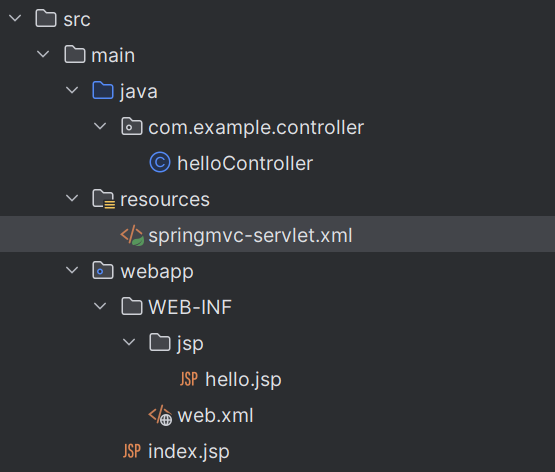
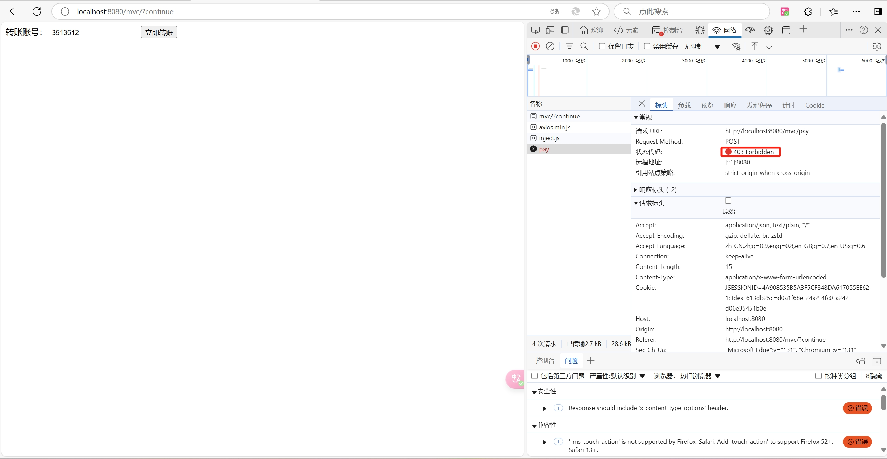
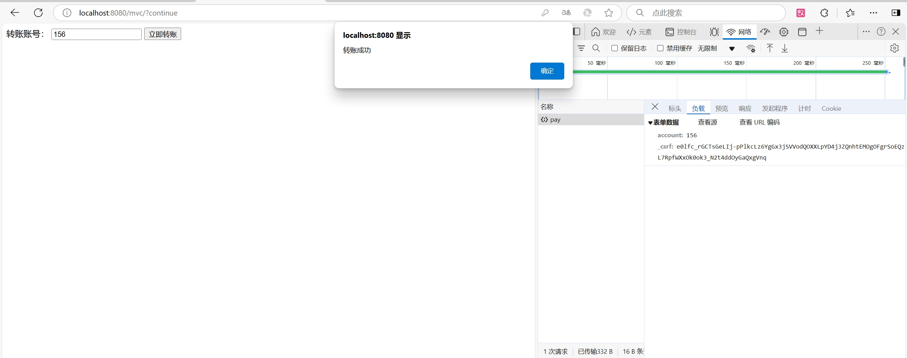
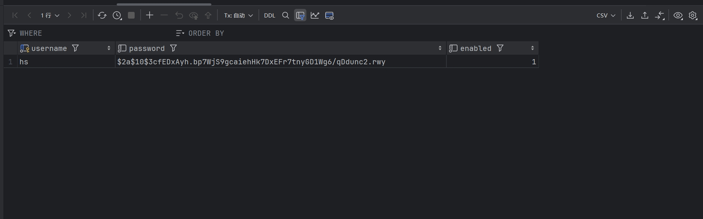

 ## 所需依赖

```xml
<properties>
        <project.build.sourceEncoding>UTF-8</project.build.sourceEncoding>
        <maven.compiler.target>11</maven.compiler.target>
        <maven.compiler.source>11</maven.compiler.source>
        <junit.version>5.9.2</junit.version>
    </properties>

    <dependencies>
        <dependency>
            <groupId>jakarta.servlet</groupId>
            <artifactId>jakarta.servlet-api</artifactId>
            <version>5.0.0</version>
            <scope>provided</scope>
        </dependency>
        <dependency>
            <groupId>org.junit.jupiter</groupId>
            <artifactId>junit-jupiter-api</artifactId>
            <version>${junit.version}</version>
            <scope>test</scope>
        </dependency>
        <dependency>
            <groupId>org.junit.jupiter</groupId>
            <artifactId>junit-jupiter-engine</artifactId>
            <version>${junit.version}</version>
            <scope>test</scope>
        </dependency>
        <dependency>
            <groupId>org.springframework</groupId>
            <artifactId>spring-webmvc</artifactId>
            <version>6.2.1</version>
        </dependency>
    </dependencies>
```

# HelloMVC



- web.xml
```xml
<?xml version="1.0" encoding="UTF-8"?>
<web-app xmlns="https://jakarta.ee/xml/ns/jakartaee"
         xmlns:xsi="http://www.w3.org/2001/XMLSchema-instance"
         xsi:schemaLocation="https://jakarta.ee/xml/ns/jakartaee https://jakarta.ee/xml/ns/jakartaee/web-app_5_0.xsd"
         version="5.0">

    <servlet>
        <servlet-name>springmvc</servlet-name>
        <servlet-class>org.springframework.web.servlet.DispatcherServlet</servlet-class>
        <init-param>
            <param-name>contextConfigLocation</param-name>
            <param-value>classpath:springmvc-servlet.xml</param-value>
        </init-param>
        <load-on-startup>1</load-on-startup>
    </servlet>
    <servlet-mapping>
        <servlet-name>springmvc</servlet-name>
        <url-pattern>/</url-pattern>
    </servlet-mapping>

</web-app>
```

- 自动扫描包，让指定包下的注解生效，有IOC容器统一管理

springmvc-servlet.xml
```xml
<?xml version="1.0" encoding="UTF-8"?>  
<beans xmlns="http://www.springframework.org/schema/beans"  
       xmlns:xsi="http://www.w3.org/2001/XMLSchema-instance"  
       xmlns:context="http://www.springframework.org/schema/context"  
       xmlns:mvc="http://www.springframework.org/schema/mvc"  
       xsi:schemaLocation="http://www.springframework.org/schema/beans http://www.springframework.org/schema/beans/spring-beans.xsd http://www.springframework.org/schema/context https://www.springframework.org/schema/context/spring-context.xsd http://www.springframework.org/schema/mvc https://www.springframework.org/schema/mvc/spring-mvc.xsd">  
  
    <context:component-scan base-package="com.example.controller"/>  
  
    <mvc:default-servlet-handler/>  
    <mvc:annotation-driven/>  
  
    <bean class="org.springframework.web.servlet.view.InternalResourceViewResolver" id="internalResourceViewResolver">  
        <property name="prefix" value="/WEB-INF/jsp/"/>  
        <property name="suffix" value=".jsp"/>  
    </bean>  
</beans>
```

hello.jsp
```jsp
<%@ page contentType="text/html;charset=UTF-8" language="java" %>  
<html>  
<head>  
    <title>Title</title>  
</head>  
<body>  
${msg}  
</body>  
</html>
```

ControllerTest.class
```java
package com.example.controller;  
  
import org.springframework.stereotype.Controller;  
import org.springframework.ui.Model;  
import org.springframework.web.bind.annotation.RequestMapping;  
  
@Controller  
@RequestMapping("/c")  
public class ControllerTest {  
    @RequestMapping("/h1")  
    public String test1(Model model) {  
  
        model.addAttribute("msg", "Controller Test");  
  
        return "hello";  //会被视图解析器处理，找到WEB-INF/jsp/hello.jsp
    }  
}
```

# RestFul 风格

**RestFul风格会允许我们将参数通过URL拼接传送到服务端

比如这里我们的URL可以填
``http://localhost:8080/add/13/18``

```java
@Controller  
public class RestFulController {  
    @GetMapping("/add/{a}/{b}")  
    public String test1(@PathVariable int a, @PathVariable int b, Model model){  
        int result = a + b;  
  
        model.addAttribute("msg", "result is " + result);  
  
        return "hello";  
    }  
}
```

**当然，我们也可以通过RestFul风格来传对象，例如：

```java
package com.example.controller;  
  
import com.example.pojo.User;  
import org.springframework.stereotype.Controller;  
import org.springframework.ui.Model;  
import org.springframework.web.bind.annotation.GetMapping;  
import org.springframework.web.bind.annotation.RequestMapping;  
import org.springframework.web.bind.annotation.RequestParam;  
  
@Controller  
@RequestMapping("/user")  
public class UserController {  
  
    @GetMapping("/t1")  
    public String test1(@RequestParam("name") String name, Model model) {  
        // 接受前端参数  
        System.out.println("前端接收的参数为" + name);  
        // 将返回的结果赋给前端  
        model.addAttribute("msg", name);  
        // 视图跳转  
        return "hello";  
    }  
  
    @GetMapping("/t2")  
    public String test2(User user, Model model) {  
        model.addAttribute("msg", user);  
        return "hello";  
    }  
}
```

我们输入``http://localhost:8080/mvc/user/t2?id=1&name="呵帅"&age=18)``也可以成功传值


这里有一篇博客讲的很清楚
[RESTful 风格（详细介绍 + 案例实现）_resultful风格开发-CSDN博客](https://blog.csdn.net/zzvar/article/details/118164133)


# JSON

```html
<!DOCTYPE html>  
<html lang="en">  
<head>  
    <meta charset="UTF-8">  
    <title>Title</title>  
  
    <script type="javascript">  
        let user = {  
            name: "hs",  
            age: 18,  
            sex: "男"  
        };  
  
        let jsonStr = JSON.stringify(user);  
  
        console.log(jsonStr);  
  
        let obj = JSON.parse(jsonStr);  
        console.log(obj);  
  
    </script>  
  
</head>  
<body>  
  
</body>  
</html>
```

utils
用json对象表示法来返回一个时间给页面
```java
package com.example.utils;  
  
import com.fasterxml.jackson.core.JsonProcessingException;  
import com.fasterxml.jackson.databind.ObjectMapper;  
import com.fasterxml.jackson.databind.SerializationFeature;  
  
import java.text.SimpleDateFormat;  
import java.util.Date;  
  
public class JsonUtils {  
    public static String getJson(Object o) {  
        return getJson(o, "yyyy-MM-dd HH:mm:ss");  
    }  
    public static String getJson(Object o, String dateFormat) {  
        ObjectMapper mapper = new ObjectMapper();  
  
        mapper.configure(SerializationFeature.WRITE_DATES_AS_TIMESTAMPS, false);  
  
        SimpleDateFormat sdf =  new SimpleDateFormat(dateFormat);  
        mapper.setDateFormat(sdf);  
  
        try {  
            return mapper.writeValueAsString(o);  
        } catch (JsonProcessingException e) {  
            throw new RuntimeException(e);  
        }  
    }  
  
}
```

UserController
```java
package com.example.controller;  
  
import com.example.pojo.User;  
import com.example.utils.JsonUtils;  
import com.fasterxml.jackson.core.JsonGenerator;  
import com.fasterxml.jackson.core.JsonProcessingException;  
import com.fasterxml.jackson.databind.ObjectMapper;  
import org.springframework.stereotype.Controller;  
import org.springframework.web.bind.annotation.GetMapping;  
import org.springframework.web.bind.annotation.RequestMapping;  
import org.springframework.web.bind.annotation.ResponseBody;  
import org.springframework.web.bind.annotation.RestController;  
  
import java.text.SimpleDateFormat;  
import java.util.ArrayList;  
import java.util.Date;  
  
@Controller  
public class UserController {  
  
    @GetMapping("/j1")  
    @ResponseBody // 不会走视图解析器，直接返回一个字符串  
    public String test1() throws JsonProcessingException {  
  
        User user = new User("hs", 18, "男");  
  
        return JsonUtils.getJson(user);  
    }  
  
    @GetMapping("/j2")  
    @ResponseBody // 不会走视图解析器，直接返回一个字符串  
    public String test2() throws JsonProcessingException {  
  
        ArrayList<User> arr = new ArrayList<>();  
  
        User user = new User("呵帅1", 18, "男");  
        User user2 = new User("呵帅2", 18, "男");  
        User user3 = new User("呵帅3", 18, "男");  
        User user4 = new User("呵帅4", 18, "男");  
        User user5 = new User("呵帅5", 18, "男");  
  
        arr.add(user);  
        arr.add(user2);  
        arr.add(user3);  
        arr.add(user4);  
        arr.add(user5);  
  
        return JsonUtils.getJson(arr);  
    }  
  
    @GetMapping("/j3")  
    @ResponseBody // 不会走视图解析器，直接返回一个字符串  
    public String test3() throws JsonProcessingException {  
  
        Date date = new Date();  
  
        return JsonUtils.getJson(date);  
  
    }  
}
```

# ModelAndView

## 固定模板

两个config

```java
package com.example.config;  
  
import org.springframework.web.servlet.support.AbstractAnnotationConfigDispatcherServletInitializer;  
  
public class MainInitializer extends AbstractAnnotationConfigDispatcherServletInitializer {  
  
    @Override  
    protected Class<?>[] getRootConfigClasses() {  
        return new Class[]{WebConfiguration.class};   //基本的Spring配置类，一般用于业务层配置  
    }  
  
    @Override  
    protected Class<?>[] getServletConfigClasses() {  
        return new Class[0];  //配置DispatcherServlet的配置类、主要用于Controller等配置，这里为了教学简单，就不分这么详细了，只使用上面的基本配置类  
    }  
  
    @Override  
    protected String[] getServletMappings() {  
        return new String[]{"/"};    //匹配路径，与上面一致  
    }  
}
```

```java
package com.example.config;  
  
import com.example.interceptor.MainInterceptor;  
import org.springframework.context.annotation.Bean;  
import org.springframework.context.annotation.ComponentScan;  
import org.springframework.context.annotation.Configuration;  
import org.springframework.web.servlet.config.annotation.EnableWebMvc;  
import org.springframework.web.servlet.config.annotation.InterceptorRegistry;  
import org.springframework.web.servlet.config.annotation.WebMvcConfigurer;  
import org.thymeleaf.spring6.SpringTemplateEngine;  
import org.thymeleaf.spring6.templateresolver.SpringResourceTemplateResolver;  
import org.thymeleaf.spring6.view.ThymeleafViewResolver;  
import org.thymeleaf.templateresolver.ITemplateResolver;  
  
@Configuration  
@EnableWebMvc   //快速配置SpringMvc注解，如果不添加此注解会导致后续无法通过实现WebMvcConfigurer接口进行自定义配置  
@ComponentScan("com.example.controller")  
public class WebConfiguration {  
    //我们需要使用ThymeleafViewResolver作为视图解析器，并解析我们的HTML页面  
    @Bean  
    public ThymeleafViewResolver thymeleafViewResolver(SpringTemplateEngine springTemplateEngine){  
        ThymeleafViewResolver resolver = new ThymeleafViewResolver();  
        resolver.setOrder(1);   //可以存在多个视图解析器，并且可以为他们设定解析顺序  
        resolver.setCharacterEncoding("UTF-8");   //编码格式是重中之重  
        resolver.setTemplateEngine(springTemplateEngine);   //和之前JavaWeb阶段一样，需要使用模板引擎进行解析，所以这里也需要设定一下模板引擎  
        return resolver;  
    }  
  
    //配置模板解析器  
    @Bean  
    public SpringResourceTemplateResolver templateResolver(){  
        SpringResourceTemplateResolver resolver = new SpringResourceTemplateResolver();  
        resolver.setSuffix(".html");   //需要解析的后缀名称  
        resolver.setPrefix("classpath:");   //需要解析的HTML页面文件存放的位置，默认是webapp目录下，如果是类路径下需要添加classpath:前缀  
        return resolver;  
    }  
  
    //配置模板引擎Bean  
    @Bean  
    public SpringTemplateEngine springTemplateEngine(ITemplateResolver resolver){  
        SpringTemplateEngine engine = new SpringTemplateEngine();  
        engine.setTemplateResolver(resolver);   //模板解析器，默认即可  
        return engine;  
    }  
  
}
```

## 返回错误信息给页面

```java
package com.example.controller;  
  
import org.springframework.ui.Model;  
import org.springframework.web.bind.annotation.ControllerAdvice;  
import org.springframework.web.bind.annotation.ExceptionHandler;  
  
@ControllerAdvice  
public class ErrorController {  
  
    @ExceptionHandler(Exception.class)  
    public String error(Exception e, Model model) {  
        e.printStackTrace();  
        model.addAttribute("e", e);  
        return "error";  
    }  
}
```

## 获取cookie的方法

```java
@RequestMapping("/test2")  
public String index2(@CookieValue("JSESSIONID") String id) {  
    System.out.println(id);  
    return "index";  
}
```

# 拦截器

```java
package com.example.interceptor;  
  
import jakarta.servlet.http.HttpServletRequest;  
import jakarta.servlet.http.HttpServletResponse;  
import org.springframework.web.servlet.HandlerInterceptor;  
import org.springframework.web.servlet.ModelAndView;  
  
public class MainInterceptor implements HandlerInterceptor {  
    @Override  
    public boolean preHandle(HttpServletRequest request, HttpServletResponse response, Object handler) throws Exception {  
        System.out.println("处理前");  
        return true;  
    }  
  
    @Override  
    public void postHandle(HttpServletRequest request, HttpServletResponse response, Object handler, ModelAndView modelAndView) throws Exception {  
        System.out.println("处理后");  
    }  
  
    @Override  
    public void afterCompletion(HttpServletRequest request, HttpServletResponse response, Object handler, Exception ex) throws Exception {  
        System.out.println("完成后");  
    }  
  
}
```

  
这段代码是一个Spring框架中的拦截器（Interceptor）实现示例。拦截器是Spring MVC中处理请求的组件之一，它可以在请求的多个不同阶段执行自定义逻辑。这个`MainInterceptor`类实现了`HandlerInterceptor`接口，并重写了其中的三个方法，分别对应请求处理的不同阶段：

1. `preHandle`：在请求处理之前调用（Controller方法调用之前）。
2. `postHandle`：在请求处理之后调用，但在视图被渲染之前（Controller方法调用之后）。
3. `afterCompletion`：在请求处理之后调用，当所有的请求处理工作完成之后，也就是在DispatcherServlet渲染了对应的视图之后调用。
4. 
具体到这个`MainInterceptor`类：

- `preHandle`方法中，打印了"处理前"，并返回`true`，表示请求可以继续向下执行。
- `postHandle`方法中，打印了"处理后"，这个方法可以修改ModelAndView对象，但在这个示例中并没有进行任何操作。
- `afterCompletion`方法中，打印了"完成后"，这个方法用于进行资源清理工作。

这个拦截器可以被注册到Spring MVC的配置中，以便在请求处理过程中自动调用。注册拦截器通常在Spring的配置类中通过`WebMvcConfigurer`接口的`addInterceptors`方法完成。

# SpringSecurity
## 配置环境

**导入 maven 依赖

```xml
<dependency>  
    <groupId>org.springframework.security</groupId>  
    <artifactId>spring-security-web</artifactId>  
    <version>6.3.4</version>  
</dependency>  
<dependency>  
    <groupId>org.springframework.security</groupId>  
    <artifactId>spring-security-config</artifactId>  
    <version>6.1.4</version>  
</dependency>
```

配置 SecurityInitializer ，与MVC一样，需要一个初始化器

```java
package com.example.init;  
  
import org.springframework.security.web.context.AbstractSecurityWebApplicationInitializer;  
  
public class SecurityInitializer extends AbstractSecurityWebApplicationInitializer {  
      // 这里会自动注册一个Filter，SpringSecurity底层就是依靠N个过滤器实现的
}
```

然后我们创建一个配置类用于配置SpringSecurity

```java
package com.example.config;  
  
import org.springframework.context.annotation.Configuration;  
import org.springframework.security.config.annotation.web.configuration.EnableWebSecurity;  
  
@Configuration  
@EnableWebSecurity // 开启 WebSecurity 相关功能  
public class SecurityConfiguration {  
}
```

创建完 SecurityConfiguration 配置类后需要修改 MainInitializer 中的 getRootConfigClasses

```java
@Override  
protected Class<?>[] getRootConfigClasses() {  
    return new Class[]{WebConfiguration.class, SecurityConfiguration.class};
}
```


## 认证

在Spring Security中，认证（Authentication）是确定用户身份的过程。它是Spring Security提供的安全功能的核心部分，用于验证用户是否为他们声称的那个人。

```java
package com.example.config;  
  
import org.springframework.context.annotation.Bean;  
import org.springframework.context.annotation.Configuration;  
import org.springframework.security.config.annotation.web.configuration.EnableWebSecurity;  
import org.springframework.security.core.userdetails.User;  
import org.springframework.security.core.userdetails.UserDetails;  
import org.springframework.security.core.userdetails.UserDetailsService;  
import org.springframework.security.provisioning.InMemoryUserDetailsManager;  
  
@Configuration  
@EnableWebSecurity // 开启 WebSecurity 相关功能  
public class SecurityConfiguration {  
  
    @Bean  
    public UserDetailsService userDetailsService() {  
        UserDetails user = User  
                .withDefaultPasswordEncoder()  
                .username("hs")  
                .password("123456")  
                .build();  
        UserDetails admin = User  
                .withDefaultPasswordEncoder()  
                .username("admin")  
                .password("123456")  
                .build();  
        return new InMemoryUserDetailsManager(user, admin);  
    }  
}
```

### BCrypt加密工具

在我们上面配置用户信息的时候发现 withDefaultPasswordEncoder 是已经被弃用的，因为用这种方式来存储密码并不安全。

这是因为SpringSecurity的密码校验建议使用加密算法将密码进行加密（或者说使用Hash处理）后将用户提供的密码与加密后的密码进行比较，而不是使用原文来进行匹配。

因此，我们在配置用户信息的时候，可以使用官方提供的BCrypt加密工具：
```java
package com.example.config;  
  
import org.springframework.context.annotation.Bean;  
import org.springframework.context.annotation.Configuration;  
import org.springframework.security.config.annotation.web.configuration.EnableWebSecurity;  
import org.springframework.security.core.userdetails.User;  
import org.springframework.security.core.userdetails.UserDetails;  
import org.springframework.security.core.userdetails.UserDetailsService;  
import org.springframework.security.crypto.bcrypt.BCryptPasswordEncoder;  
import org.springframework.security.crypto.password.PasswordEncoder;  
import org.springframework.security.provisioning.InMemoryUserDetailsManager;  
  
@Configuration  
@EnableWebSecurity // 开启 WebSecurity 相关功能  
public class SecurityConfiguration {  
  
    //这里将BCryptPasswordEncoder直接注册为Bean，Security会自动进行选择  
    @Bean  
    public PasswordEncoder passwordEncoder() {  
        return new BCryptPasswordEncoder();  
    }  
  
    @Bean  
    public UserDetailsService userDetailsService(PasswordEncoder encoder) {  
        UserDetails user = User  
                .withUsername("hs")  
                .password(encoder.encode("123456"))  
                .build();  
        System.out.println(encoder.encode("123456"));  
        UserDetails admin = User  
                .withUsername("admin")  
                .password(encoder.encode("123456"))  
                .build();  
        return new InMemoryUserDetailsManager(user, admin);  
    }  
}
```

替换后，首先最直观的体验是没有黄线警告了，然后我们正常在登录页面输入账号密码，我们在程序中可以插入print看看加密后的密码是怎么样的：


第一次登录：$2a$10$PWLZcJqEFGmDWdz6OxQaLuTP/nwi2KEZ1TwVNN3GqcuVJkcELalAG
第二次登录：$2a$10$BZpxArIf6yP.xfYVE7MywuPLH46m6UsmTWeOkd6RGDE0BoTnhSmE6

我们会发现两次登录加密后的密码都不一样，这加密强在自己都不知道加密后是怎么样的

### 登录

从现在开始，我们的网站不需要再自己编写登录模块了，这里我们可以直接去掉，只留下主页面：
```java
package com.example.controller;  
  
import com.alibaba.fastjson2.JSONObject;  
import jakarta.servlet.http.HttpSession;  
import org.springframework.stereotype.Controller;  
import org.springframework.ui.Model;  
import org.springframework.web.bind.annotation.*;  
  
@Controller  
public class HelloController {  
  
    @ResponseBody  
    @PostMapping("/pay")  
    public JSONObject pay(@RequestParam String account, HttpSession session) {  
        JSONObject jsonObject = new JSONObject();  
        if(session.getAttribute("login") != null){  
            System.out.println("转账给" + account + "成功，交易已完成");  
            jsonObject.put("success", true);  
        } else {  
            System.out.println("转账给" + account + "未成功，用户未登录");  
            jsonObject.put("success", false);  
        }  
        return jsonObject;  
    }  
  
    //处理首页或是登录界面跳转  
    @GetMapping("/")  
    public String index(){  
        return "index";  
    }  
}
```

配置完成后即可通过上面配置的账号密码进行登录


### 403

但是在页面中会发现，我们所有的Post请求都被403了


这是因为SpringSecurity自带了csrf防护，需求我们在POST请求中携带页面中的csrfToken才可以，否则一律进行拦截操作，这里我们可以将其嵌入到页面中，随便找一个地方添加以下内容：
```html
<input type="text" th:id="${_csrf.getParameterName()}" th:value="${_csrf.token}" hidden>
```

目前完整index.html：
```html
<!DOCTYPE html>  
<html lang="en">  
<head>  
    <meta charset="UTF-8">  
    <title>白马银行 - 首页</title>  
    <script src="https://unpkg.com/axios@1.1.2/dist/axios.min.js"></script>  
</head>  
<body>  
<div>  
    <label>        转账账号：  
        <input type="text" id="account"/>  
    </label>    <input type="text" th:id="${_csrf.getParameterName()}" th:value="${_csrf.token}" hidden>  
    <button onclick="pay()">立即转账</button>  
</div>  
</body>  
</html>  
  
<script>  
    function pay() {  
        const account = document.getElementById("account").value  
        const _csrf = document.getElementById("_csrf").value  
        axios.post('/mvc/pay', { account: account, _csrf: _csrf }, {  
            headers: {  
                'Content-Type': 'application/x-www-form-urlencoded'  
            }  
        }).then(({data}) => {  
            if(data.success)  
                alert("转账成功")  
            else  
                alert("转账失败")  
        })  
    }  
</script>
```




## 校验

前面我们实现了登录用户功能，但我们会想到，一般来说，用户信息都是存在数据库里的，不可能一个个写在后configuration里面，所有我们需要使用到数据库

### 搭建环境

我们使用官方默认提供的可以直接使用的用户和权限表设计，根本不需要我们来建表，直接在DataGrip 中执行以下查询：
```mysql
create table users(username varchar(50) not null primary key,password varchar(500) not null,enabled boolean not null);
create table authorities (username varchar(50) not null,authority varchar(50) not null,constraint fk_authorities_users foreign key(username) references users(username));
create unique index ix_auth_username on authorities (username,authority);
```

然后我们需要导入所需的依赖
```java
<dependency>
    <groupId>org.mybatis</groupId>
    <artifactId>mybatis</artifactId>
    <version>3.5.13</version>
</dependency>
<dependency>
    <groupId>org.mybatis</groupId>
    <artifactId>mybatis-spring</artifactId>
    <version>3.0.2</version>
</dependency>
<dependency>
    <groupId>com.mysql</groupId>
    <artifactId>mysql-connector-j</artifactId>
    <version>8.0.31</version>
</dependency>
<dependency>
    <groupId>org.springframework</groupId>
    <artifactId>spring-jdbc</artifactId>
    <version>6.0.10</version>
</dependency>
```
### 基于数据库校验

```java
package com.example.config;  
  
import org.apache.ibatis.datasource.pooled.PooledDataSource;  
import org.springframework.context.annotation.Bean;  
import org.springframework.context.annotation.Configuration;  
import org.springframework.security.config.annotation.web.configuration.EnableWebSecurity;  
import org.springframework.security.core.userdetails.User;  
import org.springframework.security.core.userdetails.UserDetailsService;  
import org.springframework.security.crypto.bcrypt.BCryptPasswordEncoder;  
import org.springframework.security.crypto.password.PasswordEncoder;  
import org.springframework.security.provisioning.JdbcUserDetailsManager;  
  
import javax.sql.DataSource;  
  
@Configuration  
@EnableWebSecurity // 开启 WebSecurity 相关功能  
public class SecurityConfiguration {  
  
    //这里将BCryptPasswordEncoder直接注册为Bean，Security会自动进行选择  
    @Bean  
    public PasswordEncoder passwordEncoder() {  
        return new BCryptPasswordEncoder();  
    }  
  
    // 数据源  
    @Bean  
    public DataSource dataSource() {  
        return new PooledDataSource("com.mysql.cj.jdbc.Driver",  
                "jdbc:mysql://localhost:3306/springsecurity_study",  
                "root",  
                "Abc123");  
    }  
  
    @Bean  
    public UserDetailsService userDetailsService(PasswordEncoder encoder, DataSource dataSource) {  
        JdbcUserDetailsManager manager = new JdbcUserDetailsManager(dataSource);  
        manager.createUser(User.withUsername("hs")  
                .password(encoder.encode("123456"))  
                .roles("USER")  
                .build());  
        return manager;  
    }  
}
```
这里使用的是JDBC的JdbcUserDetailsManager，自由度不高，挺死板的
重启tomcat可以看到两张表中已经自动添加好对应的数据了：



### 修改密码

通过使用UserDetailsManager对象，我们就能快速执行用户相关的管理操作，比如我们可以直接在网站上添加一个快速重置密码的接口，首先需要配置一下JdbcUserDetailsManager，为其添加一个AuthenticationManager用于原密码的校验：
```java
@Configuration  
@EnableWebSecurity // 开启 WebSecurity 相关功能  
public class SecurityConfiguration {  
  
    ......
  
    //手动创建一个AuthenticationManager用于处理密码校验  
    private AuthenticationManager authenticationManager(UserDetailsManager manager,  
                                                        PasswordEncoder encoder){  
        DaoAuthenticationProvider provider = new DaoAuthenticationProvider();  
        provider.setUserDetailsService(manager);  
        provider.setPasswordEncoder(encoder);  
        return new ProviderManager(provider);  
    }  
  
    @Bean  
    public UserDetailsManager userDetailsService(DataSource dataSource,  
                                                 PasswordEncoder encoder) throws Exception {  
        JdbcUserDetailsManager manager = new JdbcUserDetailsManager(dataSource);  
        //为UserDetailsManager设置AuthenticationManager即可开启重置密码的时的校验  
        manager.setAuthenticationManager(authenticationManager(manager, encoder));  
        return manager;  
    }  
  
}
```

编写接口
```java
@Controller  
public class HelloController {  
  
    @Resource  
    UserDetailsManager manager;  
  
    @Resource  
    PasswordEncoder encoder;  
  
    @ResponseBody  
    @PostMapping("/change-password")  
    public JSONObject changePassword(@RequestParam String oldPassword,  
                                     @RequestParam String newPassword) {  
        manager.changePassword(oldPassword, encoder.encode(newPassword));  
        JSONObject object = new JSONObject();  
        object.put("success", true);  
        return object;  
    }  
  
  ......
}
```

最后在index.html中添加修改密码功能
```html
<div>
    <label>
        修改密码：
        <input type="text" id="oldPassword" placeholder="旧密码"/>
        <input type="text" id="newPassword" placeholder="新密码"/>
    </label>
    <button onclick="change()">修改密码</button>
</div>
```

```JavaScript
function change() {
    const oldPassword = document.getElementById("oldPassword").value
    const newPassword = document.getElementById("newPassword").value
    const csrf = document.getElementById("_csrf").value
    axios.post('/mvc/change-password', {
        oldPassword: oldPassword,
        newPassword: newPassword,
        _csrf: csrf
    }, {
        headers: {
            'Content-Type': 'application/x-www-form-urlencoded'
        }
    }).then(({data}) => {
        alert(data.success ? "密码修改成功" : "密码修改失败，请检查原密码是否正确")
    })
}
```
这种方式虽然能够完成我们所需要的功能，但是太麻烦了，不适合在实际开发中使用。

### 自定义校验

大多数，我们并不会用SpringSecurity默认的验证来设计，而是采用自定义的表校验。

首先自行在数据库中创建一个数据表，然后在项目中创建实体类
```java
package com.example.entity;  
  
import lombok.Data;  
  
@Data  
public class Account {  
    int id;  
    String username;  
    String password;  
}
```

Service中调用数据库查询
```java
package com.example.service;  
  
import com.example.entity.Account;  
import com.example.mapper.UserMapper;  
import jakarta.annotation.Resource;  
import org.springframework.security.core.userdetails.User;  
import org.springframework.security.core.userdetails.UserDetails;  
import org.springframework.security.core.userdetails.UserDetailsService;  
import org.springframework.security.core.userdetails.UsernameNotFoundException;  
import org.springframework.stereotype.Service;  
  
@Service  
public class AuthorizeService implements UserDetailsService {  
  
    @Resource  
    UserMapper mapper;  
  
    @Override  
    public UserDetails loadUserByUsername(String username) throws UsernameNotFoundException {  
        Account account = mapper.findUserByName(username);  
        if(account == null)  
            throw new UsernameNotFoundException("用户名或密码错误");  
        return User  
                .withUsername(account.getUsername())  
                .password(account.getPassword())  
                .build();  
    }  
}
```

根据用户名查询用户的Mapper接口：
```java
package com.example.mapper;  
  
import com.example.entity.Account;  
import org.apache.ibatis.annotations.Select;  
  
public interface UserMapper {  
    @Select("select * from springsecurity_study.user where username = #{username}")  
    Account findUserByName(String username);  
}
```

别忘记在配置类WebConfiguration上添加相应的包扫描
```java
@Configuration  
@EnableWebMvc  
@ComponentScans({  
        @ComponentScan("com.example.controller"),  
        @ComponentScan("com.example.service")  
})  
@MapperScan("com.example.mapper")
```

最后，在SecurityConfiguration里配置mybatis
```java
@Bean  
public SqlSessionFactoryBean sqlSessionFactoryBean(DataSource dataSource){  
    SqlSessionFactoryBean bean = new SqlSessionFactoryBean();  
    bean.setDataSource(dataSource);  
    return bean;  
}
```

**注意：如果运行失败，则降低依赖的版本

## 其他配置

### 自定义登录界面

虽然SpringSecurity为我们提供了一个登录界面，但是很多情况下往往都是我们使用自定义的登录界面，这个时候就需要进行更多的配置了，我们还是以之前图书管理系统使用的模版为例。

首先先修改Controller
```java
@Controller
public class HelloController {
    @GetMapping("/")
    public String index(){
        return "index";
    }

    @GetMapping("/login")
    public String login(){
        return "login";
    }
}
```

不过现在依然是默认进入到SpringSecurity默认的登录界面，现在我们来配置自定义的登录界面，将我们的前端模版中的登录页面作为SpringSecurity的默认登录界面。
```java
@Configuration
@EnableWebSecurity
public class SecurityConfiguration {

  	...
	@Bean  
	public SecurityFilterChain filterChain(HttpSecurity http) throws Exception {  
	    return http  
	            //以下是验证请求拦截和放行配置  
	            .authorizeHttpRequests(auth -> {  
	                auth.requestMatchers(new AntPathRequestMatcher("/static/**"));//静态资源放行  
	                auth.anyRequest().authenticated();    //将所有请求全部拦截，一律需要验证  
	            })  
	            //以下是表单登录相关配置  
	            .formLogin(conf -> {  
	                conf.loginPage("/login");   //将登录页设置为我们自己的登录页面  
	                conf.loginProcessingUrl("/doLogin"); //登录表单提交的地址，可以自定义  
	                conf.defaultSuccessUrl("/");   //登录成功后跳转的页面  
	                conf.permitAll();    //将登录相关的地址放行，否则未登录的用户连登录界面都进不去  
	                //用户名和密码的表单字段名称，不过默认就是这个，可以不配置，除非有特殊需求  
	                conf.usernameParameter("username");  
	                conf.passwordParameter("password");  
	            })  
	            .build();  
	}

```

需要配置登陆页面的地址和登陆请求发送的地址，这里登陆页面填写为`/login`，登陆请求地址为`/doLogin`，登陆页面我们刚刚已经自己编写Controller来实现了，登陆请求提交处理由SpringSecurity提供，只需要写路径就可以了。

**如果页面加载失败没有格式，记得查看是不是没有给静态资源放行
```java
.authorizeHttpRequests(auth -> {
      auth.requestMatchers("/static/**").permitAll();   //将所有的静态资源放行，一定要添加在全部请求拦截之前
      auth.anyRequest().authenticated();    //将所有请求全部拦截，一律需要验证
})

```

### 登出按钮和关闭scrf
```java
.logout(conf -> {  
    conf.logoutUrl("/doLogout");  
    conf.logoutSuccessUrl("/login");  
    conf.permitAll();  
})  
..csrf(AbstractHttpConfigurer::disable)
```

### 记住我

之前在JavaWeb阶段，使用本地Cookie存储的方式实现了记住我功能，但是这种方式并不安全，同时在代码编写上也比较麻烦

SpringSecurity为我们提供了一种优秀的实现，它为每个已经登陆的浏览器分配一个携带Token的Cookie，并且此Cookie默认会被保留14天，只要我们不清理浏览器的Cookie，那么下次携带此Cookie访问服务器将无需登陆，直接继续使用之前登陆的身份，这样显然比我们之前的写法更加简便。**记得修改前端页面中的表单。
```java
.rememberMe(conf -> {  
    // conf.alwaysRemember(true);//无论点不点“记住我”，都记住用户  
    // conf.rememberMeParameter("remember-me");// 记住我表单字段，默认就是这个，可以不配置  
    // conf.rememberMeCookieName("xxxx");// 记住我cookie名称，默认就是这个，可以不配置  
})
```


这个Cookie信息的过期时间并不是仅会话，而是默认保存一段时间，当然，由于记住我信息是存放在内存中的，我们需要保证服务器一直处于运行状态，如果关闭服务器的话，记住我信息会全部丢失，因此，如果我们希望记住我能够一直持久化保存，我们就需要进一步进行配置。我们需要创建一个基于JDBC的TokenRepository实现
```java
@Bean
public PersistentTokenRepository tokenRepository(DataSource dataSource){
    JdbcTokenRepositoryImpl repository = new JdbcTokenRepositoryImpl();
  	//在启动时自动在数据库中创建存储记住我信息的表，仅第一次需要，后续不需要
    repository.setCreateTableOnStartup(true);
    repository.setDataSource(dataSource);
    return repository;
}
```

设置持久化存储时间
```java
.rememberMe(conf -> {
     conf.rememberMeParameter("remember-me");
     conf.tokenRepository(repository);      //设置刚刚的记住我持久化存储库
     conf.tokenValiditySeconds(60 * 60 * 24 * 7);   //设置记住我有效时间为7天
})
```

## 授权

用户登录后，可能会根据用户当前是身份进行角色划分，每个角色执行不同的功能。

SpringSecurity为我们提供了两种授权方式：

- 基于权限的授权：只要拥有某权限的用户，就可以访问某个路径。
- 基于角色的授权：根据用户属于哪个角色来决定是否可以访问某个路径。

### 基于角色授权

#### 配置开发

现在我们希望创建两个角色，普通用户和管理员，普通用户只能访问index页面，而管理员可以访问任何页面。

首先先修改数据库中的字段，添加一个role字段，接着我们需要配置SpringSecurity，决定哪些角色可以访问哪些页面：
```java
.authorizeHttpRequests(auth -> {
    //静态资源依然全部可以访问
    auth.requestMatchers("/static/**").permitAll();
    //只有具有以下角色的用户才能访问路径"/"
    auth.requestMatchers("/").hasAnyRole("user", "admin");
    //其他所有路径必须角色为admin才能访问
    auth.anyRequest().hasRole("admin");
})
```

修改实体类：
```java
@Data
public class Account {
    int id;
    String username;
    String password;
    String role;
}
```

修改我们之前写的获取用户信息：
```java
 @Override
public UserDetails loadUserByUsername(String username) throws UsernameNotFoundException {
    Account account = mapper.findUserByName(username);
    if(account == null)
        throw new UsernameNotFoundException("用户名或密码错误");
    return User
            .withUsername(username)
            .password(account.getPassword())
            .roles(account.getRole())   //添加角色，一个用户可以有一个或多个角色
            .build();
}
```

最后可以实验，只有admin可以访问其他页面，其他用户只能访问index

### 基于权限授权

基于权限的授权与角色类似，需要以`hasAnyAuthority`或`hasAuthority`进行判断：
```java
.authorizeHttpRequests(auth -> {
    //静态资源依然全部可以访问
    auth.requestMatchers("/static/**").permitAll();
    //基于权限和基于角色其实差别并不大，使用方式是相同的
    auth.anyRequest().hasAnyAuthority("page:index");
})
```

这里是index页面运行所有用户访问

### 注解开发

首先需要在配置类（这里是在MVC的配置类上添加，因为这里只针对Controller进行过滤，所有的Controller是由MVC配置类进行注册的，如果需要为Service或其他Bean也启用权限判断，则需要在Security的配置类上添加）上开启：
```java
@Configuration
@EnableWebSecurity
@EnableMethodSecurity   //开启方法安全校验
public class SecurityConfiguration {
	...
}
```

现在就可以在想要进行权限校验的方法上添加注解了，通过添加`@PreAuthorize`注解，在执行之前判断判断权限，如果没有对应的权限或是对应的角色，将无法访问页面。
```java
@PreAuthorize("hasAnyRole('user', ''admin)")
@GetMapping("/")  
public String index(){  
    return "index";  
}
```

同样的还有`@PostAuthorize`注解，但是它是在方法执行之后再进行拦截：
```java
@PostAuthorize("hasRole('user')")
@RequestMapping("/")
public String index(){
    System.out.println("执行了");
    return "index";
}
```

除了Controller以外，只要是被Spring托管的Bean都可以使用注解形式来控制权限，可以在任意方法上添加这个注解，只要不具备表达式中指定的访问权限，就无法执行方法并且放回403页面。

# 固定模板(终)

MvcConfiguration
```java
package com.example.config;

import org.springframework.context.annotation.Bean;
import org.springframework.context.annotation.Configuration;
import org.springframework.web.servlet.config.annotation.DefaultServletHandlerConfigurer;
import org.springframework.web.servlet.config.annotation.EnableWebMvc;
import org.springframework.web.servlet.config.annotation.ResourceHandlerRegistry;
import org.springframework.web.servlet.config.annotation.WebMvcConfigurer;
import org.thymeleaf.spring6.SpringTemplateEngine;
import org.thymeleaf.spring6.templateresolver.SpringResourceTemplateResolver;
import org.thymeleaf.spring6.view.ThymeleafViewResolver;
import org.thymeleaf.templateresolver.ITemplateResolver;

@EnableWebMvc
@Configuration
public class MvcConfiguration implements WebMvcConfigurer {
    @Bean
    public ThymeleafViewResolver thymeleafViewResolver(SpringTemplateEngine springTemplateEngine){
        ThymeleafViewResolver resolver = new ThymeleafViewResolver();
        resolver.setOrder(1);   //可以存在多个视图解析器，并且可以为他们设定解析顺序
        resolver.setCharacterEncoding("UTF-8");   //编码格式是重中之重
        resolver.setTemplateEngine(springTemplateEngine);   //和之前JavaWeb阶段一样，需要使用模板引擎进行解析，所以这里也需要设定一下模板引擎
        return resolver;
    }

    //配置模板解析器
    @Bean
    public SpringResourceTemplateResolver templateResolver(){
        SpringResourceTemplateResolver resolver = new SpringResourceTemplateResolver();
        resolver.setSuffix(".html");   //需要解析的后缀名称
        resolver.setPrefix("classpath:/templates/");   //需要解析的HTML页面文件存放的位置，默认是webapp目录下，如果是类路径下需要添加classpath:前缀
        resolver.setCharacterEncoding("UTF-8");
        return resolver;
    }

    //配置模板引擎Bean
    @Bean
    public SpringTemplateEngine springTemplateEngine(ITemplateResolver resolver){
        SpringTemplateEngine engine = new SpringTemplateEngine();
        engine.setTemplateResolver(resolver);   //模板解析器，默认即可
        return engine;
    }

    @Override
    public void configureDefaultServletHandling(DefaultServletHandlerConfigurer configurer){
        configurer.enable();   //开启默认Servlet处理
    }

    @Override
    public void addResourceHandlers(ResourceHandlerRegistry registry) {
        registry.addResourceHandler("/static/**").addResourceLocations("classpath:/static/");
    }
}

```