# Docker学习记录
因为在学习MySQL的时候需要用到多台客户端，如果使用VMware来一个个创建就太过于麻烦，因此我在网上冲浪的时候发现了Docker，Docker是一个 __基于go语言__ 的开源应用引擎，通过利用Docker的方法来快速交付，测试和部署代码，可以大大减少编写代码和在生产环境中运行代码之间的延迟。
## Docker的安装
因为我用的是centOS，所以我在这里展示的也是centOS的安装方法
注：如果没给权限记得在命令前加sudo
<br>
首先，如果之前有安装过docker，无论有没有成功，都先删除一遍：
> yum remove docker \
>>> docker-client \
                  docker-client-latest \
                  docker-common \
                  docker-latest \
                  docker-latest-logrotate \
                  docker-logrotate \
                  docker-engine
>
安装依赖，下载 repo 文件：
> yum install -y yum-utils
>
设置软件仓库地址（默认是国外的，不建议）：
> yum-config-manager --add-repo https://download.docker.com/linux/centos/docker-ce.repo
>
建议使用阿里云的仓库地址，因为比较快:
> yum-config-manager --add-repo https://mirrors.aliyum.com/docker-ce/linux/centos/docker-ce.repo
>
在安装前建议更新一下yum软件包
> yum makecache fast
> 

最后在安装docker-ce(ce指的是社区版，免费，也有ee版是企业版，需要付费)：
> yum install docker-ce docker-ce-cli containerd.io 
 docker-buildx-plugin docker-compose-plugin
>
Docker的安装就可以了

## Docker的信息
首先，我们先要启动docker
> systemctl start docker 
>
我们可以通过 ``docker version`` 来查询docker的一些版本信息
或者可以用 ``docker info`` 来查看docker的一些系统级的信息，比如内核，镜像数，容器数等

## hello-world
一切语言或者其他都有hello world，docker也不例外，真就是精通各种hello world了
首先，我们先来查看一下目前已有的镜像
> docker images
>
不出意外，显示的是下面几个列标题，没有值

然后，我们来执行命令
> docker run hello-world
>
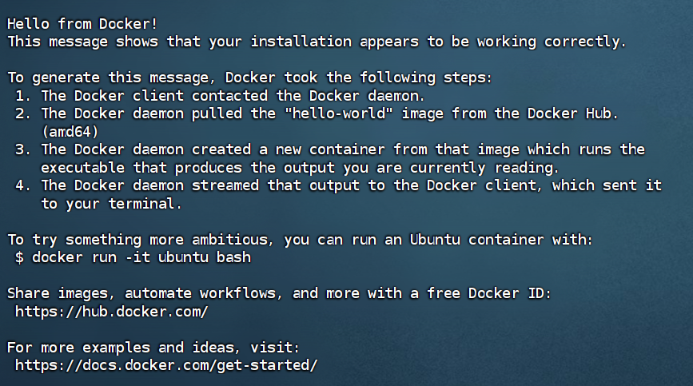
运行完后会显示一长串的东西，简单来说就是没有找到这个镜像，然后就去pull，去远程拉取一个镜像，如果输出有 ``Hello from Docker!`` 则表示成功
<br>
但是，如果没有显示上图那一长串的信息，或者是显示 ``Redirecting to /bin/systemctl stop docker.servic``之类的信息，说明拉取镜像失败了，这时候要考虑设备或者网络的问题。
我在做这一步的时候也发生了两次错误，一次是把 ``docker run hello-world`` 打错成 ``docker run hello-word``了，另一次是因为原来配置的镜像问题，建议使用阿里云的镜像加速器.
> sudo mkdir -p /etc/docker
sudo tee /etc/docker/daemon.json <<-'EOF'
{
  "registry-mirrors": ["https://wosslmsh.mirror.aliyuncs.com"]
}
EOF
sudo systemctl daemon-reload
sudo systemctl restart docker
>

完成以上步骤后，再使用 ``docker images`` 来查看已有的镜像
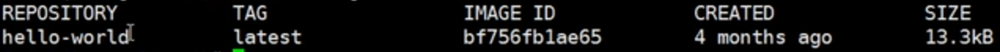
会发现，多一个"hello-world"镜像，这就是我们刚刚执行 ``docker run hello-world``所拉下来的镜像。
如果你想卸载某个镜像，你需要执行：
> 1、卸载依赖
yum remove docker-ce docker-ce-cli containerd.io
2、删除资源
rm -rf /var/lib/docker
/var/lib/docker 是docker的默认工作路径

# Docker的常用命令
## 帮助命令

> docker version  &nbsp;&nbsp;&nbsp;&nbsp;&nbsp;&nbsp;#查看客户端和服务端的详细版本信息
docker info &nbsp;&nbsp;&nbsp;&nbsp;&nbsp;&nbsp;&nbsp;&nbsp;&nbsp;&nbsp;&nbsp; #查看docker的系统信息
docker --help &nbsp;&nbsp;&nbsp;&nbsp;&nbsp;&nbsp;&nbsp;&nbsp;&nbsp;#帮助查询docker的命令
>
docker images&nbsp;查看所有本地的主机上的镜像
> <pre>REPOSITORY      TAG       IMAGE ID       CREATED       SIZE
>hello-world   latest    feb5d9fea6a5   2 years ago   13.3kB</pre>
__解释__
```
REPOSITORY  镜像的仓库源
TAG         镜像的标签
IMAGE ID    镜像的ID
CREATED     镜像的创建时间
SIZE&nbsp   镜像的大小
``` 
__可选项__
> -a, --all             #列出所有的可选项  
  -q, --quiet           #只显示镜像的ID

## 镜像命令

__搜索镜像__
> docker search 镜像名
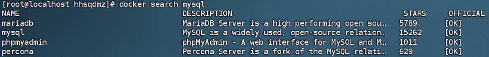

__可选项__，通过收藏来过滤
> --filter=STARS=1234&nbsp;&nbsp;&nbsp;&nbsp;&nbsp;&nbsp;&nbsp;#搜索出来的镜像就是STARS大于1234的


__下载镜像__
> docker pull 镜像名[:tag(版本)]不加默认最新版

采用的是分层下载，是docker images的核心，联合文件系统，感兴趣可以去搜索了解
最后一行是镜像的真实地址docker pull mysql = docker pull docker.io/library/mysql:latest
__指定版本下载__
例如：

我们可以看到，其实我们并没有完完全全的重新下载一份，有重复的文件会直接拿过来用，避免了不必要的麻烦，这就是分层下载的好处之一

下载完后我我们可以用``docker images```来查看下载的镜像


```
一般我们下载的流程是：
1、搜索镜像  search
2、下载镜像  pull
3、运行测试  run
4、进入容器  exec -it
```

__删除镜像__
> 删除镜像：``docker rmi``
rm我们都知道，Linux里删除东西也是用rm，rmi里的i指的是images镜像，删除镜像时我们可以通过ID来删，也可以通过名称来删

我们也可以加上参数-f来表示完全删除

如果想要删除多个镜像只需要用空格隔开即可
``docker rmi -f 镜像ID 镜像ID 镜像ID``
如果像全部删除
``docker rmi -f $(docker images -aq)``

## 容器命令
__新建容器并启动__
> 我们有了镜像才可以创建容器，所有学习之前先得下载一个centos的镜像
``docker pull centos``
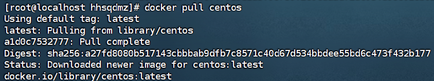

```
docker run [可选参数] image
# 参数说明
--name="Name"    容器的名字，用来区分容器
-d               以后台方式运行
-i/-t            使用交互方式运行，进入容器查看内容
-p               指定容器的端口，主机映射
        -p ip:主机窗口:容器窗口
        -p 主机窗口:容器窗口 （常用）
        -p 容器端口
        (省略-p)容器端口
-P               随机指定端口
```
__启动并进入容器__
> 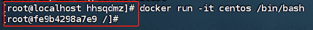
从原来的主机名变成容器ID

```
[root@fe9b4298a7e9 /]# ls
bin  dev  etc  home  lib  lib64  lost+found  media  mnt  opt  proc  root
run  sbin  srv  sys  tmp  usr  var
展开后我们会发现是不是跟外面的centOS一样，这就是一个小型的服务器，但是是基础版本，很多命令都还不完善
```

__查看运行的容器__
```
通过docker ps来查看运行的容器
参数：
什么都不加 #列出正在运行的容器
-a        #列出正在运行的容器，带出历史运行过的容器
-n        #显示最近创建的容器
-q        #只显示容器的编号

```


__退出容器__
```
exit                # 直接停止容器并退出，从容器中退到主机
快捷键Ctrl + P + Q   # 容器不停止退出
```


__删除容器__
```
docker rm 容器ID                 #删除指定的容器，不能删除正在运行的容器，如果需要强制删除 rm -f
docker rm -f $(docker ps -aq)   #删除所有的容器
docker ps -a -q|xargs docker rm #删除所有容器
```

__启动和停止容器__
```
docker start 容器ID       #启动容器
docker restart 容器ID     #重启容器
docker stop 容器ID        #停止当前运行的容器
docker kill 容器ID        #强制停止当前运行的容器
```

## 其他常用命令
__后台启动容器__
``docker run -d 镜像名``
> 
&nbsp;&nbsp;我们使用后台运行命令启动centOS后，再使用``docker ps``发现，centOS停止了。
<dr>
这是因为docker容器使用后台运行时，就必须要有一个前台进程，如果docker没有发现有前台进程就会自动停止

__查看日志__
``docker logs -f -t --tail 容器``
这里我没有成功，我输出的日志是空白的，所以就不做展示了
<br>

__查看容器中的进程__
``docker top 容器ID``
> 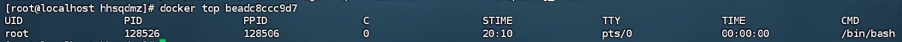
<dr>

__查看镜像的元数据__
``docker inspect 容器ID``
> 输入后显示很长一串的内容，我这里只截取一部分，但是所截取的内容也分丰富
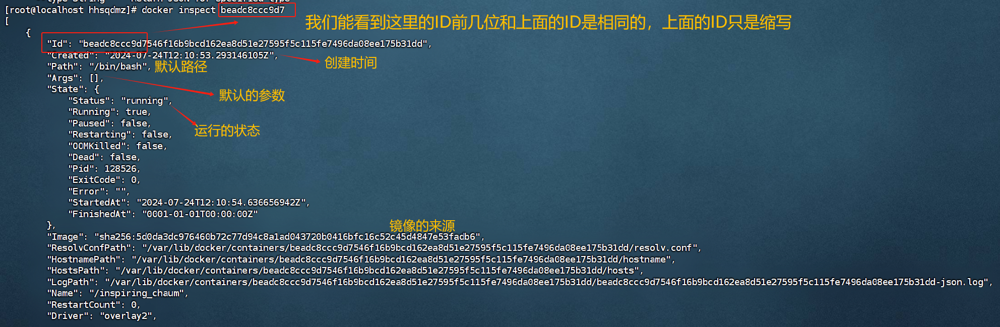
<dr>

__进入当前正在运行的容器__
一般来说，通常容器都是使用后台方式运行，因此我们需要进入当前正在运行的容器的命令
方法一：``docker exec -it 容器ID bashshell``
> 这里的-it和上面一样，也是交互模式执行
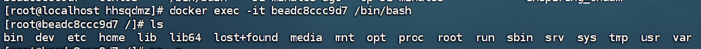

方法二：``docker attach 容器ID``
执行当前的代码
<dr>
```
两者的区别
docker exec      # 进入容器后开启一个新的终端，可以在里面操作命令
docker attach    # 进入容器正在执行的终端，不会开启新的进程
```

__从容器内拷贝内容到主机上__
``docker cp 容器ID:容器内路径 目的的主机路径``
> 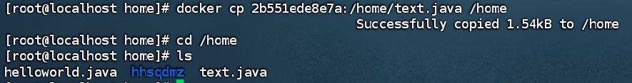

## commit镜像
``docker commit``命令用于创建一个新的镜像，基于正在运行的容器的当前状态。它允许你捕捉容器所做的更改并将其保存为一个新的镜像，以便以后可以使用该镜像创建相同的容器或与之共享状态
<dr>
命令和git原理类似
``docker commit -m="提交信息描述" -a="作者" 容器ID 目标镜像名:[TAG(版本标签)]``
案例：
> 上文有提到，我们下载的镜像一般都是为删减版，功能不全，这时，我们想要用到tomcat较为完整的功能该怎么办
1、先启动一个默认的tomcat
2、进入后我们cd到webapps里，发现文件为空
3、把文件拷贝进去
&nbsp;&nbsp;&nbsp;&nbsp;&nbsp;&nbsp;这时我们需要运行代码``cp -r webapps.dist/* webapps``把webapps.dist里的全部内容拷贝进webapps里即可。
> 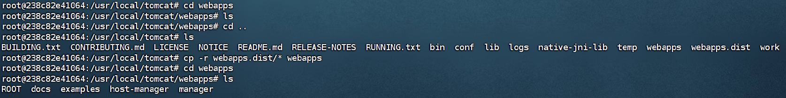
4、通过"docker commit"来提交为一个镜像，这就是我们自己修改过的镜像
> 


# 关于Docker的一些理论知识
## 关于镜像
__镜像是什么__
```
镜像是一种轻量级、可执行的独立软件包，某种意义上你可以把它理解成我们常用的压缩包，这个压缩包里包含着软件
所需要的内容，例如代码、运行时的环境变量、配置文件等，一打开就是一个软件。
```
__如何可以得到镜像__
```
1、从远程仓库下载
2、朋友拷贝给你
3、自己手动做一个镜像DockerFile
```

__镜像加载原理__
1、UnionFS（联合文件系统）
```
    UnionFS联合文件系统是一个分层、轻量且高性能的文件系统，它支持对文件系统的修改作为一次提交来一层层的
叠加，我们可以想象的到，我们的电脑上现在有了centOS，然后我们在centOS里安装了docker，我们再从docker里安
装了jdk，一直套娃，联合文件系统就会把每一层都记录下来，所以我们上文提到的下载镜像时的分层，就是因为这个。
```

2、分层
```
  我们在下载镜像的时候能够发现，它不像我们平时在其他地方下载一个软件就是一个包，在docker里，一个软件分了
很多层，这提高了使用性和可重复性。
  然而一个软件可以分成两个大层，一个是镜像层，一个是容器层，镜像层和容器层之间有什么关系呢，我们做到命令
都是在容器层上所操作的，无法改变镜像层内，我的理解是，镜像是一个压缩包，而容器是解压后的软件，我们可以改
变软件里的内容，但是无法改变压缩包里的内容。
```

# 容器数据卷
## 容器数据卷的作用
我们在docker运行时产生的数据，如果不是通过``docker commit``来提交的话，等容器删除时数据也会跟着删除，为了能保存数据在Docker中我们使用卷。
卷的设计目的就是数据的持久化，完全独立于容器的生存周期，因此Docker不会在容器删除时删除其挂载的数据卷。
卷就是目录或文件，存在于一个或多个容器中，由Docker挂载到容器，但卷不属于联合文件系统（Union FileSystem），因此能够绕过联合文件系统提供一些用于持续存储或共享数据的特性:。
## 使用数据卷
> 方式一：直接使用命令来挂载 -v
```docker run -it -v 主机目录:容器目录```
> 
> 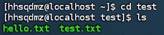
现在，容器内和容器外的地址都相连起来了，会发现，两个地方的内容是一致的。
<br>

如何去验证是否连接到，是否连接对：``docker inspect``
> 
如果inspect后没有看到Mounts，说明挂载失败了

在容器内部生成的文件也会映射在外面，同理，外面生成的内容也会映射到里面，停止容器后，外面文件再做修改，也是会映射到里面
> 
> 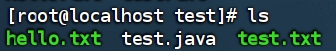

`
<dr>
<dr>
__小案例__：MySQL同步数据
```
1、下载MySQL：docker pull mysql
2、运行容器，做数据挂载：
docker run -d -p 3310:3306 -v /home/mysql/conf:/etc/mysql/conf.d -v /home/mysql/data:/var/lib/
mysql -e MYSQL_ROOT_PASSWORD=123456 --name mysql01 容器ID
注解：
      -d 后台运行
      -p 端口映射
      -v 卷挂载
      -e 环境配置
      --name 容器命名
```
> 让我们来检查一下同步到了吗
这是默认data文件里的内容：

此时，我们在外部连接上MySQL后，新建一个text数据库，再来看看data里的内容有没有做改变

我们能清楚的看到，多了一个text，说明，同步数据成功，就算把容器删除，我们已经存储到本地的数据依然还在，不会丢失，这就实现了容器数据持久化。

## 具名和匿名挂载
> \# 匿名挂载
-v 容器内路径
``docker run -v /容器内需挂载的路径 容器ID``
例如：``docker run -P -v /ect/nginx nginx``
<dr>
\# 查看所有的volume
``docker volume ls``

这种就是匿名挂载，没有指出卷名是什么
<dr>
我们平时也可以用具名挂载
例如：``docker run -v hhhhhh-nginx:/etc/nginx 605c77e624dd``
-v 卷名:容器内的路径

<dr>
然后，我们可以用"``docker volume inspect 卷名``"来查看卷在主机内所挂载的位置

可以看出，所有的docker容器内的卷，没有指定目录的情况下都是在：
&nbsp;&nbsp;&nbsp;&nbsp;&nbsp;&nbsp;/var/lib/docker/volume/卷名/_data
我们可以在主机上进入路径查看文件

<dr>
还有一种是指定路径挂载
``-v /主机路径:容器内路径``
感兴趣的可以去试试，这里就不作展示了

```
总结：
一般来说，我们的挂载方式最常用的有三种：
1、 -v 容器内的路径           # 匿名挂载
2、 -v 卷名:容器内的路径      # 具名挂载
3、 -v /主机地址:容器内的地址 # 指定路径挂载
```
扩展：
```
我们可以通过 -v 容器内路径:ro或者rw 来改变读写权限
ro      # read only  只读
rw      # read write 可读可写
默认是rw
例如：docker run -v hhsqdmz:/容器地址 容器ID

# 一旦设置了容器权限，容器对我们挂载出来的内容就有了限定
比如你看到有个ro，说明这个路径无法从容器内部做出操作，只能从主机来操作
```

## Dockerfile
Dockerfile用来构建docker镜像的构建文件，是一种命令脚本，通过这个脚本可以生成镜像，镜像是一层一层的，脚本是一个个的命令，每个命令都是一层
```
1、创建一个Dockerfile文件，名字任取
2、编写文件的内容，一个命令对着一层  指令(大写)  参数：
   FROM centos
   VOLUME ["volume1","volume2"]
   CMD echo "succeed"
   CMD /bin/bash
3、构造镜像
   "docker build -f 主机路径(编写Dockerfile的路径) -t 镜像名字(任取):TAG(版本号) .(别漏了这里的点)"
```


> 这个容器构建出来后也是可以启动的，启动命令和之前一样

这两个卷算是匿名挂载，在外部一定有一个同步的目录，我们可以通过inspect来查看地址


dockerfile是面向开发的，我们以后要发布项目，做镜像，就要编写dockerfile文件
```
DockerFile：构建文件，定义一切的步骤，源代码
            相当于软件包
DockerImages：通过DockerFile构建生成的镜像，最终发布和运行的产品
            相当于软件
Docker容器：容器就是镜像运行起来提供的服务器
            相当于打开软件后，软件的后台
```
<dr>

注意事项
```
1、每个保留关键字（指令）都必须是大写字母
2、执行从上到下顺序执行
3、'#'表示注释
4、每一个指令都会创建提交一个新的镜像层
```

### DockerFile的指令
```
FROM        # 指定基础镜像，一切从这里开始构建
              DockerHub中99%的镜像都是从FROM seach过来的，然后配置所需要的软件来进行构建
MAINTAINER  # 作者是谁：姓名+邮箱
RUN         # 镜像构建的时候需要运行的命令
ADD         # 添加内容，可以理解成加个软件包
COPY        # 类似ADD，将文件拷贝到镜像中
WORKDIR     # 镜像的工作目录
VOLUME      # 挂载卷的目录
ENV         # 构建时设置环境变量
CMD         # 指定容器运行时要运行的命令，只有最后一个生成，可被替代
ENTRYPOINT  # 指定容器运行时要运行的命令，可以追加命令
EXPOSE      # 暴露端口配置，跟上面的-p一样
ONBULID     # 是一个触发指令，当构建一个被继承 DockerFile 时，会运行 ONBULID 指令
```

## 数据卷容器
我们同时启动三个我们上面自己构建的容器centos1、centos2、centos3
> centos1为父容器，centos2是os1的子容器，os3是os2的子容器 
1、"docker run -it --name centos01 容器ID"
2、docker run -it --name centos02 --volumes-from centos01 容器ID
3、docker run -it --name centos03 --volumes-from centos02 容器ID
我们能在里面找到我们自己构建的两个文件"volume01"和"volume02"

我们在centos01里面，进入volume01，touch一个新的文件docker1；然后在centos03里，也是在volume01里，touch一个docker3。
然后我们无论在三个容器之间的任意一个容器，都能看见新构建出来的文件
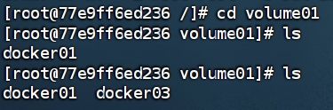
我们把centos01给exit退出，或者是删除rm都可以，但是，在其他两个容器里面依然能够看到docker1和docker2两个文件，只要其中有一个容器存活，数据就不会丢失

这种容器之间配置信息的传递，数据卷容器的生命周期一直持续到所有共享的容器都停止为止


# Docker网络
## 查看网络配置
> 我们每次启动一个docker容器，docker都会给docker容器分配一个ip地址，只要我们安装了docker，就会有一个网卡 docker0，这种叫桥接模式，使用的是evth-pair技术，只要一删除容器ip地址也会跟着消失
\# evth-pair技术就是一对虚拟设备接口，都是成对出现的，一端连着协议，一端互相连接，OpenStac也是运用这个技术
查看网络配置命令 "``ip addr``"
