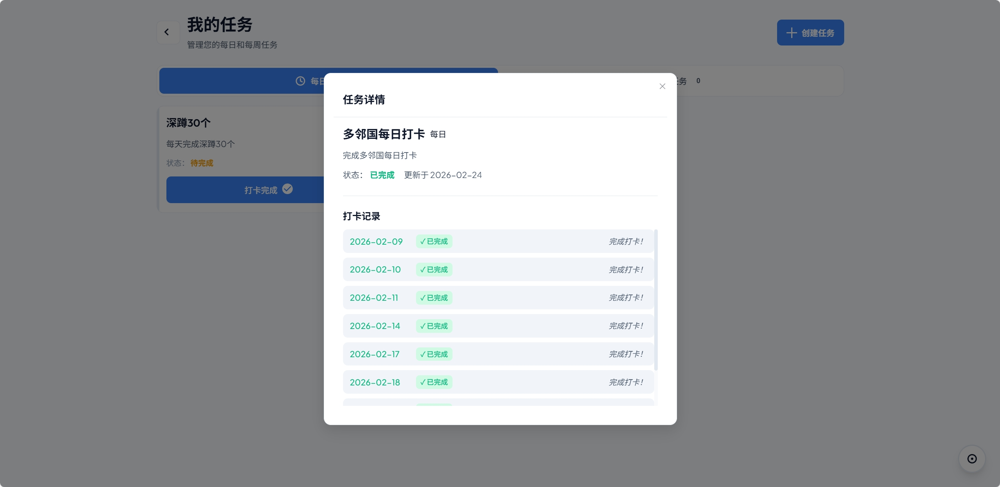

## 项目概述

DailyCheck 是一个现代化的任务打卡 Web 应用，通过简洁直观的界面帮助用户管理每日任务和每周任务。系统采用前后端分离架构，后端基于 Spring Boot 3.2 + Spring Data JPA + PostgreSQL，前端采用 Vue 3 (Composition API) + TypeScript + Vite + Element Plus，实现了任务管理、打卡记录、状态自动刷新、统计分析等核心功能，并创新性地集成了鼓励语录系统。

---

## 核心亮点

### 自动状态刷新
- **每日任务**：每天 00:00 自动检查，重置为未完成状态
- **每周任务**：每周一 00:00 自动重置
- **智能判断**：基于最后操作日期判断是否需要刷新
- **定时任务**：后端 @Scheduled 定时器自动执行

### 未完成提醒系统
- **过期检测**：启动时自动检测昨日/上周未完成任务
- **鼓励语录**：随机生成一句鼓励性话语激励用户
- **友好提醒**：使用 Element Plus 通知组件展示

### 完整任务管理
- **任务类型**：支持每日任务和每周任务两种类型
- **CRUD 操作**：创建、读取、更新、删除任务
- **打卡记录**：记录每次打卡的日期和备注
- **软删除**：删除任务仅标记为不活跃，保留历史数据

### 数据统计分析
- **完成率统计**：计算上周打卡成功率
- **连续打卡**：统计每个任务的连续打卡天数
- **可视化图表**：使用 ECharts 展示统计数据
- **概览仪表盘**：今日/本周任务完成情况一目了然

---

## 技术栈

### 前端技术

| 技术 | 版本 | 用途 |
|------|------|------|
| **Vue** | 3.4 | UI 框架 (Composition API) |
| **TypeScript** | 5.3 | 类型安全 |
| **Vite** | 5.0 | 构建工具 |
| **Element Plus** | 2.4 | UI 组件库 |
| **Pinia** | 2.1 | 状态管理 |
| **Vue Router** | 4.2 | 路由管理 |
| **Axios** | 1.6 | HTTP 客户端 |
| **ECharts** | 5.6 | 数据可视化 |
| **Day.js** | 1.11 | 日期处理 |

### 后端技术

| 技术 | 版本 | 用途 |
|------|------|------|
| **Spring Boot** | 3.2.2 | 应用框架 |
| **Spring Data JPA** | - | ORM 框架 |
| **Spring Security** | - | 安全框架 |
| **PostgreSQL** | 16+ | 数据库 |
| **JWT** | 0.11.5 | 认证令牌 |
| **Java** | 17 | 开发语言 |
| **Lombok** | 1.18.30 | 减少样板代码 |
| **Maven** | - | 构建工具 |

---

## 核心功能详解

### 1. 任务状态刷新机制

系统通过两种方式触发状态刷新：

**方式一：前端调用刷新接口**
```java
// CheckInService.java
public void refreshTaskStatus() {
    LocalDate today = LocalDate.now();
    List<Task> tasks = taskRepository.findAll();

    for (Task task : tasks) {
        if (today.isAfter(task.getLastUpdateDate())) {
            if (task.getTaskType() == TaskType.DAILY) {
                task.setStatus(TaskStatus.PENDING);
            } else if (task.getTaskType() == TaskType.WEEKLY) {
                DayOfWeek dayOfWeek = today.getDayOfWeek();
                if (dayOfWeek == DayOfWeek.MONDAY) {
                    task.setStatus(TaskStatus.PENDING);
                }
            }
            task.setLastUpdateDate(today);
        }
    }
    taskRepository.saveAll(tasks);
}
```

**方式二：后端定时任务**
```java
@Scheduled(cron = "0 5 0 * * ?")  // 每天 00:05 执行
public void scheduledRefresh() {
    checkInService.refreshTaskStatus();
}
```

### 2. 未完成提醒与鼓励系统

当用户登录或打开应用时触发：

```java
// CheckInService.java
public OverdueTasksResponse getOverdueTasks() {
    LocalDate yesterday = LocalDate.now().minusDays(1);
    List<Task> overdueTasks = taskRepository
        .findByLastUpdateDateBeforeAndStatus(yesterday, TaskStatus.PENDING);

    String quote = encouragementService.getRandomQuote();

    return new OverdueTasksResponse(overdueTasks, quote);
}
```

**鼓励语录示例**：
- "每一天都是新的开始，今天要加油！"
- "坚持就是胜利，小步前进也是进步！"
- "你的潜力远比你想象的更大！"

### 3. 统计分析功能

**统计指标**：
- 上周打卡成功率 = 完成天数 / 7 × 100%
- 任务执行频率（按任务统计）
- 连续打卡天数（Streak）
- 最长连续记录

```java
// StatisticsService.java
public StatisticsDTO getWeeklyStatistics() {
    LocalDate weekStart = LocalDate.now().minusWeeks(1);
    List<CheckInLog> logs = checkInLogRepository
        .findByCheckInDateAfter(weekStart);

    long completedCount = logs.stream()
        .filter(CheckInLog::isCompleted)
        .count();

    // 计算完成率、连续天数等...
}
```

### 4. RESTful API 设计

| 方法 | 路径 | 说明 |
|------|------|------|
| **任务管理** |
| GET | `/api/tasks` | 获取任务列表 |
| POST | `/api/tasks` | 创建任务 |
| PUT | `/api/tasks/{id}` | 更新任务 |
| DELETE | `/api/tasks/{id}` | 删除任务 |
| **打卡操作** |
| POST | `/api/checkin` | 打卡/取消打卡 |
| GET | `/api/checkin/overdue` | 获取过期任务 |
| **统计数据** |
| GET | `/api/statistics/overview` | 获取概览统计 |
| GET | `/api/statistics/weekly` | 获取周报统计 |
| **用户认证** |
| POST | `/api/auth/register` | 用户注册 |
| POST | `/api/auth/login` | 用户登录 |
| GET | `/api/user/profile` | 获取用户信息 |

---

## 数据库设计

### 核心数据表

| 表名 | 说明 | 关键字段 |
|------|------|----------|
| `users` | 用户表 | id, username, email, password_hash |
| `tasks` | 任务表 | id, user_id, title, description, task_type, status, last_update_date |
| `check_in_logs` | 打卡记录表 | id, task_id, check_in_date, completed, note |

### ER 关系

```
User (1) --- (N) Task
Task (1) --- (N) CheckInLog
```

### 关键字段说明

**tasks 表**：
- `task_type`: DAILY（每日任务）或 WEEKLY（每周任务）
- `status`: COMPLETED（已完成）或 PENDING（待完成）
- `last_update_date`: 最后操作日期，用于判断是否需要刷新

**check_in_logs 表**：
- 唯一索引：`(task_id, check_in_date)` 防止重复打卡

---

## 项目截图

### 登录页面


用户登录界面，支持用户名/邮箱登录。

### 任务列表



展示所有任务，支持按每日/每周筛选。点击复选框即可打卡。

### 任务打卡


点击任务卡片上的复选框，立即完成打卡，状态实时更新。

### 统计报告


使用 ECharts 展示上周完成率、连续打卡天数等统计数据。

---

## 核心代码示例

### 任务实体 (Task.java)

```java
@Entity
@Table(name = "tasks")
@Data
public class Task {
    @Id
    @GeneratedValue(strategy = GenerationType.IDENTITY)
    private Long id;

    @Column(nullable = false)
    private String title;

    private String description;

    @Enumerated(EnumType.STRING)
    @Column(nullable = false)
    private TaskType taskType;

    @Enumerated(EnumType.STRING)
    @Column(nullable = false)
    private TaskStatus status;

    @Column(nullable = false)
    private LocalDate lastUpdateDate;

    @Column(nullable = false)
    private Boolean isActive = true;

    @CreationTimestamp
    private LocalDateTime createdAt;

    @UpdateTimestamp
    private LocalDateTime updatedAt;
}
```

### 任务控制器 (TaskController.java)

```java
@RestController
@RequestMapping("/api/tasks")
@RequiredArgsConstructor
public class TaskController {
    private final TaskService taskService;

    @GetMapping
    public ApiResponse<List<TaskDTO>> getAllTasks(
        @RequestParam(required = false) TaskType type) {
        List<TaskDTO> tasks = taskService.getAllTasks(type);
        return ApiResponse.success(tasks);
    }

    @PostMapping
    public ApiResponse<TaskDTO> createTask(@Valid @RequestBody TaskDTO dto) {
        TaskDTO task = taskService.createTask(dto);
        return ApiResponse.success(task);
    }

    @PutMapping("/{id}")
    public ApiResponse<TaskDTO> updateTask(
        @PathVariable Long id,
        @Valid @RequestBody TaskDTO dto) {
        TaskDTO task = taskService.updateTask(id, dto);
        return ApiResponse.success(task);
    }
}
```

### 打卡服务 (CheckInService.java)

```java
@Service
@RequiredArgsConstructor
public class CheckInService {
    private final TaskRepository taskRepository;
    private final CheckInLogRepository logRepository;
    private final EncouragementService encouragementService;

    @Transactional
    public CheckInLog checkIn(Long taskId, String note) {
        Task task = taskRepository.findById(taskId)
            .orElseThrow(() -> new RuntimeException("任务不存在"));

        LocalDate today = LocalDate.now();
        Optional<CheckInLog> existingLog = logRepository
            .findByTaskIdAndCheckInDate(taskId, today);

        if (existingLog.isPresent()) {
            throw new RuntimeException("今日已打卡");
        }

        CheckInLog log = new CheckInLog();
        log.setTask(task);
        log.setCheckInDate(today);
        log.setCompleted(true);
        log.setNote(note);

        task.setStatus(TaskStatus.COMPLETED);
        task.setLastUpdateDate(today);

        return logRepository.save(log);
    }
}
```

---

## 技术难点与解决方案

### 1. 时区问题导致日期判断错误

**问题**：服务器时区与用户时区不一致，导致日期判断错误

**解决方案**：统一使用 LocalDate 和 LocalDateTime，并在 application.properties 中配置时区
```properties
spring.datasource.url=jdbc:postgresql://localhost:5432/dailycheck_db?TimeZone=Asia/Shanghai
```

### 2. 跨域请求被阻止

**问题**：前端访问后端 API 时出现 CORS 错误

**解决方案**：配置 CorsConfig 允许前端跨域访问
```java
@Configuration
public class CorsConfig implements WebMvcConfigurer {
    @Override
    public void addCorsMappings(CorsRegistry registry) {
        registry.addMapping("/**")
            .allowedOrigins("http://localhost:5173")
            .allowedMethods("*")
            .allowedHeaders("*")
            .allowCredentials(true);
    }
}
```

### 3. JWT 认证拦截器失效

**问题**：部分接口未经过 JWT 验证即可访问

**解决方案**：在 SecurityConfig 中正确配置安全规则，将登录/注册接口放行
```java
@Bean
public SecurityFilterChain filterChain(HttpSecurity http) throws Exception {
    http.csrf().disable()
        .authorizeHttpRequests(auth -> auth
            .requestMatchers("/api/auth/**").permitAll()
            .anyRequest().authenticated()
        )
        .addFilterBefore(jwtFilter, UsernamePasswordAuthenticationFilter.class);
    return http.build();
}
```

---

## 部署说明

### 环境要求
- JDK 17+
- Node.js 18+
- PostgreSQL 16+
- Maven 3.8+

### 快速启动

**后端启动**：
```bash
cd dailycheck-backend
mvn spring-boot:run
```

**前端启动**：
```bash
cd dailycheck-frontend
npm install
npm run dev
```

### Docker 部署

```bash
# 构建并启动所有服务
docker-compose up -d
```

---

## 项目总结

DailyCheck 是一个功能完整的任务打卡管理系统，主要成果：

1. **功能完整**：实现了任务管理、打卡记录、状态刷新、统计分析等核心功能
2. **技术现代**：采用 Vue 3 Composition API、Spring Boot 3、TypeScript 等现代技术栈
3. **用户体验**：简洁直观的界面设计，流畅的交互体验
4. **可扩展性**：前后端分离架构，易于添加新功能
5. **部署友好**：支持 Docker 一键部署

该项目展示了现代 Web 应用开发的最佳实践，为个人任务管理提供了实用的解决方案。

---