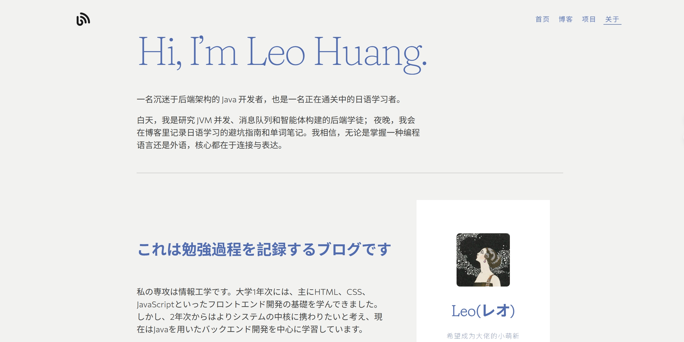

## 项目概述

这是一个基于 Hugo 框架构建的个人博客系统，采用 Hugo Apéro 主题，支持文章发布、项目展示、作品集管理等功能。网站具有现代化的设计风格，完全响应式，适配各种设备。

---

## 主要功能

### 📝 内容管理
- **Markdown 写作**：使用 Markdown 格式编写文章，支持代码高亮
- **分类标签**：文章可按分类和标签组织，便于检索
- **草稿系统**：支持草稿预览，发布前可随时编辑

### 🎨 界面特性
- **响应式设计**：完美适配桌面、平板、手机
- **暗色模式**：支持日间/夜间模式切换
- **自定义主题**：可自定义颜色、字体等样式

### 🔧 技术功能
- **搜索功能**：全站内容搜索
- **评论系统**：集成评论功能
- **数据分析**：访问统计与分析

---

## 技术栈

| 技术 | 用途 | 说明 |
|------|------|------|
| **Hugo** | 静态网站生成器 | 快速构建，编译时间< 1秒 |
| **Markdown** | 内容编写 | 简洁易学的标记语言 |
| **HTML/CSS** | 前端开发 | 使用 Tachyons CSS 框架 |
| **JavaScript** | 交互功能 | 搜索、暗色模式等 |
| **Git** | 版本控制 | 代码管理与部署 |

---

## 项目截图

### 首页展示

博客首页采用简洁的卡片式布局，突出展示最新文章。

### 关于页

文章页面采用优化的阅读体验设计，侧边栏显示目录导航。

### 项目展示页

项目页面采用网格布局，展示作品集和项目介绍。

---

## 实现亮点

### 1. 性能优化
- 使用 Hugo 生成纯静态 HTML
- 图片懒加载，提升页面加载速度
- CSS/JS 文件压缩，减小资源体积

### 2. SEO 优化
- 自动生成 sitemap
- 支持自定义 meta 标签
- 语义化 HTML 结构

### 3. 部署自动化
- 使用 GitHub Actions 自动部署
- 推送代码后自动构建并发布到 Netlify

---

## 总结

这个博客项目不仅展示了我的技术能力，也是我记录学习心得、分享技术文章的平台。通过这个项目，我深入学习了静态网站生成、前端开发、自动化部署等技术，也养成了持续写作的习惯。

如果你对 Hugo 或静态网站感兴趣，欢迎与我交流！
