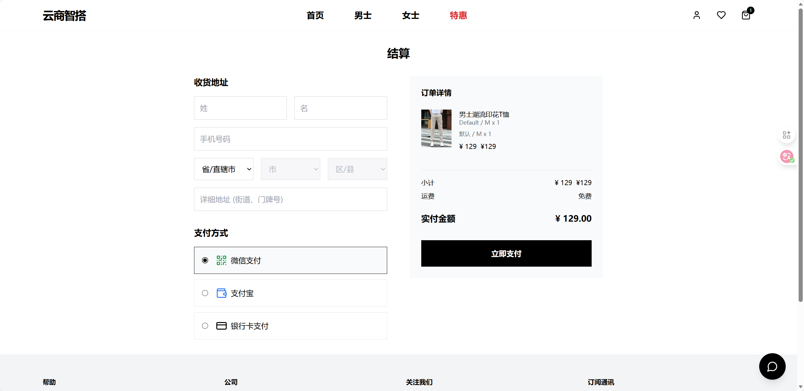

## 项目概述

云商智搭是一个融合了 **Spring AI** 技术的智能电商平台，通过对话式 AI 助手为用户提供全新的购物体验。系统采用前后端分离架构，后端基于 Spring Boot 3.2 + Spring AI，前端采用 React 18 + TypeScript + Vite，实现了商品浏览、购物车、订单管理、收藏功能等核心电商功能，并创新性地集成了 AI 智能购物助手。

---

## 核心亮点

### 🤖 AI 智能购物助手
- **对话式购物**：用户可通过自然语言与 AI 助手交互，实现商品搜索、加购、查询等操作
- **智能搭配推荐**：AI 自动为用户推荐上下装组合，一键加购
- **智能搜索优化**：支持模糊关键词识别（如"裤子"自动匹配"西裤"、"牛仔裤"）
- **多轮对话记忆**：基于 ChatMemory 实现会话上下文记忆
- **流式响应**：支持 SSE 流式输出，提供更流畅的交互体验

### 🛒 完整电商功能
- **商品管理**：商品列表、详情展示、分类筛选、价格排序
- **购物车系统**：支持商品添加、数量调整、实时价格计算
- **订单流程**：下单、支付、订单历史查询
- **收藏功能**：商品收藏与管理
- **用户认证**：基于 Context 的用户身份管理

### 🎨 现代化界面
- **响应式设计**：完美适配桌面和移动端
- **流畅动画**：使用 Framer Motion 实现优雅的页面过渡效果
- **组件化开发**：高复用性的 React 组件架构

---

## 技术栈

### 前端技术

| 技术 | 版本 | 用途 |
|------|------|------|
| **React** | 18.2 | UI 框架 |
| **TypeScript** | 5.2 | 类型安全 |
| **Vite** | 5.1 | 构建工具 |
| **Tailwind CSS** | 3.4 | 样式框架 |
| **React Router** | 6.22 | 路由管理 |
| **Framer Motion** | 11.0 | 动画效果 |
| **Lucide React** | 0.344 | 图标库 |

### 后端技术

| 技术 | 版本 | 用途 |
|------|------|------|
| **Spring Boot** | 3.2.3 | 应用框架 |
| **Spring AI** | 1.0.0-M6 | AI 集成框架 |
| **Spring Data JPA** | - | ORM 框架 |
| **MySQL** | 8.0 | 数据库 |
| **Java** | 17 | 开发语言 |
| **Lombok** | - | 减少样板代码 |

---

## AI 功能详解

### 1. 智能商品搜索

AI 助手能够理解用户的自然语言查询，自动优化搜索关键词：

```
用户：搜一下100元以下的裤子
AI：调用 searchProducts(query="裤", gender="MEN", maxPrice=100)
返回：找到 3 条符合条件的商品...
```

**关键词智能映射**：
- "裤子" → "裤"（匹配西裤、牛仔裤等）
- "鞋子" → "鞋"（匹配运动鞋、皮鞋等）
- "衣服" → 按性别筛选所有商品

### 2. 智能搭配推荐

当用户要求购买"一套"时，AI 自动推荐上下装组合：

```
用户：帮我买一套1000元以内的男装
AI：调用 smartRecommendAndAdd(gender="MEN", maxPrice=1000)
返回：
✓ 商务夹克 - 推荐理由：采用优质面料...
✓ 休闲裤 - 推荐理由：舒适百搭...
```

### 3. AI 工具函数 (Function Calling)

系统提供了以下 AI 可调用的工具：

| 工具名 | 功能 | 参数 |
|--------|------|------|
| `searchProducts` | 搜索商品 | query, gender, maxPrice |
| `addToCart` | 添加到购物车 | productName, quantity |
| `getCart` | 查询购物车 | - |
| `removeFromCart` | 从购物车删除 | productName |
| `smartRecommendAndAdd` | 智能搭配推荐并加购 | gender, maxPrice |

### 4. 对话记忆系统

基于 `MessageChatMemoryAdvisor` 实现：
- 每个会话独立存储上下文
- 保留最近 10 轮对话历史
- 支持会话重置功能

---

## 项目截图

### AI 对话式购物体验


右下角悬浮的 AI 助手，支持自然语言对话式购物。用户可以通过对话完成商品搜索、添加购物车、智能搭配推荐等操作。

### 添加购物车


AI 助手智能识别用户意图，一键将商品添加到购物车，无需手动操作。

### 商品页面


商品详情页展示商品信息、价格、库存等，支持快速加入购物车和收藏。

### 男士专区


男士商品专区，展示男装、男鞋等男性用品。

### 女士专区


女士商品专区，展示女装、女鞋等女性用品。

### 结算页面



购物车结算页面，展示已选商品、数量、总价，支持确认下单。

---

## 核心代码示例

### AI 聊天控制器 (ChatController.java:20)

```java
@RestController
@RequestMapping("/api/chat")
public class ChatController {
    private final ChatClient chatClient;
    private final ChatMemory chatMemory;

    public ChatController(ChatClient.Builder builder, ChatMemory chatMemory) {
        this.chatMemory = chatMemory;
        this.chatClient = builder
            .defaultFunctions("searchProducts", "addToCart", "getCart",
                            "removeFromCart", "smartRecommendAndAdd")
            .defaultSystem("""
                你是一个专业的智能购物助手。
                你的核心任务是：
                1. 帮助用户查找商品（支持按名称和价格筛选）
                2. 帮助用户将商品加入购物车
                3. 智能推荐搭配商品
                """)
            .build();
    }
}
```

### 智能推荐工具 (AiTools.java:216)

```java
@Bean
@Description("Smartly recommend a set of clothes and add to cart automatically")
public Function<SmartRecommendRequest, SmartRecommendResponse> smartRecommendAndAdd() {
    return request -> {
        // 1. 按性别筛选商品
        List<Product> allProducts = productRepository.findByGender(gender);

        // 2. 分离上衣和裤子
        List<Product> tops = allProducts.stream()
            .filter(p -> !p.getName().contains("裤"))
            .collect(Collectors.toList());
        List<Product> bottoms = allProducts.stream()
            .filter(p -> p.getName().contains("裤"))
            .collect(Collectors.toList());

        // 3. 自动选择并加购
        // ...
    };
}
```

---

## 技术难点与解决方案

### 1. AI 关键词模糊匹配问题

**问题**：用户搜索"裤子"无法匹配数据库中的"西裤"、"牛仔裤"

**解决方案**：在 AI 工具层实现关键词预处理
```java
if (query.contains("裤子")) {
    query = query.replace("裤子", "裤");
}
```

### 2. JPA 级联保存外键约束

**问题**：订单创建时 `OrderItem` 外键为空导致 `SQLIntegrityConstraintViolationException`

**解决方案**：采用分步持久化策略
```java
// 1. 先保存 Order 获取 ID
order = orderRepository.saveAndFlush(order);

// 2. 设置关联关系后保存 OrderItem
item.setOrder(order);
orderItemRepository.saveAll(items);
```

### 3. 类型不匹配查询为空

**问题**：`userId` 字段类型定义为 `Long`，但数据库存储为 `VARCHAR`

**解决方案**：统一修改实体字段类型为 `String`，并在查询时添加 `u_` 前缀处理

---

## 数据库设计

### 核心数据表

| 表名 | 说明 | 关键字段 |
|------|------|----------|
| `products` | 商品表 | id, name, price, gender, stock, image_url |
| `orders` | 订单表 | id, user_id, total_amount, status, order_time |
| `order_items` | 订单明细 | id, order_id, product_id, quantity, price |
| `cart` | 购物车 | product_name, quantity |
| `favorites` | 收藏表 | product_id, user_id |
| `users` | 用户表 | id, username, password |

### ER 关系

```
User (1) --- (N) Order
Order (1) --- (N) OrderItem
Product (1) --- (N) OrderItem
User (1) --- (N) Favorite
```

---

## 部署说明

### 环境要求
- JDK 17+
- Node.js 18+
- MySQL 8.0+
- Maven 3.8+

---

## 项目总结

云商智搭电商平台是一个融合了前沿 AI 技术的全栈电商项目，主要成果：

1. **技术创新**：成功集成 Spring AI 框架，实现 Function Calling、对话记忆、流式响应等 AI 能力
2. **业务价值**：通过 AI 助手提供更智能的购物体验，降低用户搜索成本
3. **架构完整**：前后端分离、RESTful API、分层架构设计
4. **可扩展性**：代码结构清晰，易于添加新的 AI 工具函数

该项目展示了 AI 技术与传统电商业务的融合创新，为未来智能电商系统的发展提供了实践参考。

---

## 相关文档

- [需求分析文档](./需求分析文档.md) - 详细的功能需求和业务流程
- [技术架构文档](./技术文档.md) - 系统架构和技术实现细节
- [项目结项报告](./项目报告文档.md) - 开发过程总结和问题解决记录
